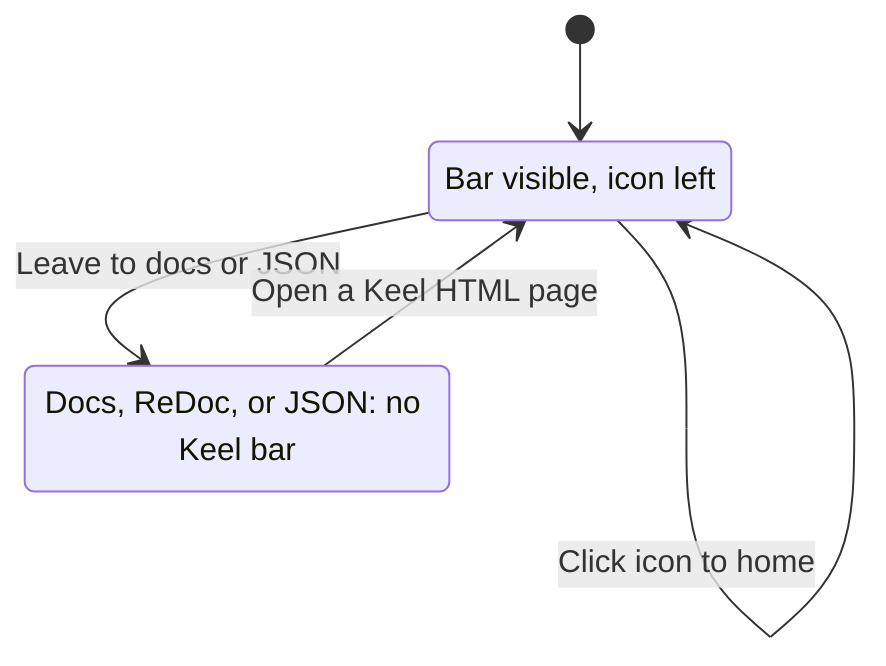

# ADR 001: Persistent top menu bar

* **Status:** Accepted, amended 2026-08-31
* **Date:** 2026-08-31

> **Amended 2026-08-31.** The original record forbade any menu destination or label besides the home icon. That was a note about how little existed at the time, not a lasting property of the bar, and later decisions contradict it: [ADR 011](ADR-011.md) places the user picker in the bar, and the [UI design](../design/ui.md) places project section links there. The bar is the application's shared shell and may carry navigation. What it must keep is the home icon at the far left and the recorded palette.

## Background

Keel’s web UI is currently a single HTML home page at `/` plus API/docs routes. Brand artwork lives under `assets/` (`logos.png`, `small_icon.png`, and related marks). There is no shared chrome, so the site does not feel like a persistent application shell.

## Problem Statement

People moving around Keel HTML pages have no always-visible way back to home and no consistent brand frame. The menu must stay present on those pages, show the small icon on the far left as a home link, and use colors taken from the logo sheet—with that scheme written down so it can be reused.

## Objective(s)

- Give every Keel HTML page a sticky top menu that remains visible while the page scrolls.
- Place `small_icon` at the far left of the bar and make it navigate to the main site page (`/`).
- Derive a small brand color palette from `logos.png`, record it in one canonical place, and use those tokens for the menu bar.

## Scope and Deliverables

### In-Scope

- Sticky top bar on **Keel-authored HTML pages** (home now; the same chrome on later HTML pages).
- Far-left `small_icon` image, linking to `/`.
- Solid bar fill using the primary brand blue from the recorded scheme.
- A **canonical color-scheme record** (tokens people can read and the UI can follow), sampled from `logos.png` (brand blue, white, and supporting neutrals from that sheet).

### Out-of-Scope

- A “Keel” wordmark beside the icon, and placeholder destinations that lead nowhere.
- Showing the bar on `/docs`, `/redoc`, or raw JSON responses (for example `/health`).
- Dark mode, user-theming, or colors not taken from the logo sheet.
- Changing favicon behavior except as needed so the bar and home page stay consistent.

### Deliverables

- Persistent sticky top menu on Keel HTML pages, with the home icon at the far left linking to `/`.
- Recorded brand color scheme sourced from `logos.png`.
- Home (and future HTML) layout that keeps page content below the bar so the bar does not cover the first lines of content.

## Technical Requirements

* **Must** show the top bar on every Keel HTML page, including after navigation between those pages.
* **Must** keep the bar visible at the top of the viewport when the page is taller than the window (content scrolls; bar stays).
* **Must** show `small_icon` at the far left of the bar.
* **Must** make that icon a control that goes to the main site page (`/`).
* **Must** use the recorded primary brand blue as the bar’s background color.
* **Must** store the color scheme in one obvious place so it is not only “in CSS by memory.”
* **Must** keep the icon recognizable (not cropped away; adequate contrast on the blue bar).
* **May** scale the 128px small icon down to a compact bar height as long as it stays clear.
* **May** include white and light-gray (from the logo sheet) in the recorded scheme for later UI, even if this bar is solid blue.
* **May** carry further destinations and controls, such as section links and the user picker, placed to the right of the home icon.
* **Must Not** displace the home icon from the far left, whatever else the bar carries.
* **Must Not** require the bar on Swagger, ReDoc, or JSON-only URLs.
* **Must Not** invent a second unrelated palette (for example arbitrary accent colors not present on `logos.png`).

## Consequences

* **Good:** Home is one click away from any Keel HTML page; the shell matches the logo; colors are reusable instead of one-off.
* **Bad:** `/docs` and `/redoc` will still look like stock FastAPI pages with no Keel bar, which can feel like leaving the site.
* **Risk:** A large circular icon on a solid blue field may need a little padding or a light treatment so the white interior of the mark stays readable; if the sampled blue is too close to the icon ring, contrast could suffer.

## System Design

### Technical Stack and Architecture

This feature only touches **Keel-authored HTML** (today: the home page at `/`) and **static files under `/assets`** (`small_icon.png`, `logos.png` as the sampling source). JSON `/health` and the existing `/docs` and `/redoc` UIs stay as they are. Shared page chrome should be the same for any later HTML page so the bar is not a one-page special case.

### UML Diagrams

```mermaid
flowchart TD
  visit[Person opens a Keel HTML page]
  bar[Sticky top bar is visible]
  scroll[Person scrolls the page]
  still[Bar stays at the top of the viewport]
  click[Person activates the small icon]
  home[Main site page at slash]

  visit --> bar
  bar --> scroll
  scroll --> still
  bar --> click
  click --> home
  home --> bar
```



## Supporting Documentation

* [Package version (single source of truth)](../version.md)
* [ADR 002: Persistent version footer](ADR-002.md)
* [Brand colors from logos.png](../brand-colors.md)
