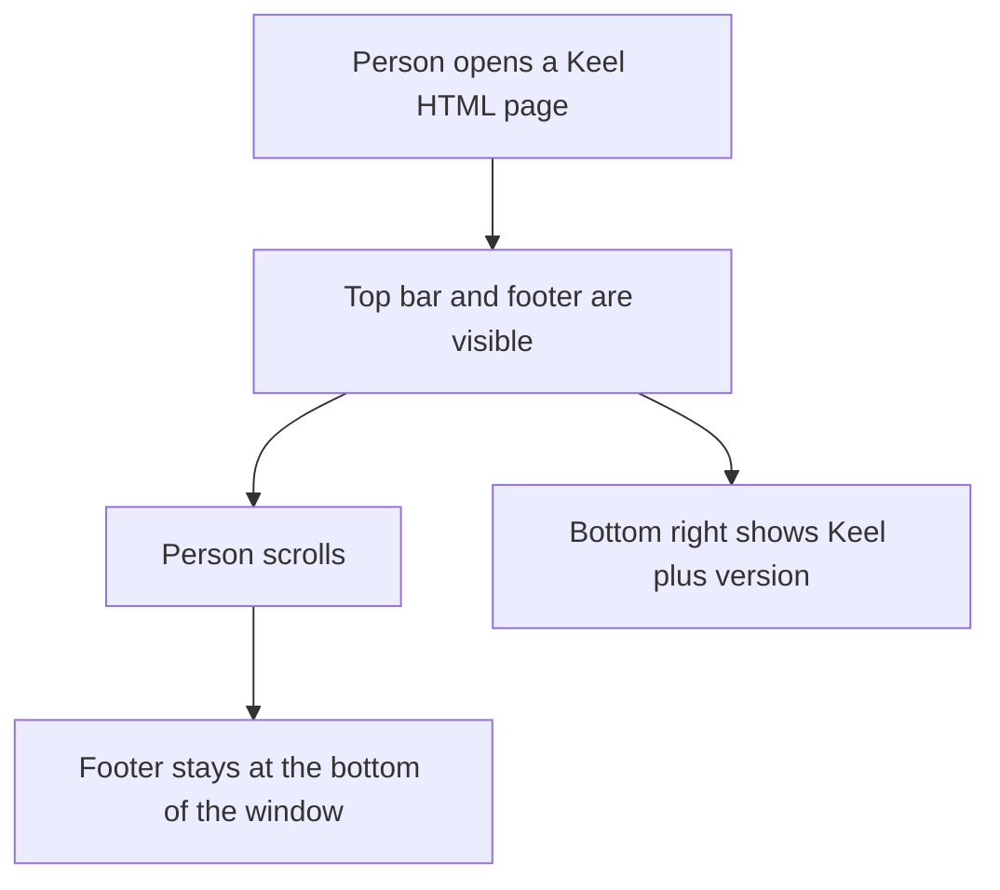
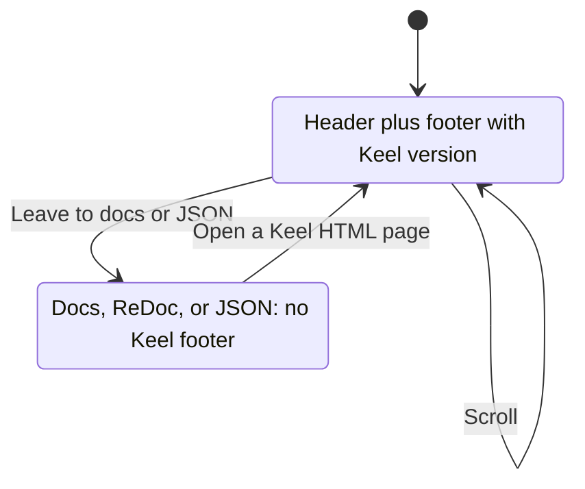

# ADR 002: Persistent version footer

* **Status:** Accepted
* **Date:** 2026-08-29

## Background

Keel HTML pages already share a sticky top bar (ADR 001) and a recorded palette from `logos.png`. Version lived in more than one place in the codebase, and there was no always-visible chrome for it while scrolling.

## Problem Statement

People using the web UI need a persistent footer with the product version on the bottom right, on the same pages as the menu bar, using the established brand colors. The version string must come from a single source of truth so it cannot drift.

## Objective(s)

- Give every Keel HTML page a footer that stays at the bottom of the viewport while the page scrolls.
- Show the app version on the bottom right as `Keel` plus the version number.
- Use the existing brand color scheme (no new palette).
- Define the version only in `pyproject.toml` and read it everywhere else from package metadata.

## Scope and Deliverables

### In-Scope

- Sticky footer on **Keel-authored HTML pages** (same set as the top bar).
- Version text on the **bottom right** only; left side empty.
- Visual treatment from the recorded scheme: brand-blue bar, white version text.
- Layout so page content is not hidden under the footer.
- Single source of truth for the version number: `[project].version` in `pyproject.toml`.

### Out-of-Scope

- Extra footer content (name on the left, copyright, links, extra nav).
- Footer on `/docs`, `/redoc`, or JSON (for example `/health`).
- A second color palette or dark mode.

### Deliverables

- Persistent sticky footer on Keel HTML pages with `Keel {version}` on the right.
- Shared chrome so later HTML pages get the footer automatically.
- Version helper and documentation so the number is never duplicated.

## Technical Requirements

* **Must** show the footer on every Keel HTML page, including after navigation between those pages.
* **Must** keep the footer visible at the bottom of the viewport when the page is taller than the window (content scrolls; footer stays).
* **Must** place version information on the bottom right.
* **Must** display it as `Keel` followed by the running app version from package metadata.
* **Must** use the existing brand tokens (blue bar, white type), not new colors.
* **Must** keep the last lines of page content readable (not covered by the footer).
* **Must** treat `pyproject.toml` `[project].version` as the only written version number.
* **May** match the top bar’s height and padding so the shell feels like one frame.
* **Must Not** add other footer labels, links, or left-side content in this version.
* **Must Not** require the footer on Swagger, ReDoc, or JSON-only URLs.
* **Must Not** invent colors outside [Brand colors](../brand-colors.md).
* **Must Not** hardcode a version literal in application code, tests, or HTML.

## Consequences

* **Good:** Version is always findable; header and footer read as one branded shell; bumping version is a single edit.
* **Bad:** `/docs` and `/redoc` still have no Keel chrome, so the footer version is missing there.
* **Risk:** A sticky top and bottom bar reduces the visible content height. Editable installs must be refreshed after a version bump or metadata can lag `pyproject.toml`.

## System Design

### Technical Stack and Architecture

Touches the **same Keel HTML chrome** as ADR 001 (shared `html_page` layout) and **existing brand CSS tokens**. Version is read at runtime with `importlib.metadata` for the `keel` distribution. JSON `/health` and stock `/docs` / `/redoc` stay unchanged.

### UML Diagrams

## Supporting Documentation

* [Package version (single source of truth)](../version.md)
* [ADR 001: Persistent top menu bar](ADR-001.md)
* [Brand colors from logos.png](../brand-colors.md)
