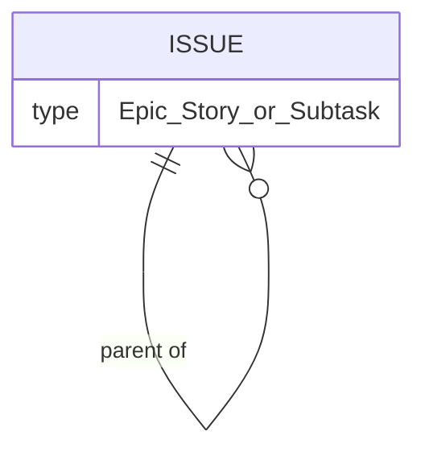
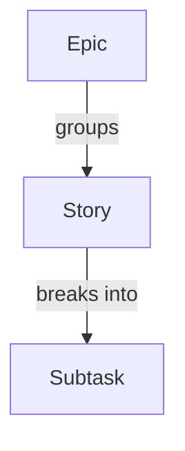

# ADR 003: Unified issue model with a typed hierarchy

* **Status:** Accepted
* **Date:** 2026-08-31

## Background

Keel is growing from a home page and a few routes into a personal issue tracker. Its core domain includes Epics, Stories, and Subtasks. These three concepts share almost everything — a title, a description, a status, an assignee, comments, time estimates, and dependencies — and differ mainly in where they sit in a hierarchy: an Epic groups Stories, and a Story is broken into Subtasks. This is the first ADR that shapes the tracker's domain, so the question of how to represent these three concepts must be settled before boards, sprints, and dependencies are built on top of them.

## Problem Statement

Epics, Stories, and Subtasks need one clear representation. If each is modeled as its own separate entity, every shared behavior — status changes, assignment, comments, estimates, dependency links — must be defined and maintained three times, and any feature that acts on "an issue" must special-case three shapes. Keel needs a single, coherent notion of an issue that still expresses the Epic → Story → Subtask hierarchy.

## Objective(s)

- Represent Epics, Stories, and Subtasks as **one issue concept** distinguished by a type.
- Express the hierarchy through a **parent relationship** so an Epic groups Stories and a Story groups Subtasks.
- Let every cross-cutting concern (status, assignment, comments, estimates, dependencies) attach to the single issue concept once.

## Scope and Deliverables

### In-Scope

- A single **Issue** entity with a **type** of *Epic*, *Story*, or *Subtask*.
- A self-referencing **parent** relationship forming Epic → Story → Subtask.
- Progress and effort rollup from children to their parent.

### Out-of-Scope

- Additional issue types beyond Epic, Story, and Subtask (for example Bug, Task, or Spike).
- Configurable or user-defined type hierarchies.
- The physical representation of the issue (storage engine, schema, keys) — left open at the system level.

### Deliverables

- A conceptual **Issue** entity in the [domain model](../architecture/domain-model.md) with a type discriminator and a parent link.
- Documented hierarchy rules: Epics group Stories; Stories group Subtasks.

## Technical Requirements

* **Must** model Epic, Story, and Subtask as one issue concept carrying a type.
* **Must** express the hierarchy through a parent relationship rather than separate entities.
* **Must** let status, assignment, comments, time estimates, and dependencies attach to the single issue concept.
* **May** aggregate child progress and effort onto a parent issue.
* **Must Not** duplicate shared issue behavior across three separate entities.
* **Must Not** introduce new issue types in v1.

## Consequences

* **Good:** Shared behavior is defined once; any feature can operate on "an issue" uniformly; adding a future type is a small change rather than a new entity.
* **Bad:** A single entity must carry attributes and hierarchy rules that only apply to certain types, so type-specific constraints have to be enforced deliberately.
* **Risk:** Without clear parent rules, invalid hierarchies (for example a Subtask directly under an Epic, or an Epic with a parent) could be created; the hierarchy constraints must be stated and honored.

## System Design

### Technical Stack and Architecture

This is a **conceptual domain decision**, not an implementation one. It defines the shape of the central entity that later features — boards ([ADR 005](ADR-005.md)), sprints, dependencies ([ADR 006](ADR-006.md)), comments, and time estimates — all build on. It does not choose a storage technology or dictate module layout; those belong to the component/blueprint stage.

### UML Diagrams

## Supporting Documentation

* [Domain model](../architecture/domain-model.md)
* [Capabilities](../architecture/capabilities.md)
* [v1 scope](../architecture/v1-scope.md)
* [Glossary](../architecture/glossary.md)
* [ADR 004: Shared fixed workflow](ADR-004.md)
* [ADR 005: Boards, sprints, and backlog as views over one issue pool](ADR-005.md)
* [ADR 006: Ticket dependencies as directed typed links](ADR-006.md)
* [Package version (single source of truth)](../version.md)
