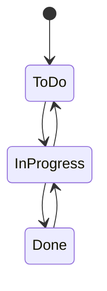
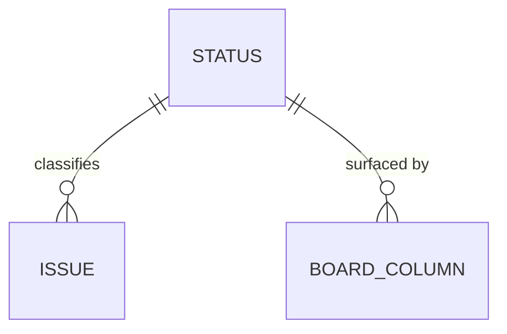

# ADR 004: Shared fixed workflow with a small status set

* **Status:** Accepted, extended by [ADR 013](ADR-013.md)
* **Date:** 2026-08-31

> **Extension.** [ADR 013](ADR-013.md) fixes the labels this ADR deliberately left open — *To Do*, *In Progress*, *In Review*, *Blocked*, *Done* — and records that the set is realized as an enumeration in code rather than as stored records. [ADR 020](ADR-020.md) adds *Cancelled*.

## Background

Every issue in Keel moves through states as work progresses, and the Kanban board's columns are drawn from those states ([ADR 005](ADR-005.md)). Full issue trackers let each project define its own statuses and transitions. Keel is a personal tool for one owner plus up to two collaborators, so the machinery a large team needs to negotiate a shared workflow is out of proportion here.

## Problem Statement

Keel needs an agreed set of statuses that issues move through and that a board can render as columns. The question is whether that workflow should be **configurable per project** — with user-defined statuses and transition rules — or a **single fixed set shared across all projects**. A configurable workflow adds setup, editing, and validation surface that a 1–3 person tool does not need in v1.

## Objective(s)

- Give every issue a clear status drawn from one shared, well-known set.
- Keep the workflow **fixed and shared across all projects** in v1.
- Provide a stable basis for board columns without per-project configuration.

## Scope and Deliverables

### In-Scope

- A single, small, ordered set of statuses (for example *To Do*, *In Progress*, *Done*) shared by all projects.
- Each issue is classified by exactly one status at a time.
- Board columns are surfaced from this shared status set ([ADR 005](ADR-005.md)).

### Out-of-Scope

- Per-project or user-configurable statuses and transitions.
- Enforced transition rules (which status may follow which).
- Swimlanes, sub-states, or resolution categories.
- The exact status names and count as a fixed contract — the decision is that the set is small, shared, and fixed, not the specific labels.

### Deliverables

- A conceptual **Status** entity in the [domain model](../architecture/domain-model.md), shared across projects.
- Documented statement that the workflow is fixed and shared in v1, with configurable workflows deferred.

## Technical Requirements

* **Must** provide one shared, ordered status set used by every project.
* **Must** classify each issue by exactly one status at a time.
* **Must** let the Kanban board derive its columns from this status set.
* **May** allow the specific status labels to be refined later without making the workflow per-project.
* **Must Not** offer per-project or user-configurable workflows in v1.
* **Must Not** require transition rules between statuses in v1.

## Consequences

* **Good:** Zero workflow setup; every project's board reads the same way; the model stays small and predictable.
* **Bad:** A project with genuinely different states cannot tailor its workflow in v1.
* **Risk:** A future move to configurable workflows will need to migrate existing issues onto the new model; keeping the shared set small limits that cost.

## System Design

### Technical Stack and Architecture

A conceptual decision about the **Status** entity and its relationship to issues and boards. It deliberately keeps configuration out of v1 and does not specify how statuses are stored or how transitions are enforced. It underpins [ADR 005](ADR-005.md), where board columns are surfaced from these statuses.

### UML Diagrams

## Supporting Documentation

* [Domain model](../architecture/domain-model.md)
* [Capabilities](../architecture/capabilities.md)
* [v1 scope](../architecture/v1-scope.md)
* [Glossary](../architecture/glossary.md)
* [ADR 003: Unified issue model with a typed hierarchy](ADR-003.md)
* [ADR 005: Boards, sprints, and backlog as views over one issue pool](ADR-005.md)
* [Package version (single source of truth)](../version.md)
