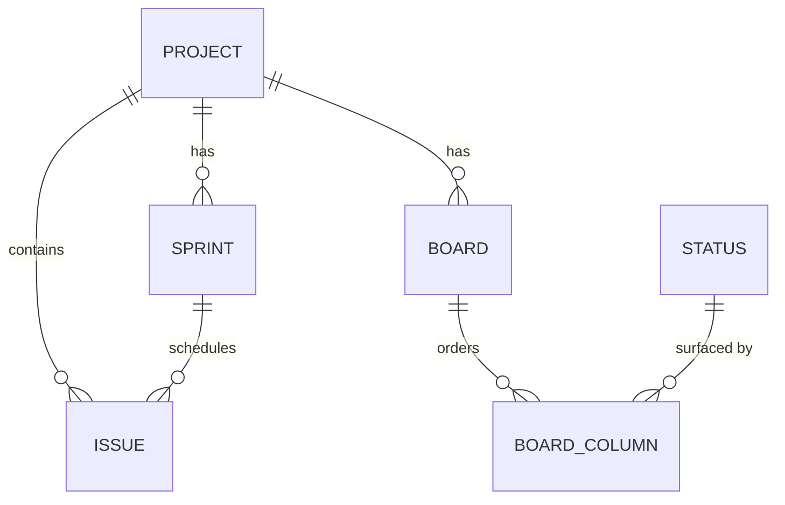
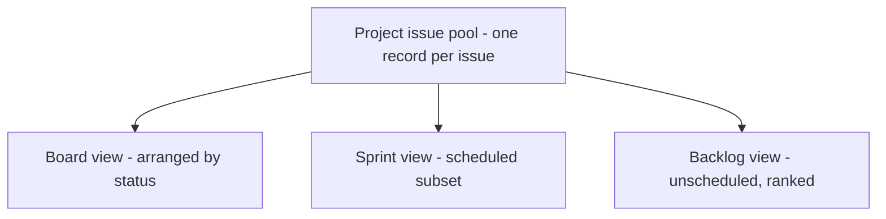
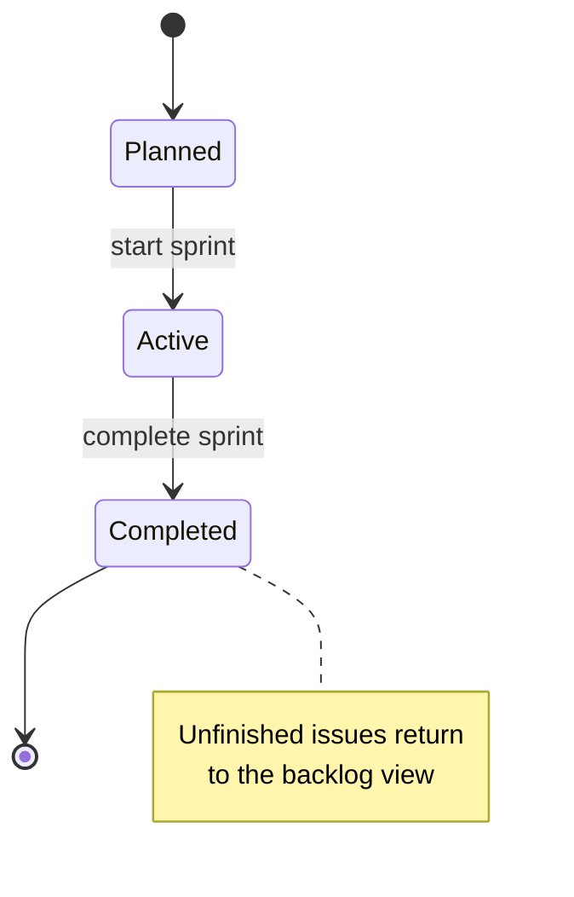

# ADR 005: Boards, sprints, and backlog as views over one issue pool

* **Status:** Accepted, amended by [ADR 013](ADR-013.md)
* **Date:** 2026-08-31

> **Amendment.** [ADR 013](ADR-013.md) supersedes this ADR's backlog rules. The backlog carries no manual rank and is ordered by creation date, and membership is defined as having no sprint assigned and not being done, rather than not being scheduled in an *active* sprint. [ADR 013](ADR-013.md) also fixes the sprint lifecycle details this ADR left open. Everything else here stands.

## Background

Keel presents a project's work three ways: on a **Kanban board**, inside a **sprint**, and in the **backlog**. In many trackers these feel like separate places that "hold" issues. But an issue on the board, an issue committed to a sprint, and an issue waiting in the backlog are the *same* issue seen through different lenses. With the unified issue from [ADR 003](ADR-003.md) and the shared statuses from [ADR 004](ADR-004.md) established, Keel must decide how boards, sprints, and the backlog relate to issues.

## Problem Statement

If a board, a sprint, and the backlog each own their own copy or list of issues, the same issue can drift out of sync between views — a status changed on the board might not match what the sprint or backlog shows — and there is no single source of truth for an issue's state. Keel needs boards, sprints, and the backlog to be **consistent views over one pool of issues per project**, not independent containers.

## Objective(s)

- Keep exactly one authoritative record per issue, scoped to its project.
- Make the **board** a view that arranges the project's issues by status.
- Make **sprint membership** an attribute of an issue rather than a separate copy.
- Make the **backlog** a derived, ordered view of the project's unscheduled issues rather than a stored list of its own.

## Scope and Deliverables

### In-Scope

- **Board** as a per-project view; its columns surface the shared statuses ([ADR 004](ADR-004.md)) and its cards are the project's issues.
- **Sprint** as a time-boxed grouping; an issue's membership in a sprint is an attribute of that issue.
- **Backlog** as the ordered set of a project's issues **not** scheduled in an active sprint, sorted by each issue's backlog rank.
- Sprint lifecycle *planned → active → completed*, where completing a sprint returns unfinished issues to the backlog view.

### Out-of-Scope

- Boards, sprints, or the backlog owning or duplicating issue records.
- Multiple boards behaving as independent issue stores.
- Physical ordering, ranking, or storage mechanics — conceptual only.

### Deliverables

- Conceptual **Board**, **Board column**, and **Sprint** entities in the [domain model](../architecture/domain-model.md), each relating to the shared issue pool.
- Documented statement that the **backlog is a view, not an entity**.

## Technical Requirements

* **Must** keep one authoritative issue record per issue, scoped to a project.
* **Must** treat the board as a view that arranges a project's issues by status.
* **Must** represent sprint membership as an attribute of the issue, not a separate copy.
* **Must** derive the backlog from issues that are unscheduled in an active sprint, ordered by backlog rank.
* **Must** return unfinished issues to the backlog view when a sprint completes.
* **May** allow more than one board per project as additional views over the same pool.
* **Must Not** let a board, sprint, or backlog store an independent copy of an issue.

## Consequences

* **Good:** An issue has one state that every view agrees on; moving an issue between backlog, sprint, and board changes attributes, not identity; no synchronization between views is needed.
* **Bad:** "The backlog" and "the board" are not things you can point at and edit directly — they are computed from issue attributes, which is a subtler mental model.
* **Risk:** Correct derivation depends on issues carrying accurate sprint membership and backlog rank; if those attributes are wrong, the views mislead. The rules for what appears in each view must be stated clearly.

## System Design

### Technical Stack and Architecture

A conceptual decision about how **Board**, **Sprint**, and the **backlog** relate to the unified **Issue** ([ADR 003](ADR-003.md)) and shared **Status** ([ADR 004](ADR-004.md)). Boards and sprints are entities; the backlog is a derived view. No storage, ordering, or query mechanism is specified here.

### UML Diagrams

## Supporting Documentation

* [Domain model](../architecture/domain-model.md)
* [Capabilities](../architecture/capabilities.md)
* [Use cases](../architecture/use-cases.md)
* [v1 scope](../architecture/v1-scope.md)
* [Glossary](../architecture/glossary.md)
* [ADR 003: Unified issue model with a typed hierarchy](ADR-003.md)
* [ADR 004: Shared fixed workflow](ADR-004.md)
* [Package version (single source of truth)](../version.md)
