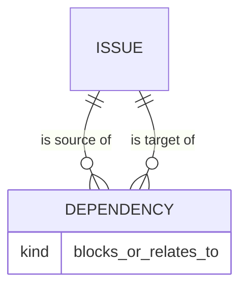
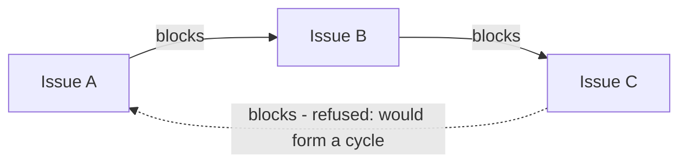

# ADR 006: Ticket dependencies as directed typed links with cycle prevention

* **Status:** Accepted, extended by [ADR 014](ADR-014.md)
* **Date:** 2026-08-31

> **Extension.** [ADR 014](ADR-014.md) resolves the cross-project scoping question this ADR left open — links may cross projects, so cycle detection runs over the global blocking graph — and specifies how unresolved blocking surfaces outside the issue detail page.

## Background

Keel tracks relationships between issues: one Story may need to finish before another can start, and two issues may simply be related without any ordering. With the unified issue established ([ADR 003](ADR-003.md)), Keel needs a way to record these connections. The Epic → Story → Subtask hierarchy from [ADR 003](ADR-003.md) already expresses containment; dependencies are a *different* kind of relationship — about ordering and association, not parentage — and must be modeled separately.

## Problem Statement

Keel needs to represent connections between issues that carry meaning and, in some cases, direction. A blocking relationship is inherently directional ("A blocks B" is not the same as "B blocks A"), while a plain association is not. If blocking links are allowed to form a cycle — A blocks B, B blocks C, C blocks A — the result is a contradiction that can never be resolved. Keel needs typed, directional dependencies and must prevent blocking cycles.

## Objective(s)

- Record connections between two issues as **directed, typed links** distinct from the parent hierarchy.
- Support at least a **blocks** link (directional, ordering) and a **relates-to** link (non-directional association).
- **Prevent cycles** among *blocks* links so blocking relationships stay resolvable.
- Let a user see, for any issue, what it blocks, what blocks it, and what it relates to.

## Scope and Deliverables

### In-Scope

- A **Dependency** relationship between a source issue and a target issue, carrying a kind (*blocks* or *relates-to*).
- Prevention of any *blocks* link that would introduce a cycle across the blocking graph.
- The ability to view an issue's incoming and outgoing dependencies.

### Out-of-Scope

- Dependency kinds beyond *blocks* and *relates-to* (for example *duplicates*, *clones*).
- Cross-project dependencies (v1 dependencies are within the domain of issues as modeled; scoping rules beyond this are not decided here).
- Automatic status changes triggered by dependencies (for example auto-blocking an issue).
- Graph storage, traversal, or cycle-detection algorithms — these are implementation concerns.

### Deliverables

- A conceptual **Dependency** entity in the [domain model](../architecture/domain-model.md) linking two issues with a kind.
- Documented rule that *blocks* links must not form a cycle.

## Technical Requirements

* **Must** represent a dependency as a directed link from a source issue to a target issue with a kind.
* **Must** support a *blocks* kind (directional) and a *relates-to* kind (association).
* **Must** reject a *blocks* link whose creation would form a cycle in the blocking graph.
* **Must** let a user see an issue's incoming and outgoing dependencies.
* **May** treat *relates-to* as symmetric for display purposes.
* **Must Not** conflate dependencies with the parent/child hierarchy from [ADR 003](ADR-003.md).
* **Must Not** add further dependency kinds in v1.

## Consequences

* **Good:** Blocking order is explicit and always resolvable; associations and ordering constraints are captured distinctly from the hierarchy; a user can see what any issue waits on.
* **Bad:** Cycle prevention means some link attempts are refused, which the user must understand and work around by restructuring dependencies.
* **Risk:** Cycle detection must consider the whole blocking graph, not just the two issues involved; if this check is incomplete, contradictory blocking chains could slip in.

## System Design

### Technical Stack and Architecture

A conceptual decision defining the **Dependency** relationship over the unified **Issue** ([ADR 003](ADR-003.md)). It states the kinds of link and the acyclicity constraint for blocking links, without prescribing how the graph is stored or how cycles are detected.

### UML Diagrams

## Supporting Documentation

* [Domain model](../architecture/domain-model.md)
* [Capabilities](../architecture/capabilities.md)
* [Use cases](../architecture/use-cases.md)
* [v1 scope](../architecture/v1-scope.md)
* [Glossary](../architecture/glossary.md)
* [ADR 003: Unified issue model with a typed hierarchy](ADR-003.md)
* [Package version (single source of truth)](../version.md)
