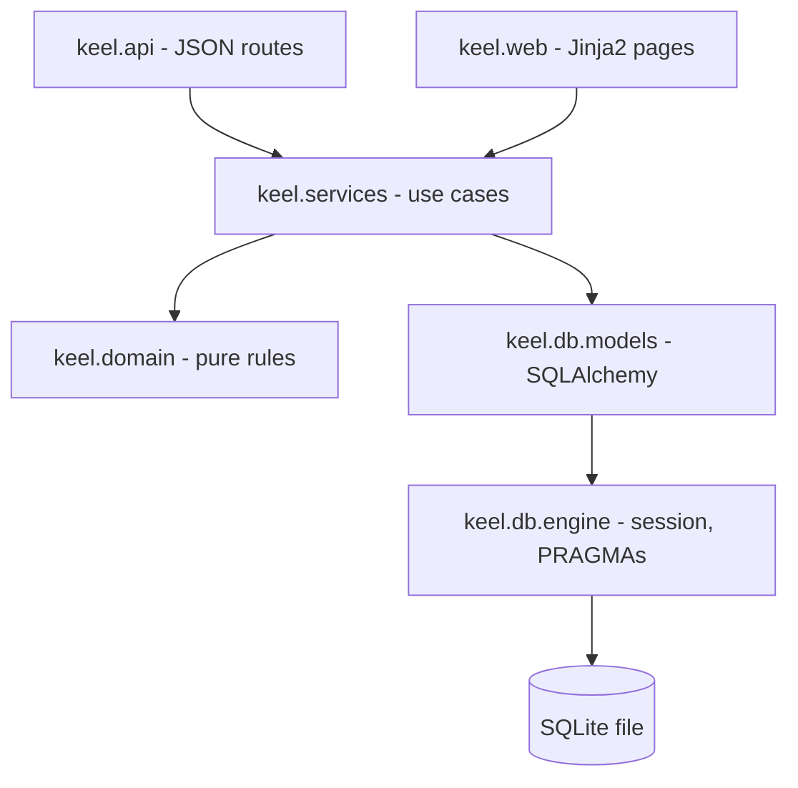
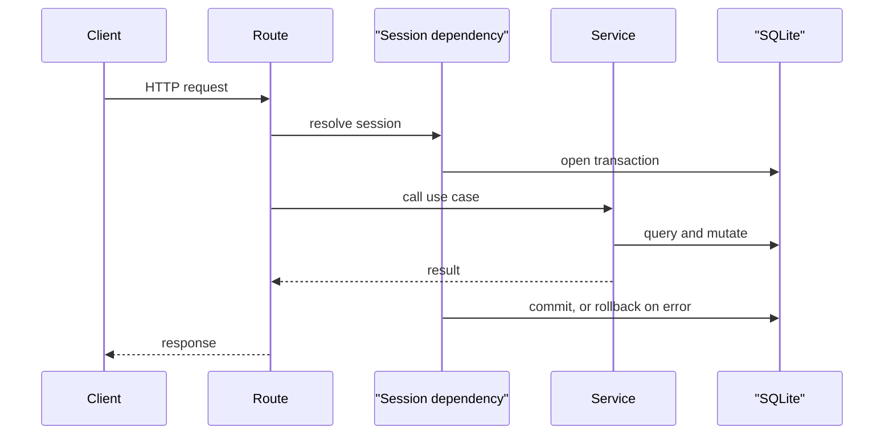
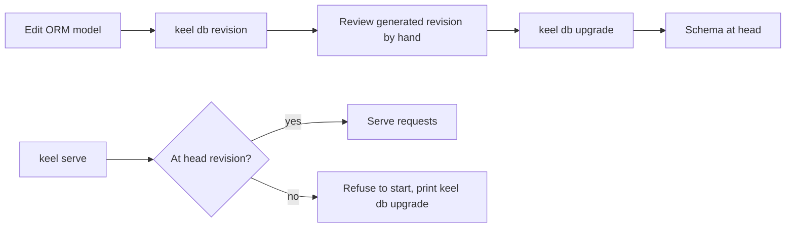

# ADR 007: Persistence via SQLite, SQLAlchemy, and Alembic

* **Status:** Accepted
* **Date:** 2026-08-31

## Background

The system-level architecture deliberately stopped short of choosing a storage technology. The [domain model](../architecture/domain-model.md) states only that every entity "must be durably stored," and [v1 scope](../architecture/v1-scope.md) lists the persistence technology choice as deferred, reasoning that *how* entities persist is a low-level detail below the system level. That deferral has now been reached: nothing further can be built until it is resolved.

Keel is a self-hosted personal tool for one owner plus up to two collaborators, started with `keel serve` and used through a browser. It runs as a single local process with no database server available.

## Problem Statement

Keel's entities are more relational than a personal tool usually implies. The [domain model](../architecture/domain-model.md) contains a self-referencing Epic to Story to Subtask hierarchy, a directed dependency graph requiring whole-graph cycle detection ([ADR 006](ADR-006.md)), and views that are derived rather than stored ([ADR 005](ADR-005.md)) — the backlog is computed by query. Effort rollup aggregates across a subtree. Choosing storage badly means hand-writing indexing, ordering, and referential integrity in application code.

Separately, the deferred feature queue in [v1 scope](../architecture/v1-scope.md) — authentication, labels, attachments, activity history — guarantees the schema will change after real data exists. Without versioned migrations, every schema change destroys the user's work.

## Objective(s)

- Persist every entity durably in a single local file requiring no server process.
- Support relational traversal, filtering, and aggregation directly rather than in application code.
- Satisfy the repository's strict mypy configuration without pervasive type escapes.
- Allow the schema to evolve without data loss.
- Locate the data file predictably regardless of the working directory `keel serve` runs from.

## Scope and Deliverables

### In-Scope

- SQLite as the storage engine, in a single file.
- SQLAlchemy 2.0 declarative ORM models using typed `Mapped[...]` annotations.
- Alembic for versioned schema migrations, applied explicitly.
- A `KEEL_DATABASE_URL` setting with an OS user-data-directory default.
- Session lifecycle bound to the request through a FastAPI dependency.

### Out-of-Scope

- Any client-server database such as PostgreSQL or MySQL.
- Asynchronous database access; sessions are synchronous and endpoints are defined with `def` so FastAPI runs them in its threadpool.
- Multi-tenancy, sharding, replication, or connection pooling beyond SQLite defaults.
- Backup, export, and import tooling.
- The concrete table definitions, which belong to the [data model](../design/data-model.md).

### Deliverables

- A `keel.db` package holding engine construction, session dependency, declarative base, and ORM models.
- An Alembic environment with an initial migration covering the full v1 schema.
- `keel db upgrade` and `keel db revision` CLI subcommands.
- A startup check that refuses to serve when the schema is not at the head revision.
- The [data model](../design/data-model.md) documenting the physical schema.

## Technical Requirements

* **Must** store all entities in one SQLite database file requiring no separate server.
* **Must** define ORM models with SQLAlchemy 2.0 typed `Mapped[...]` annotations that pass mypy in strict mode.
* **Must** enable `PRAGMA foreign_keys=ON` on every connection, since SQLite does not enforce foreign keys by default.
* **Must** manage schema changes through Alembic revisions, with the initial revision covering the entire v1 schema.
* **Must** resolve the database location from `KEEL_DATABASE_URL`, defaulting to a `keel.db` file inside the OS user-data directory resolved by `platformdirs`.
* **Must** apply migrations only on explicit invocation of `keel db upgrade`; `keel serve` verifies the revision and refuses to start when it is behind, naming the command to run.
* **Must** scope a session to a single request via a FastAPI dependency, committing on success and rolling back on failure.
* **May** express derived views such as the backlog as query-level filters rather than stored state.
* **Must Not** access the database from the `keel.domain` layer, which stays pure and free of SQLAlchemy imports.
* **Must Not** use `create_all` to provision schema outside of test fixtures.
* **Must Not** introduce asynchronous sessions or an async SQLite driver in v1.

## Consequences

* **Good:** Relational queries, ordering, and aggregation come from the database; a single file is trivially backed up by copying; the file lives in a stable location independent of the working directory; migrations mean schema changes never cost data; strict typing is preserved end to end.
* **Good:** Explicit migration application means a schema upgrade is never a silent side effect of starting the server, which matters when the file holds real work.
* **Bad:** Three new runtime dependencies (SQLAlchemy, Alembic, and `platformdirs`), alongside Jinja2 from [ADR 009](ADR-009.md). Every model change now requires generating a revision, which is friction during rapid iteration.
* **Bad:** The default data location is not visible in the project folder, so users must be told where it is; a `keel db path` command is not in scope, so the location is documented in the README instead.
* **Risk:** SQLite serializes writes, so concurrent writes from two collaborators can raise "database is locked." Mitigated by a busy timeout and short transactions; at one to three users, contention is unlikely.
* **Risk:** Alembic autogenerate does not detect every change, notably `CHECK` constraint edits and some SQLite `ALTER` limitations. Mitigated by reviewing every generated revision by hand and using batch operations for SQLite alterations.

## System Design

### Technical Stack and Architecture

SQLAlchemy 2.0 declarative models live in `keel/db/models/`, one module per entity, over a shared `DeclarativeBase`. `keel/db/engine.py` builds the engine from `KEEL_DATABASE_URL` and registers a connect-time listener applying `PRAGMA foreign_keys=ON` and a busy timeout. `keel/db/session.py` exposes a session dependency with per-request commit or rollback.

Only the service layer touches models; the domain layer operates on plain values, and the API and web layers receive already-loaded objects. Alembic lives in `migrations/` at the repository root, with its `env.py` reading the same settings object, so the CLI and the application never disagree about which file they address.

Dependency versions are pinned exactly in `pyproject.toml`, matching the existing convention.

### UML Diagrams

Layer placement and dependency direction:

Request-scoped session lifecycle:

Migration and startup flow:

## Supporting Documentation

* [Data model (physical schema)](../design/data-model.md)
* [Module layout](../design/module-layout.md)
* [Implementation plan](../design/implementation-plan.md)
* [Domain model](../architecture/domain-model.md)
* [v1 scope](../architecture/v1-scope.md)
* [Capabilities](../architecture/capabilities.md)
* [ADR 005: Boards, sprints, and backlog as views over one issue pool](ADR-005.md)
* [ADR 006: Ticket dependencies as directed typed links](ADR-006.md)
* [ADR 008: Layered module structure](ADR-008.md)
* [Package version (single source of truth)](../version.md)
