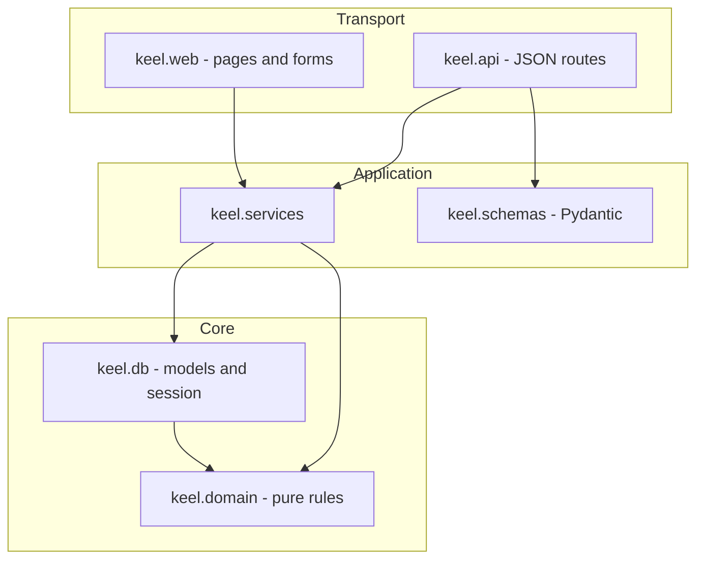
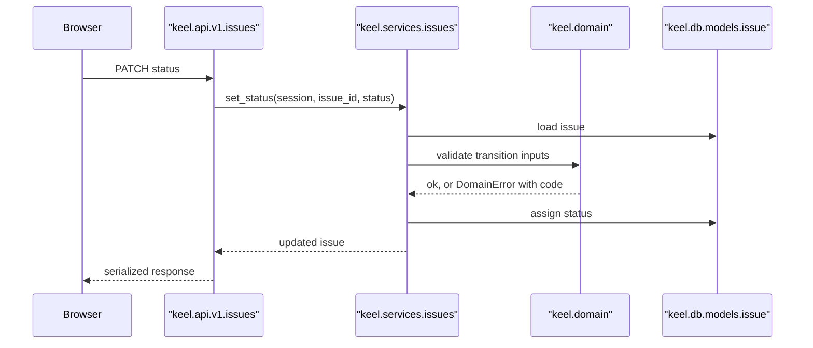

# ADR 008: Layered module structure with a pure domain core

* **Status:** Accepted
* **Date:** 2026-08-31

## Background

Keel's existing source tree is eight modules: an app factory, a CLI, settings, path helpers, a version reader, one HTML layout helper, and two route modules. That is proportional to a home page and a health check. The v1 [capabilities](../architecture/capabilities.md) add project management, a typed issue hierarchy, a Kanban board, sprints, dependencies, comments, and effort rollup, each with rules that must hold no matter which entry point invoked them.

Those rules are not incidental. [ADR 003](ADR-003.md) warns that "invalid hierarchies could be created; the hierarchy constraints must be stated and honored," and [ADR 006](ADR-006.md) warns that "cycle detection must consider the whole blocking graph." Both are correctness properties that must not depend on whether a request arrived from the browser, the JSON API, or the CLI.

## Problem Statement

Keel now has three entry points into the same behaviour: server-rendered pages, a JSON API, and a CLI. If business rules live in route handlers, each rule must be repeated per entry point and will eventually diverge — the browser path will enforce a constraint the API path does not. Keel needs one place where each operation lives and one place where each invariant is enforced, with a structure that says clearly where any new piece of code belongs.

## Objective(s)

- Give every business operation exactly one implementation, shared by all entry points.
- Keep pure rules — hierarchy validation, cycle detection, duration parsing, rollup arithmetic — independently testable without a database or an HTTP client.
- Establish an unambiguous dependency direction so the structure cannot quietly rot.
- Keep transport concerns out of business logic and business logic out of transport.

## Scope and Deliverables

### In-Scope

- A package layout for `src/keel/` organized by technical layer.
- A stated dependency rule between layers.
- Separation of Pydantic API schemas from SQLAlchemy ORM models.
- A domain error type carrying a machine-readable code, translated to HTTP by the transport layers.

### Out-of-Scope

- Repository or unit-of-work abstractions over SQLAlchemy; services use the session directly.
- Dependency injection frameworks beyond FastAPI's own dependency system.
- Splitting Keel into multiple installable packages.
- Vertical feature packaging, evaluated and rejected below.

### Deliverables

- The `keel.domain`, `keel.db`, `keel.services`, `keel.schemas`, `keel.api`, and `keel.web` packages.
- The [module layout](../design/module-layout.md) documenting each layer's responsibility and contents.

## Technical Requirements

* **Must** place every business operation in `keel.services`, so the API, web, and CLI layers contain no business rules.
* **Must** keep `keel.domain` pure: no imports of SQLAlchemy, FastAPI, or any `keel` layer above it.
* **Must** enforce a one-directional dependency rule — transport depends on services, services depend on domain and models, and nothing depends upward.
* **Must** define Pydantic schemas separately from ORM models, so the API contract and the table definitions can change independently.
* **Must** raise domain rule violations as a typed error carrying a machine-readable code, translated to a response by each transport layer.
* **May** split a layer's module into several modules per entity as it grows.
* **Must Not** query the database from route handlers or templates.
* **Must Not** import FastAPI request or response types inside `keel.services`.

## Consequences

* **Good:** A rule is written and tested once; the browser and the API cannot disagree. Pure rules are unit-testable with no fixtures, which supports the repository's 90% unit coverage gate. New code has an obvious home.
* **Bad:** More indirection than the current tree: a simple read now passes through a route, a service, and a model. Small operations feel over-structured.
* **Bad:** Keeping schemas separate from models means some field definitions appear twice, and the two can drift if a change is made in only one place.
* **Risk:** Layering erodes silently when a route reaches for the session because a service call feels like too much ceremony. Mitigated by the explicit dependency rule and by keeping the session dependency out of route signatures except where it is passed straight to a service.

## System Design

### Technical Stack and Architecture

Six packages under `src/keel/`, alongside the existing `app.py`, `cli.py`, `settings.py`, `paths.py`, and `version.py`.

`keel.domain` holds pure functions and value types: duration parsing and formatting, hierarchy validation, blocking-graph cycle detection, rollup arithmetic, the status and type enumerations, and the domain error hierarchy. It imports only the standard library.

`keel.db` holds the declarative base, engine and session machinery, and one ORM model module per entity.

`keel.services` holds one module per entity or use-case group. A service receives a session and plain arguments, applies domain rules, mutates models, and returns models or plain values.

`keel.schemas` holds Pydantic request and response models.

`keel.api` holds JSON routes under a versioned prefix plus the exception handlers that turn domain errors into coded responses. `keel.web` holds page routes, form-handling routes, and Jinja2 templates.

### UML Diagrams

Package structure:

Where a single operation flows, using a status change from the board:

## Supporting Documentation

* [Module layout](../design/module-layout.md)
* [Data model](../design/data-model.md)
* [API reference](../design/api.md)
* [Capabilities](../architecture/capabilities.md)
* [ADR 003: Unified issue model with a typed hierarchy](ADR-003.md)
* [ADR 006: Ticket dependencies as directed typed links](ADR-006.md)
* [ADR 007: Persistence via SQLite, SQLAlchemy, and Alembic](ADR-007.md)
* [ADR 010: One versioned JSON API with coded domain errors](ADR-010.md)
