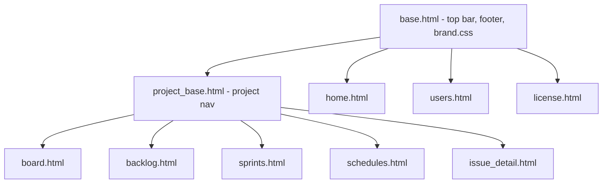
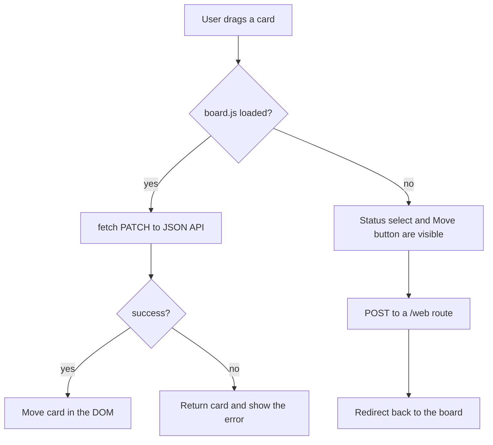

# ADR 009: Server-rendered Jinja2 pages with progressively enhanced vanilla JavaScript

* **Status:** Accepted
* **Date:** 2026-08-31

## Background

Keel's HTML is currently assembled from Python f-strings in `src/keel/web/layout.py`, which renders the shared chrome — the sticky top bar of [ADR 001](ADR-001.md) and the version footer of [ADR 002](ADR-002.md) — around a block of markup passed in by each route. That works for the two pages that exist.

The v1 [capabilities](../architecture/capabilities.md) add a project list, issue creation and detail pages, a backlog, sprint pages, a user list, and a Kanban board. [ADR 005](ADR-005.md) makes moving a card between columns the primary way an issue's status changes, and [use cases](../architecture/use-cases.md) describes it as "moves a card from one column to the next." Dragging is inherently a client-side interaction.

## Problem Statement

Two questions must be answered together. First, how HTML is produced: hand-written f-strings become unmaintainable across a dozen pages with loops and conditionals, and make HTML-escaping mistakes easy to introduce. Second, how the board becomes draggable: drag-and-drop requires client-side JavaScript, but adopting a front-end framework or a component library would introduce a build step, a package manager, and a toolchain for a tool whose entire deployment story is `keel serve`.

Keel also runs locally and may run offline, so any client-side asset loaded from a content delivery network is a liability rather than a convenience.

## Objective(s)

- Render every page on the server, preserving the existing shared chrome.
- Make templates composable so the chrome is defined once and pages fill in content.
- Provide drag-and-drop on the board without adopting a front-end framework, a bundler, or a package manager.
- Keep the application fully usable when JavaScript is unavailable or fails to load.
- Keep the whole UI testable through the existing HTTP-level test suites.

## Scope and Deliverables

### In-Scope

- Jinja2 as the server-side template engine, with `base.html` carrying the chrome and pages extending it.
- Hand-written vanilla JavaScript using the browser's native HTML Drag and Drop API, served from the existing `/assets` mount.
- A plain-form fallback for every action that JavaScript enhances.
- Retention of the brand tokens in `assets/brand.css` and the palette recorded in [brand colors](../brand-colors.md).

### Out-of-Scope

- Any front-end framework or component library, including React, Vue, HTMX, and drag-and-drop libraries such as SortableJS.
- A JavaScript build step, bundler, transpiler, package manager, or `node_modules` directory.
- Loading any asset from a content delivery network.
- Client-side routing or a single-page application shell.
- A JavaScript test runner; see [ADR 010](ADR-010.md) and the [implementation plan](../design/implementation-plan.md) for how the enhanced paths are verified.

### Deliverables

- A `keel/web/templates/` tree with `base.html` and one template per page.
- `assets/js/board.js` implementing card dragging against the JSON API.
- Fallback form controls on every board card and every enhanced control.
- The [UI design](../design/ui.md) documenting the page inventory, template hierarchy, and JavaScript behaviour.

## Technical Requirements

* **Must** render all pages on the server with Jinja2, with autoescaping enabled.
* **Must** define the chrome from [ADR 001](ADR-001.md) and [ADR 002](ADR-002.md) once in `base.html`, with pages extending it rather than repeating it.
* **Must** implement drag-and-drop with the browser's native HTML Drag and Drop API in hand-written JavaScript, with no third-party front-end dependency.
* **Must** serve all JavaScript from the existing `/assets` static mount, never from a remote origin.
* **Must** provide a working non-JavaScript path for every enhanced action, so a card's status can be changed by a plain form submission.
* **Must** have enhancing scripts hide their own fallback controls at load time, so the fallback is visible precisely when the script did not run.
* **Must** read the product version through `keel.version.package_version()` rather than embedding it in a template.
* **May** add further small scripts for other pages, subject to the same constraints.
* **Must Not** introduce a package manager, bundler, or build step of any kind.
* **Must Not** make any page reachable only through JavaScript.

## Consequences

* **Good:** No build step means `keel serve` remains the whole deployment story, and the repository stays Python-only. Pages work offline. Template inheritance removes the duplication and escaping risk of hand-assembled HTML. Every page remains assertable with the existing httpx-based tests.
* **Good:** The fallback requirement means keyboard-only and assistive-technology users are never locked out of moving an issue, since native drag-and-drop is poorly accessible on its own.
* **Bad:** Every enhanced interaction is implemented twice — once as JavaScript against the JSON API and once as a form posting to a redirecting route — which is more code and two paths to keep in step.
* **Bad:** The native drag-and-drop API is verbose and has well-known inconsistencies across browsers, so the board script will be longer and fussier than the equivalent using a library.
* **Risk:** The fallback path can silently rot, because the JavaScript path is the one exercised by hand during development. Mitigated by testing the fallback routes automatically, which is where the automated coverage of these interactions lives.
* **Risk:** Jinja2 templates escape by default, but a future `| safe` filter would reintroduce injection risk. Mitigated by never marking user-supplied content safe.

## System Design

### Technical Stack and Architecture

Jinja2 templates live in `src/keel/web/templates/`, registered through a `templates_dir()` helper in `keel/paths.py` that follows the existing repository-root-then-package fallback pattern, with a package-data entry in `pyproject.toml` so templates survive installation. `base.html` reproduces the chrome currently emitted by `keel/web/layout.py`, which is retired.

JavaScript lives in `assets/js/`, already served by the `/assets` mount configured in `keel/app.py`. `board.js` attaches `dragstart` and `drop` handlers to cards and columns, sends the resulting status change to the JSON API, and moves the card in the DOM once the response succeeds, restoring it on failure. On load it sets a marker on the document root that CSS uses to hide fallback controls.

Web form routes live under a `/web` prefix, accept form encoding, call the same services, and redirect back to the originating page so a refresh does not resubmit.

### UML Diagrams

Template inheritance:

The two paths for one action:

## Supporting Documentation

* [UI design](../design/ui.md)
* [API reference](../design/api.md)
* [Implementation plan](../design/implementation-plan.md)
* [Brand colors](../brand-colors.md)
* [Capabilities](../architecture/capabilities.md)
* [Use cases](../architecture/use-cases.md)
* [ADR 001: Persistent top menu bar](ADR-001.md)
* [ADR 002: Persistent version footer](ADR-002.md)
* [ADR 005: Boards, sprints, and backlog as views over one issue pool](ADR-005.md)
* [ADR 010: One versioned JSON API with coded domain errors](ADR-010.md)
* [Package version (single source of truth)](../version.md)
