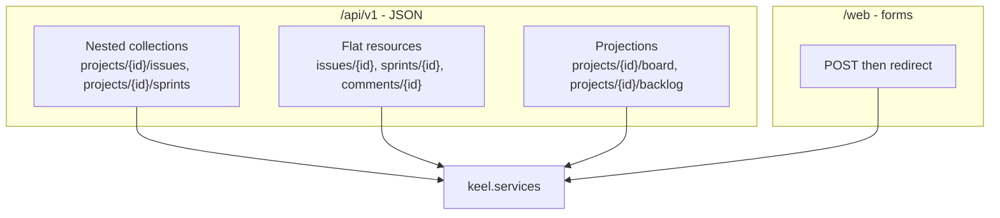
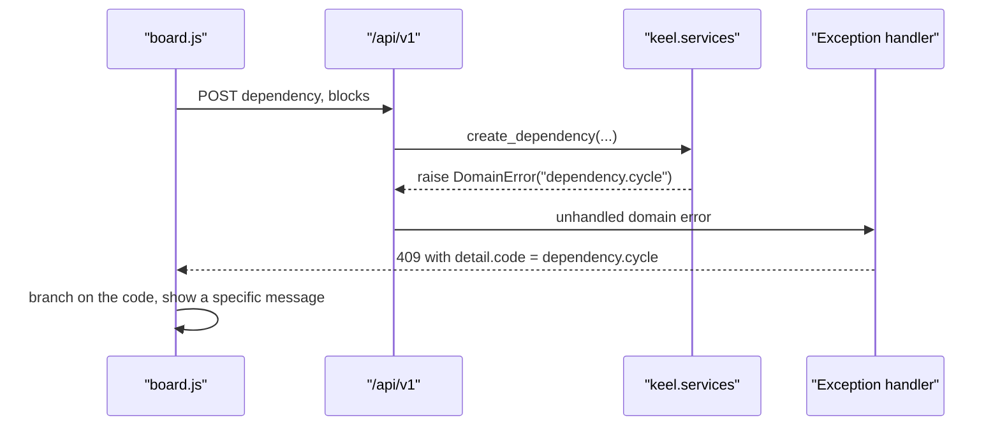

# ADR 010: One versioned JSON API with coded domain errors

* **Status:** Accepted
* **Date:** 2026-08-31

## Background

[Capabilities](../architecture/capabilities.md) requires Keel to "continue to expose the JSON API and the `keel` CLI as the existing platform does." With [ADR 009](ADR-009.md) settling that the board is enhanced by hand-written JavaScript, that JavaScript needs somewhere to send a status change when a card is dropped. Keel therefore has three consumers of the same operations: the browser's scripts, the CLI, and any external caller.

Several v1 rules refuse operations rather than performing them. [ADR 006](ADR-006.md) requires that a *blocks* link forming a cycle be rejected, [ADR 003](ADR-003.md) requires hierarchy constraints to be honored, and the rules recorded in [ADR 012](ADR-012.md), [ADR 013](ADR-013.md), and [ADR 014](ADR-014.md) add more. A refusal must be intelligible to a script, not just to a person reading a sentence.

## Problem Statement

Two decisions are needed. First, whether the browser gets its own private endpoints or shares the public API — building a second, parallel route surface for the UI doubles the operations to maintain and lets the two drift. Second, how a refused operation is reported: FastAPI's default error body is a human-readable string, so client JavaScript that wants to distinguish "this would create a cycle" from "that issue does not exist" would have to match on prose, which breaks the moment the wording is improved.

There is also a shape question. Every issue belongs to exactly one project ([ADR 005](ADR-005.md)), which argues for nesting issue routes under projects; but a dropped card knows only its own identifier, so requiring a project in the path would force the UI to carry redundant context.

## Objective(s)

- Serve the browser, the CLI, and external callers from one set of endpoints.
- Let the API evolve without breaking existing callers.
- Make refusals machine-readable so client code can react to a specific rule.
- Keep single-resource operations addressable by the resource identifier alone.

## Scope and Deliverables

### In-Scope

- A versioned `/api/v1` prefix for all JSON endpoints.
- Nested routes for collection operations and flat routes for single-resource operations.
- A domain error response body carrying a stable code, a message, and structured context.
- A registry of error codes and the HTTP statuses they map to.
- Separate `/web` form routes that redirect, serving the non-JavaScript fallback of [ADR 009](ADR-009.md).

### Out-of-Scope

- Authentication and authorization on the API; see [ADR 011](ADR-011.md).
- Pagination, rate limiting, and caching headers, all disproportionate at one to three users.
- Hypermedia controls or a schema negotiation mechanism beyond the generated OpenAPI document.
- Long-lived API stability guarantees; v1 may change until it is released.
- A second API version.

### Deliverables

- A `keel.api.v1` package with one route module per resource.
- Exception handlers translating domain errors into coded responses.
- The [API reference](../design/api.md) listing every endpoint, payload, and error code.

## Technical Requirements

* **Must** expose all JSON endpoints under a `/api/v1` prefix.
* **Must** serve the browser's scripts, the CLI, and external callers from the same endpoints, with no parallel private JSON API for the UI.
* **Must** nest collection routes under their parent (`/api/v1/projects/{project_id}/issues`) and expose single-resource routes flat (`/api/v1/issues/{issue_id}`), so a client holding only an issue identifier can act on it.
* **Must** return domain rule violations as HTTP 409 with a body of `{"detail": {"code": ..., "message": ..., "context": {...}}}`, where the code is stable and machine-readable.
* **Must** use HTTP 404 for missing resources and HTTP 422 for request-shape validation, keeping FastAPI's default validation body.
* **Must** define request and response bodies as Pydantic schemas distinct from ORM models, per [ADR 008](ADR-008.md).
* **Must** handle non-JavaScript form submissions on separate `/web` routes that redirect after a successful post, since a form cannot consume a JSON response.
* **May** add convenience read endpoints, such as a board or backlog projection, that return data already derivable from other endpoints.
* **Must Not** place business rules in route handlers.
* **Must Not** change the meaning of an existing error code; a new rule gets a new code.

## Consequences

* **Good:** One implementation per operation, so the UI cannot enforce a rule the API misses. Client JavaScript can branch on a code and show a specific message. The generated OpenAPI document at `/docs` and `/redoc` describes exactly what the UI itself uses, so it stays honest.
* **Good:** Flat single-resource routes keep the board script simple: a dropped card sends one request against its own identifier.
* **Bad:** Two route surfaces still exist — JSON under `/api/v1` and redirecting forms under `/web` — because forms and scripts genuinely need different responses. They call the same services, but they are two sets of handlers to maintain.
* **Bad:** A mixed nesting convention is less uniform than an entirely flat or entirely nested API, and requires the reference documentation to state which operations live where.
* **Risk:** Error codes become an informal contract that client code depends on, so renaming one silently breaks the UI. Mitigated by treating codes as append-only and listing them in one place.
* **Risk:** Wrapping the coded object inside FastAPI's `detail` key means a caller that reads `detail` as a string will receive an object instead. Mitigated by using the wrapper consistently for every domain error so callers see one shape.

## System Design

### Technical Stack and Architecture

`keel.api.v1` holds one module per resource — users, projects, issues, sprints, boards, dependencies, comments — aggregated into a single router mounted at `/api/v1` by `keel.app`. Handlers resolve a session and the current user, call a service, and serialize the result through a Pydantic schema.

Domain errors are raised by services as a typed exception carrying a code, a message, and a context mapping. A single exception handler registered in `keel.api.errors` renders them for JSON routes; the web layer catches the same exception and re-renders the originating page with the message attached, so both entry points honor the same refusal.

Codes are namespaced by entity, for example `issue.has_children`, `issue.invalid_parent_type`, `dependency.cycle`, `dependency.self_link`, `sprint.already_active`, `project.duplicate_key`, and `user.in_use`. The [API reference](../design/api.md) holds the authoritative list.

### UML Diagrams

Route surface:

How a refusal reaches each consumer:

## Supporting Documentation

* [API reference](../design/api.md)
* [UI design](../design/ui.md)
* [Module layout](../design/module-layout.md)
* [Capabilities](../architecture/capabilities.md)
* [ADR 003: Unified issue model with a typed hierarchy](ADR-003.md)
* [ADR 006: Ticket dependencies as directed typed links](ADR-006.md)
* [ADR 008: Layered module structure](ADR-008.md)
* [ADR 009: Server-rendered Jinja2 pages with vanilla JavaScript](ADR-009.md)
* [ADR 011: Ambient identity without authentication](ADR-011.md)
