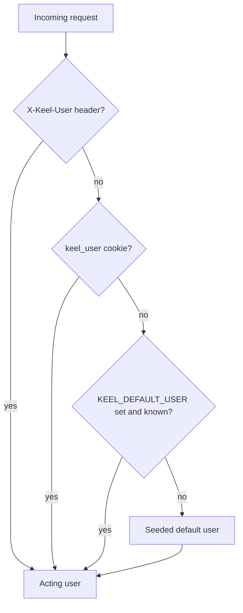
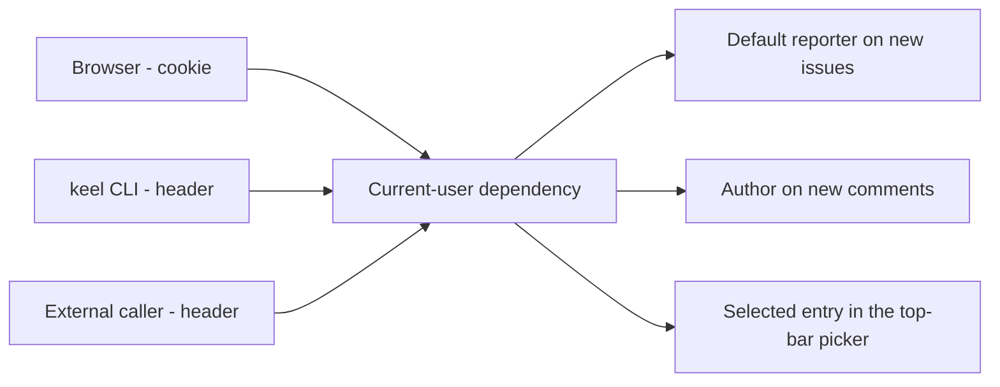

# ADR 011: Ambient identity without authentication

* **Status:** Accepted
* **Date:** 2026-08-31

## Background

[v1 scope](../architecture/v1-scope.md) defers authentication and identity entirely, on the grounds that "v1 assumes a trusted local/small-group context." [Context](../architecture/context.md) states there are no external identity providers and that in v1 all users are trusted equals.

Yet the [domain model](../architecture/domain-model.md) still contains a `User`, because issues carry a reporter and an assignee and comments carry an author. So Keel needs people without needing logins.

## Problem Statement

Someone has to be recorded as the reporter of a new issue and the author of a new comment. Without authentication there is no session to read that from, so the acting identity must come from somewhere else — and from somewhere that works for all three entry points, since the browser, the JSON API, and the CLI all create records.

Requiring every write to name its actor explicitly would push the burden onto every form and every API call. Configuring a single fixed owner would make collaborator-authored comments impossible to attribute. Neither fits a tool where two or three people share a machine or a small network.

## Objective(s)

- Determine an acting user for any request without a login step.
- Let a browser user switch identity in one click and have it persist across pages.
- Give the CLI and API callers an equally simple way to declare who they are.
- Never leave the acting user undefined, including on a freshly created database.
- Be explicit that this mechanism is not a security control.

## Scope and Deliverables

### In-Scope

- A user picker in the shared top bar that writes a cookie.
- An `X-Keel-User` request header for API and CLI callers.
- A deterministic resolution order with a configured fallback.
- Seeding one default user when the database has none.
- Web and JSON routes for managing users.

### Out-of-Scope

- Passwords, sessions, tokens, single sign-on, and any form of credential.
- Roles, permissions, and ownership checks; all users remain equal per [context](../architecture/context.md).
- Signing or tamper-proofing the cookie, which would imply a security guarantee this does not provide.
- Per-user preferences beyond the selected identity.
- Any protection of the API surface.

### Deliverables

- Current-user resolution shared by the API and web layers.
- A user picker rendered in `base.html`.
- A users management page and JSON routes.
- First-run seeding of a default user.

## Technical Requirements

* **Must** resolve the acting user in this order: the `X-Keel-User` header, then the `keel_user` cookie, then the `KEEL_DEFAULT_USER` setting, then the single seeded default user.
* **Must** accept either a user identifier or a display name in the header and cookie.
* **Must** seed one user on a database with no users, named from `KEEL_DEFAULT_USER` when set and otherwise from the operating system username, so the picker is never empty.
* **Must** default an issue's reporter and a comment's author to the resolved acting user when the caller does not specify one.
* **Must** render a user picker in the shared top bar from [ADR 001](ADR-001.md) that sets the cookie and returns to the current page.
* **Must** state in user-facing documentation that identity is declared rather than verified.
* **May** let a caller override reporter or assignee explicitly on a write.
* **Must Not** treat the resolved user as an authorization decision or gate any operation on it.
* **Must Not** reject a request because no user was named; the fallback chain always yields one.
* **Must Not** persist anything about the acting user beyond the cookie holding the selection.

## Consequences

* **Good:** No login stands between the owner and their work, which matches the tool's purpose. Attribution still works, so comments and assignments are meaningful. The CLI and scripts pass one header. A fresh install is immediately usable because a user always exists.
* **Bad:** Identity is trivially spoofable — anyone can send any header or edit the cookie. This is acceptable only because [context](../architecture/context.md) places Keel inside a trusted local context, and it means Keel must never be exposed to an untrusted network.
* **Bad:** The fallback chain has four steps, so "why is this issue reported by that person" has more than one possible answer and needs documenting.
* **Risk:** The deferred authentication work in [v1 scope](../architecture/v1-scope.md) will replace this mechanism, and any code that reads the cookie directly will need revisiting. Mitigated by resolving the current user in exactly one place that a future authentication layer can replace.
* **Risk:** Seeding from the operating system username can produce an odd display name. Mitigated by making the name editable on the users page.

## System Design

### Technical Stack and Architecture

A single dependency in `keel.web.context` resolves the acting user and is shared by both transport layers: the JSON routes depend on it directly, and the web routes pass the result into the template context so the picker can render the current selection. Because it is one dependency, replacing it with real authentication later is a contained change.

Seeding runs during application startup against the already-migrated database, inserting a default user only when the users table is empty.

The picker is a small form in `base.html` posting to a `/web/user` route, which sets the `keel_user` cookie and redirects back to the referring page, so it works without JavaScript like everything else in [ADR 009](ADR-009.md).

### UML Diagrams

Resolution order:

Consumers of the resolved identity:

## Supporting Documentation

* [API reference](../design/api.md)
* [UI design](../design/ui.md)
* [Context](../architecture/context.md)
* [Domain model](../architecture/domain-model.md)
* [v1 scope](../architecture/v1-scope.md)
* [ADR 001: Persistent top menu bar](ADR-001.md)
* [ADR 009: Server-rendered Jinja2 pages with vanilla JavaScript](ADR-009.md)
* [ADR 010: One versioned JSON API with coded domain errors](ADR-010.md)
