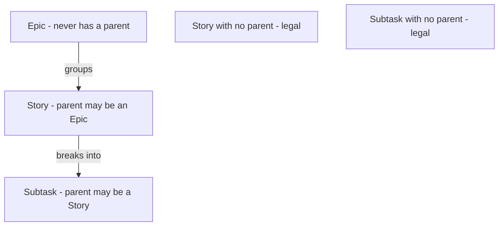
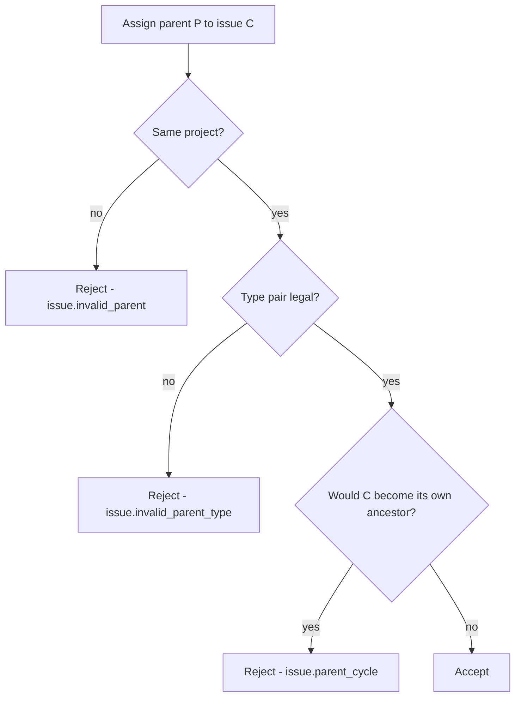
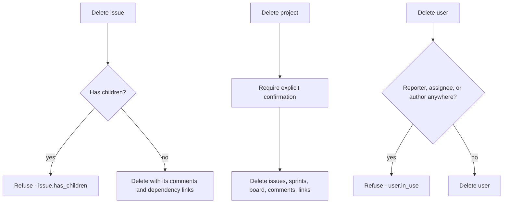

# ADR 012: Issue realization — identifiers, hierarchy, effort, and deletion

* **Status:** Accepted
* **Date:** 2026-08-31

## Background

[ADR 003](ADR-003.md) established the Issue as one entity carrying a type of Epic, Story, or Subtask, with the hierarchy expressed through a parent relationship. It deliberately stopped at the conceptual level, and closed by naming a risk: "without clear parent rules, invalid hierarchies (for example a Subtask directly under an Epic, or an Epic with a parent) could be created; the hierarchy constraints must be stated and honored."

The [domain model](../architecture/domain-model.md) likewise gives an issue an estimated time and a time remaining without saying what unit those are in, and [capabilities](../architecture/capabilities.md) requires viewing effort "aggregated from child issues" without defining what happens when a parent has both its own estimate and children with estimates. [ADR 003](ADR-003.md) mentions progress rollup without defining progress. Nothing anywhere describes deletion.

## Problem Statement

Four gaps must be closed before issues can be implemented. Which parent/child combinations are legal, and whether a parent is ever required. How an issue is referred to in a URL and in conversation, since the domain model gives an issue no human-facing identifier. What unit effort is captured in, and how a parent's own effort relates to its children's. And what happens when an issue, project, or user is deleted while other records still point at it — a question the architecture documents never raise but which the parent, dependency, and comment relationships all force.

## Objective(s)

- State the hierarchy constraints precisely enough to enforce, closing the risk named in [ADR 003](ADR-003.md).
- Give every issue a short, readable, stable identifier suitable for URLs and for quoting.
- Define a single effort unit and a rollup rule that hides nothing.
- Define progress concretely enough to render.
- Define deletion behaviour so no operation silently destroys work.

## Scope and Deliverables

### In-Scope

- Per-project issue keys of the form `KEY-123`, backed by a project key and a per-project sequence.
- Type-specific parent rules with optional parents at every level.
- Effort stored in whole minutes, entered and displayed in shorthand.
- Rollup showing an issue's own effort alongside a subtree total.
- Progress as the proportion of descendant issues in the terminal status.
- Deletion rules for issues, projects, and users.

### Out-of-Scope

- Additional issue types, excluded by [ADR 003](ADR-003.md).
- Moving an issue between projects, which would break the immutability of its key.
- Reusing the numbers of deleted issues.
- Soft deletion, archiving, and an undo mechanism.
- Activity history, deferred by [v1 scope](../architecture/v1-scope.md).

### Deliverables

- Hierarchy, effort, and deletion rules implemented in `keel.domain` and enforced in `keel.services`.
- Duration parsing and formatting helpers.
- The corresponding schema and constraints in the [data model](../design/data-model.md).

## Technical Requirements

### Identifiers

* **Must** give every project a short key, uppercase, two to ten characters, starting with a letter and unique across projects.
* **Must** assign each issue a number that increments per project, so an issue is referred to as `KEEL-12`.
* **Must** treat an issue's key as immutable once assigned, and never reuse the number of a deleted issue.
* **Must** address issues by key in web page URLs, while the JSON API addresses them by internal identifier.

### Hierarchy

* **Must** reject a parent for an issue of type Epic.
* **Must** require that a Story's parent, when set, is an Epic.
* **Must** require that a Subtask's parent, when set, is a Story.
* **Must** allow a Story or a Subtask to exist with no parent.
* **Must** require that a parent belongs to the same project as its child.
* **Must** reject a parent assignment that would make an issue its own ancestor.
* **Must Not** allow an issue's type to change in a way that would violate these rules while it has a parent or children.

### Effort

* **Must** store estimated time and time remaining as whole non-negative minutes.
* **Must** accept shorthand input of the form `2h`, `90m`, `1h 30m`, and `1d`, where one day means eight hours, and display effort in the same shorthand.
* **Must** show a parent both its own estimate and remaining time and a rolled-up total covering itself and all descendants.
* **Must** treat an unset estimate as absent rather than as zero when displaying, while contributing nothing to a total.
* **Must** define progress for an issue with descendants as the proportion of those descendants whose status is the terminal status, presented as a count and a proportion.
* **Must Not** overwrite an issue's own estimate or remaining time with a value derived from its children.

### Deletion

* **Must** refuse to delete an issue that has children, reporting the code `issue.has_children`, so the user moves or deletes them first.
* **Must** delete a childless issue together with its comments and every dependency link naming it as source or target.
* **Must** delete a project together with its issues, sprints, board, comments, and dependency links, behind an explicit confirmation that names what will be removed.
* **Must** refuse to delete a user who is still a reporter, an assignee, or a comment author, reporting the code `user.in_use`.
* **Must Not** delete any record implicitly as a side effect of an unrelated operation.

## Consequences

* **Good:** The hierarchy risk from [ADR 003](ADR-003.md) is closed with rules narrow enough to implement as a single validation function and test exhaustively. Readable keys make issues quotable in commit messages and conversation. Showing own and rolled-up effort side by side means no number is silently replaced. Refusing destructive deletes protects work in a tool with no undo and no activity history.
* **Bad:** Optional parents at every level mean orphaned Stories and Subtasks are legal, so views must handle unparented issues everywhere rather than assuming a tree.
* **Bad:** Per-project sequences require a counter on the project and a serialized increment, which is a small write contention point on a database that already serializes writes.
* **Bad:** Refusing to delete an issue with children makes clearing out a large Epic tedious, since it must be emptied from the leaves upward.
* **Risk:** Shorthand duration parsing is a small language, and lenient parsing could accept `1h30` or `1.5h` inconsistently. Mitigated by defining the accepted forms narrowly and rejecting anything else with a validation error.
* **Risk:** Count-based progress treats a five-minute Subtask and a three-day Subtask as equal, so a progress bar can overstate how much work is done. Accepted deliberately as the simplest rule that is never wrong about counts; effort totals sit alongside it for the fuller picture.
* **Risk:** Cascading a project delete removes dependency links whose other end lives in another project, per [ADR 014](ADR-014.md), so a surviving issue can silently lose a blocker. Mitigated by naming cross-project links in the confirmation.

## System Design

### Technical Stack and Architecture

Hierarchy validation, duration parsing and formatting, and rollup arithmetic live in `keel.domain` as pure functions with no database access, per [ADR 008](ADR-008.md), which makes them directly unit-testable against the repository's coverage gate. `keel.services.issues` composes them: it loads the issue and any proposed parent, calls the validator, and raises a coded domain error on refusal.

Issue numbering uses a counter column on the project, incremented within the same transaction that inserts the issue. Rollup is computed with a recursive query over the parent relationship rather than by loading a subtree into memory.

Deletion refusals are enforced in services so the user receives a coded, explicable error, with database-level restrictions acting only as a backstop. The relationships that are meant to cascade do so at the database level.

### UML Diagrams

Legal hierarchy:

Parent assignment validation:

Deletion policy:

## Supporting Documentation

* [Data model](../design/data-model.md)
* [API reference](../design/api.md)
* [UI design](../design/ui.md)
* [Domain model](../architecture/domain-model.md)
* [Capabilities](../architecture/capabilities.md)
* [Glossary](../architecture/glossary.md)
* [ADR 003: Unified issue model with a typed hierarchy](ADR-003.md)
* [ADR 008: Layered module structure](ADR-008.md)
* [ADR 013: Planning realization](ADR-013.md)
* [ADR 014: Cross-project dependencies and cycle detection](ADR-014.md)
