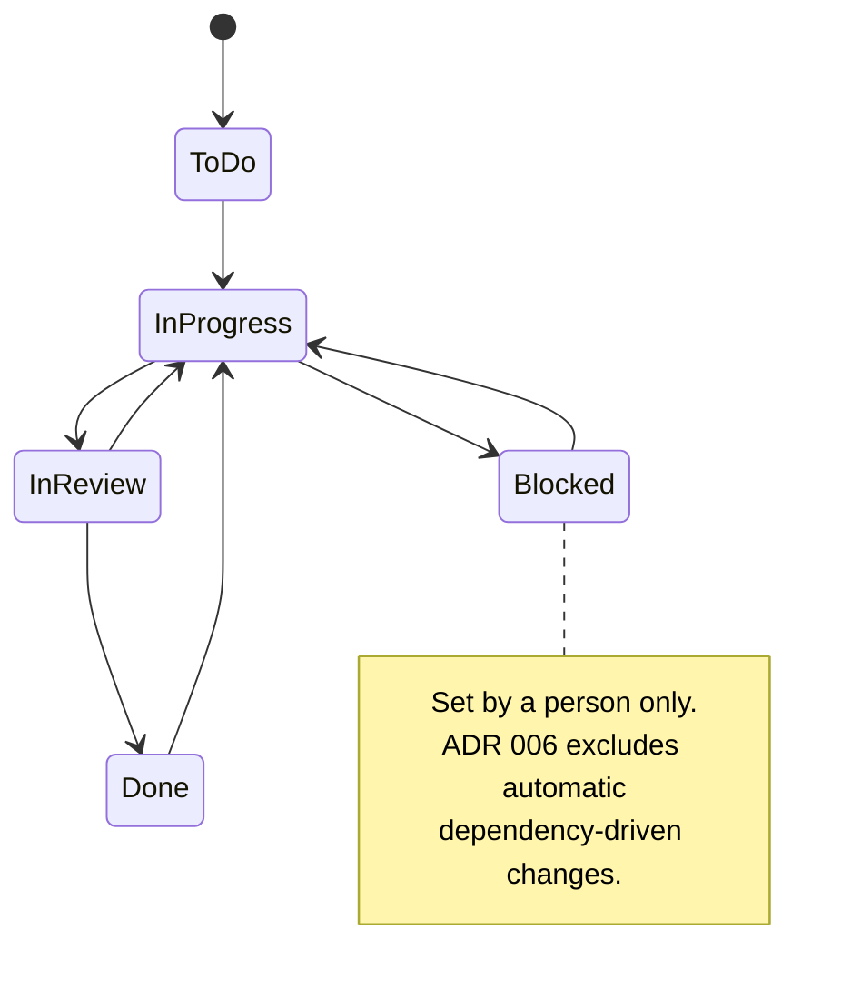
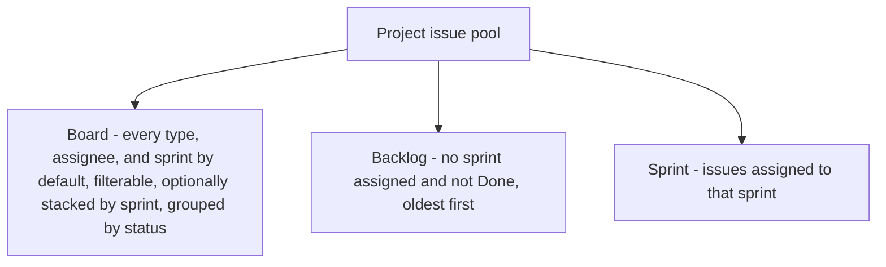
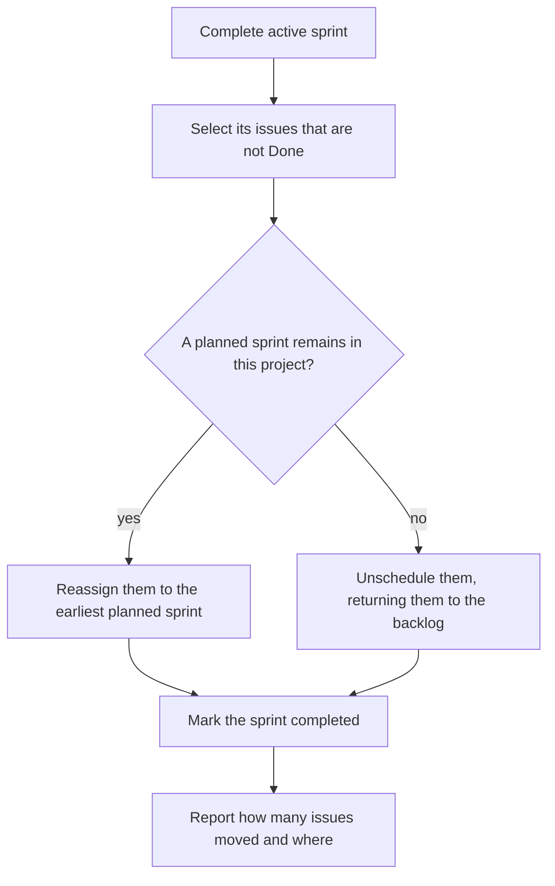

# ADR 013: Planning realization — statuses, board and backlog composition, sprint lifecycle

* **Status:** Accepted
* **Date:** 2026-09-02

> **Amendment.** The board filters by sprint, including unscheduled, and can stack a row of columns per sprint. Work-in-progress limits and swimlanes other than sprint remain out of scope.

## Background

[ADR 004](ADR-004.md) decided that the workflow is one small, ordered, fixed status set shared by every project, and explicitly placed "the exact status names and count" out of scope: "the decision is that the set is small, shared, and fixed, not the specific labels." Those labels must now be chosen.

[ADR 005](ADR-005.md) decided that boards, sprints, and the backlog are views over one issue pool, defined the backlog as "the ordered set of a project's issues not scheduled in an active sprint, sorted by each issue's backlog rank," and left the sprint lifecycle at *planned to active to completed* with unfinished issues returning to the backlog. It did not say what counts as unfinished, whether two sprints can be active at once, or which issue types belong on a board.

During blueprinting the owner determined that hand-ordering the backlog serves no workflow they use, which contradicts the ranking requirement in [ADR 005](ADR-005.md).

## Problem Statement

Four things block implementation of the planning surfaces. The status labels are undecided, and so is whether `Status` becomes a seeded table or an enumeration in code — the [domain model](../architecture/domain-model.md) names it as an entity conceptually, but it is not user-configurable, so a table may earn nothing.

Backlog rank is required by [ADR 005](ADR-005.md) but unwanted, so the backlog needs a different ordering and that ADR needs amending rather than quietly ignoring.

The backlog definition in [ADR 005](ADR-005.md) is also awkward on inspection: reading it literally, an issue pulled into a *planned* sprint still appears in the backlog, because the sprint is not yet active, and a finished issue in a completed sprint reappears there once the sprint ends.

Finally, the sprint lifecycle is underspecified in ways that change behaviour: with no limit on active sprints, "not scheduled in an active sprint" becomes ambiguous, and "unfinished issues return to the backlog" gives no definition of unfinished.

## Objective(s)

- Fix the concrete status set and how it is realized in code and storage.
- Define which issues appear on the board and in the backlog, and in what order.
- Replace backlog ranking with an ordering that requires no manual curation.
- Make the sprint lifecycle deterministic, including what happens to incomplete work.

## Scope and Deliverables

### In-Scope

- A five-status workflow realized as an enumeration in code.
- Board composition, including type, assignee, and sprint filters, and optional separation by sprint.
- Backlog composition and ordering, amending [ADR 005](ADR-005.md).
- Single-active-sprint enforcement and carry-over on completion.
- One board created automatically per project.

### Out-of-Scope

- Per-project or configurable workflows, excluded by [ADR 004](ADR-004.md).
- Enforced transition rules between statuses, also excluded by [ADR 004](ADR-004.md).
- Multiple boards per project, permitted but not required by [ADR 005](ADR-005.md).
- Work-in-progress limits, and swimlanes other than sprint.
- Burndown, velocity, and reporting, deferred by [v1 scope](../architecture/v1-scope.md).
- Overlapping or nested sprints.

### Deliverables

- Status and sprint-state enumerations in `keel.domain`.
- Board and backlog projections in `keel.services`.
- Sprint lifecycle transitions with their invariants.
- Amendments to [ADR 005](ADR-005.md) and to the architecture documents that repeat the ranking requirement.

## Technical Requirements

### Statuses

* **Must** define exactly five ordered statuses: *To Do*, *In Progress*, *In Review*, *Blocked*, *Done*.
* **Must** treat *Done* as the single terminal status, used to decide progress rollup and sprint carry-over.
* **Must** realize the status set as an enumeration in code with a fixed ordinal, stored as a string on the issue, with no status table and no foreign key.
* **Must** generate board columns from the enumeration in ordinal order, so board columns are derived rather than stored.
* **Must** treat *Blocked* as set only by a person, never applied automatically, since [ADR 006](ADR-006.md) excludes dependency-triggered status changes.
* **May** rename a label later without making the workflow per-project, per [ADR 004](ADR-004.md).
* **Must Not** enforce which status may follow which.

### Board

* **Must** create exactly one board per project, automatically, with no board management interface.
* **Must** show all three issue types as cards by default, with the type shown on the card.
* **Must** provide a filter that restricts the board to chosen issue types, applied at query time.
* **Must** provide a filter that restricts the board to a chosen assignee, including unassigned, applied at query time.
* **Must** provide a filter that restricts the board to a chosen sprint, including unscheduled, applied at query time.
* **Must** let the board stack a row of columns per sprint, including unscheduled, as an optional grouping of the same cards.
* **Must** change an issue's status when its card is moved to another column.
* **Must** show a marker on a card whose blockers are unresolved, as required by [ADR 014](ADR-014.md).

### Backlog

* **Must** define the backlog as the project's issues that have no sprint assigned and are not in the terminal status.
* **Must** order the backlog by creation time, oldest first.
* **Must** include all three issue types in one flat list.
* **Must Not** store a manual ordering, a rank, or a priority for backlog items.

### Sprints

* **Must** allow at most one active sprint per project, enforced in the database as well as in services.
* **Must** refuse to start a sprint while another is active in the same project, reporting `sprint.already_active`.
* **Must** allow only the transitions *planned* to *active* and *active* to *completed*, refusing others with `sprint.invalid_transition`.
* **Must** define an unfinished issue as one whose status is not the terminal status.
* **Must**, on completion, move unfinished issues into the earliest remaining planned sprint of the same project, and otherwise unschedule them so they return to the backlog.
* **Must** leave finished issues attached to the completed sprint as a record of what it delivered.
* **Must** require an issue and its sprint to belong to the same project.

## Consequences

* **Good:** No workflow setup and no board setup; a project is usable the moment it is created. An enumeration means no join to render a board and no seeding step, and an invalid status is impossible. Dropping rank removes a whole interaction — the backlog needs no drag-and-drop, only the board does. Automatic carry-over means completing a sprint never strands work.
* **Good:** Redefining the backlog as "no sprint assigned" makes sprint planning behave as expected: pulling an issue into a planned sprint removes it from the backlog immediately, rather than only once the sprint starts.
* **Bad:** This amends an accepted ADR. [ADR 005](ADR-005.md) requires ordering by backlog rank and defines membership by active-sprint scheduling; both are superseded here, and several architecture documents repeat the ranking requirement and must be corrected.
* **Bad:** Creation-order backlogs cannot express priority at all, so the top of the list carries no meaning and long backlogs offer no way to surface what matters.
* **Bad:** Including *Blocked* as a status while [ADR 006](ADR-006.md) forbids automatic transitions means an issue can be genuinely blocked by a dependency and not be in the *Blocked* status, so two signals coexist. The card marker from [ADR 014](ADR-014.md) is the automatic one.
* **Risk:** Enforcing one active sprint per project relies on a partial unique index; the same rule is also checked in services so the user gets a coded error rather than a constraint failure.
* **Risk:** Carrying work into the next planned sprint can silently overfill it. Mitigated by reporting how many issues were moved and where they went on completion.
* **Risk:** Realizing `Status` as an enumeration diverges from the entity in the [domain model](../architecture/domain-model.md), so a future move to configurable workflows must introduce a table and migrate every issue's string. Accepted because the string values become the natural migration key.

## System Design

### Technical Stack and Architecture

`keel.domain.enums` holds `IssueStatus`, `IssueType`, and `SprintState`. Board columns are produced by iterating `IssueStatus` in ordinal order, so adding a status is a one-line change that the board picks up automatically.

`keel.services.boards` builds the board projection with one query per render — issues for the project, filtered by type, assignee, and sprint, grouped by status in Python — plus one aggregate query for unresolved blocker counts. The same cards are also regrouped into sprint lanes so the page can stack a row per sprint. `keel.services.backlog` applies the membership filter and creation-time ordering.

`keel.services.sprints` owns the lifecycle. Starting a sprint checks for an existing active sprint in the project. Completing one runs in a single transaction: it selects the sprint's issues that are not in the terminal status, finds the earliest remaining planned sprint by start date and then identifier, reassigns or unschedules them, marks the sprint completed, and returns a summary of what moved.

### UML Diagrams

The workflow and its board columns:

What each view contains:

Sprint completion:

## Supporting Documentation

* [Data model](../design/data-model.md)
* [API reference](../design/api.md)
* [UI design](../design/ui.md)
* [Domain model](../architecture/domain-model.md)
* [Use cases](../architecture/use-cases.md)
* [Capabilities](../architecture/capabilities.md)
* [v1 scope](../architecture/v1-scope.md)
* [ADR 004: Shared fixed workflow with a small status set](ADR-004.md)
* [ADR 005: Boards, sprints, and backlog as views over one issue pool](ADR-005.md)
* [ADR 006: Ticket dependencies as directed typed links](ADR-006.md)
* [ADR 012: Issue realization](ADR-012.md)
* [ADR 014: Cross-project dependencies and cycle detection](ADR-014.md)
