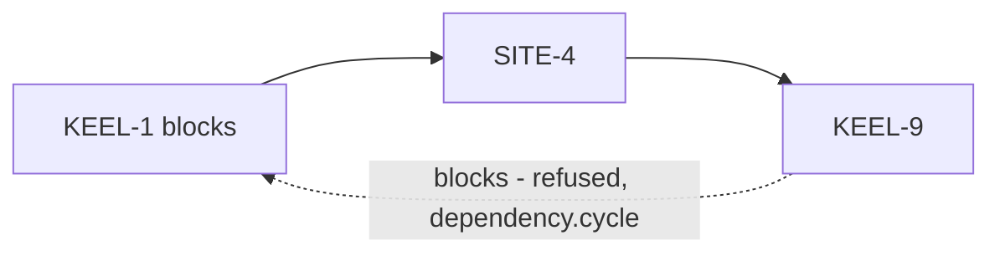
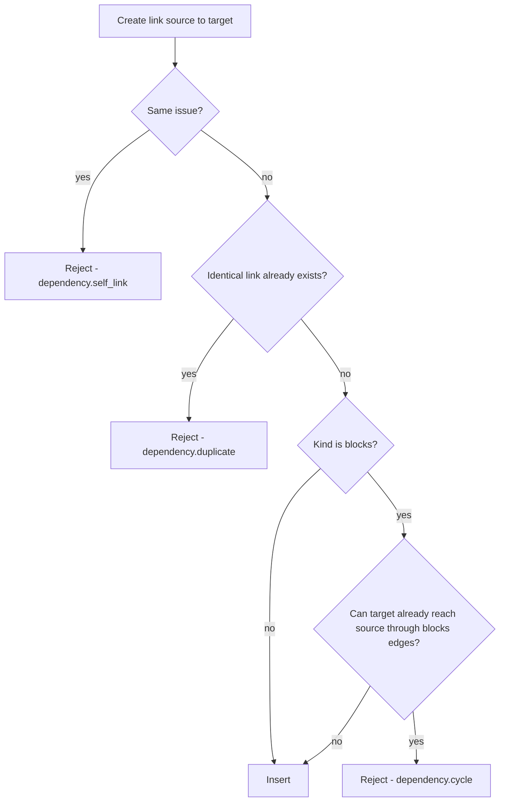
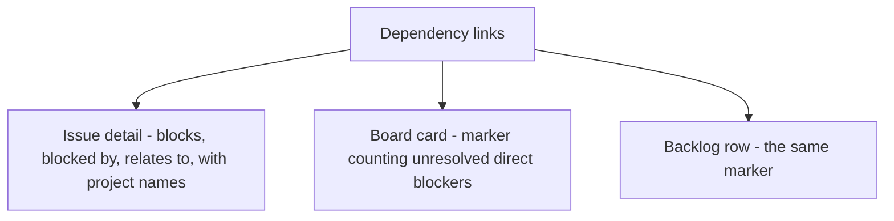

# ADR 014: Cross-project dependencies with global cycle detection

* **Status:** Accepted
* **Date:** 2026-08-31

## Background

[ADR 006](ADR-006.md) established the Dependency as a directed, typed link between a source and a target issue, carrying a kind of *blocks* or *relates-to*, with *blocks* links forbidden from forming a cycle. It placed one question explicitly out of scope: "Cross-project dependencies (v1 dependencies are within the domain of issues as modeled; scoping rules beyond this are not decided here)." It also left graph storage, traversal, and cycle detection as implementation concerns, and closed by warning that "cycle detection must consider the whole blocking graph, not just the two issues involved; if this check is incomplete, contradictory blocking chains could slip in."

Keel supports multiple coexisting projects from the start, per [v1 scope](../architecture/v1-scope.md), and a personal tool's projects are frequently not independent — a change in one is often what a task in another is waiting for.

## Problem Statement

The deferred scoping question must be answered, and it determines the shape of cycle detection. If links may only join issues in the same project, the blocking graph partitions cleanly by project and detection can be bounded to one project's issues. If links may cross projects, there is one global blocking graph, and any check bounded to a project would miss a cycle that leaves and re-enters it.

Separately, [ADR 006](ADR-006.md) requires that a user can see what an issue waits on, but only ever describes this on the issue itself. Since [ADR 013](ADR-013.md) makes *Blocked* a status a person sets by hand, nothing in the compact planning views would otherwise reveal that an issue is waiting on unfinished work, and it would be possible to start work on something unstartable without any signal.

## Objective(s)

- Decide the scoping rule [ADR 006](ADR-006.md) deferred.
- Specify cycle detection completely enough that the risk named in [ADR 006](ADR-006.md) is closed.
- Reject the degenerate link cases the conceptual ADR does not mention.
- Surface unresolved blocking in the views where planning actually happens.

## Scope and Deliverables

### In-Scope

- Dependency links between any two issues, in the same project or in different ones.
- Cycle detection over the global blocking graph.
- Rejection of self-links and duplicate links.
- A blocked marker on board cards and backlog rows.
- A full dependency section on the issue detail page.

### Out-of-Scope

- Dependency kinds beyond *blocks* and *relates-to*, excluded by [ADR 006](ADR-006.md).
- Automatic status changes driven by dependencies, also excluded by [ADR 006](ADR-006.md).
- A whole-graph visualization.
- Transitive or indirect blocker display; markers count direct blockers only.
- Cycle detection among *relates-to* links, which carry no ordering and therefore cannot contradict.

### Deliverables

- A dependency model, service, and JSON routes.
- A pure cycle-detection function in `keel.domain`.
- Blocked markers rendered on the board and backlog.
- The dependency section of the issue detail page.

## Technical Requirements

* **Must** allow a dependency to link two issues in different projects.
* **Must** run cycle detection over the entire blocking graph, disregarding project boundaries.
* **Must** reject a *blocks* link whose creation would make the graph cyclic, reporting `dependency.cycle`.
* **Must** reject a link whose source and target are the same issue, reporting `dependency.self_link`.
* **Must** reject a link duplicating an existing link of the same kind between the same ordered pair, reporting `dependency.duplicate`.
* **Must** perform the cycle check and the insert within one transaction, so two concurrent inserts cannot together create a cycle.
* **Must** show, on an issue's detail page, what it blocks, what blocks it, and what it relates to, naming the project of any issue in a different project.
* **Must** show on board cards and backlog rows a marker counting direct blockers that are not in the terminal status.
* **May** present *relates-to* as symmetric, listing it identically from either end, per [ADR 006](ADR-006.md).
* **May** compute blocker counts for a whole view in one aggregate query rather than per card.
* **Must Not** treat *relates-to* links as constraining order or contributing to cycles.
* **Must Not** change any issue's status as a consequence of a dependency.

## Consequences

* **Good:** Work that genuinely spans projects can be recorded honestly, rather than forcing everything that relates into one project. Global detection is strictly safer than a project-scoped check and closes the risk [ADR 006](ADR-006.md) identified. The card marker gives the automatic blocking signal that the manual *Blocked* status cannot, so unstartable work is visible while planning rather than only after opening an issue.
* **Bad:** Projects are no longer independent. Deleting a project, which cascades per [ADR 012](ADR-012.md), can remove links whose other end survives in another project, so a remaining issue silently loses a blocker.
* **Bad:** A cross-project link means the issue picker must search across projects, which is a wider search surface than any other part of the interface.
* **Bad:** Blocker markers cost an extra aggregate query on every board and backlog render, and add visual weight to cards that were meant to stay compact.
* **Risk:** Cycle detection traverses an unbounded graph, so a pathological chain could be slow. Mitigated by the scale — a personal tool's blocking graph is small and sparse — and by traversing only *blocks* edges with a visited set, which bounds the walk by the number of reachable issues.
* **Risk:** Detection guards only the creation path; a link inserted outside the service layer, such as by direct database editing, could introduce a cycle no check would catch. Accepted, since the same is true of every invariant in the system.

## System Design

### Technical Stack and Architecture

`keel.domain.graph` holds cycle detection as a pure function: given the existing *blocks* edges as source-to-targets adjacency and a proposed edge, it reports whether the proposed target can already reach the proposed source. It is a depth-first walk with a visited set and no database access, so it is directly unit-testable, per [ADR 008](ADR-008.md).

`keel.services.dependencies` loads the *blocks* edges reachable from the proposed target, calls the check, and inserts within the same transaction. The graph is small enough that loading edges is cheaper than a recursive query, and it keeps the rule in pure code where it is tested.

Blocker counts for a view come from one aggregate query over dependencies joined to issues, counting *blocks* links whose source is not in the terminal status, grouped by target. The board and backlog services attach the counts to their rows, so rendering costs one additional query rather than one per card.

Because links may cross projects, dependency rows carry no project column, and the delete cascade reaches them through either endpoint's issue.

### UML Diagrams

The refused case:

Creation check:

Where blocking appears:

## Supporting Documentation

* [Data model](../design/data-model.md)
* [API reference](../design/api.md)
* [UI design](../design/ui.md)
* [Domain model](../architecture/domain-model.md)
* [Use cases](../architecture/use-cases.md)
* [v1 scope](../architecture/v1-scope.md)
* [ADR 006: Ticket dependencies as directed typed links](ADR-006.md)
* [ADR 008: Layered module structure](ADR-008.md)
* [ADR 012: Issue realization](ADR-012.md)
* [ADR 013: Planning realization](ADR-013.md)
