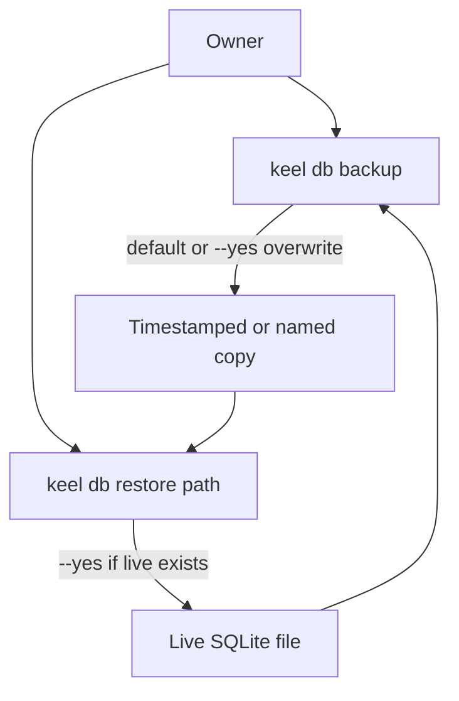
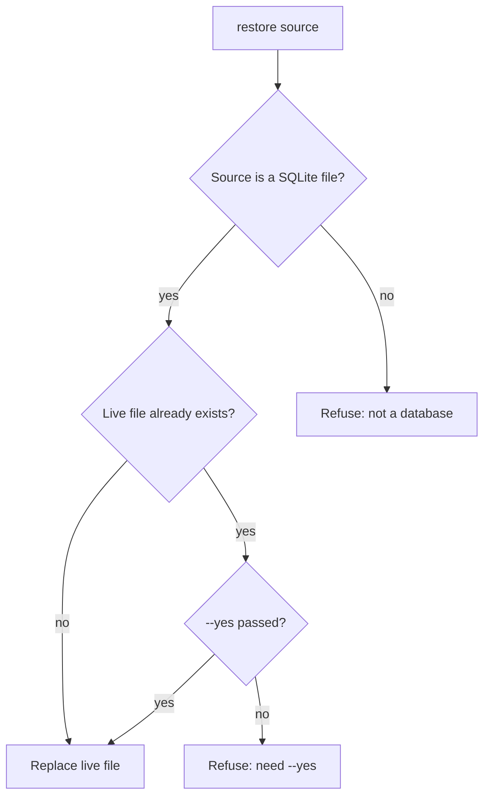

# ADR 015: Database backup and restore via the CLI

* **Status:** Accepted
* **Date:** 2026-09-02

## Background

Keel stores all work in one SQLite file under the OS user data directory, or wherever `KEEL_DATABASE_URL` points. [ADR 007](ADR-007.md) chose that file so it could be copied, and listed backup, export, and import tooling as out of scope. `keel db` already applies migrations (`upgrade`) and generates revisions. The live path is documented in the README; there is no command that copies or restores the file. Losing the user data directory, or experimenting against real issues, currently has no supported recovery path.

## Problem Statement

The owner's issues, sprints, and comments live in a single file that is easy to lose and awkward to copy by hand. Without a first-class backup and restore, a wiped data directory or a bad change is permanent. Restore is destructive: it must not silently replace a live database, and a backup taken while `keel serve` is running must still be a file that restore can use.

## Objective(s)

- Let the owner take a restorable copy of the live database in one command.
- Let the owner put a chosen copy back as the live database, with an explicit flag when that would overwrite existing data.
- Keep both commands usable while the app is running, without asking the owner to copy WAL sidecars by hand.

## Scope and Deliverables

### In-Scope

- `keel db backup` — copy the live SQLite database to a timestamped sibling file by default, or to a path the owner names.
- `keel db restore` — replace the live database with a file the owner names.
- `--yes` to overwrite: an existing backup destination, or an existing live file on restore.
- Refusal with a named path when the live file is missing (backup), the source is missing (restore), the destination already exists without `--yes`, or the URL is not a SQLite file.
- README documentation of the two commands.

### Out-of-Scope

- A web UI, download, or in-app backup.
- `keel db path` (the live location stays documented in the README; backup and restore print the paths they used).
- JSON or other export/import formats.
- Scheduled or automatic backups.
- Stopping, restarting, or detecting `keel serve` as a process.
- Choosing “the latest backup” without a path.

### Deliverables

- CLI subcommands `backup` and `restore` under `keel db`.
- This ADR, accepted, amending [ADR 007](ADR-007.md) so backup and restore are no longer out of scope there.
- README Database section updated for the two commands.

## Technical Requirements

* **Must** copy the live SQLite database when the owner runs `keel db backup`.
* **Must** write a default backup next to the live file, named from its stem plus a local-time timestamp that is safe on every OS Keel runs on (for `keel.db`, like `keel-20260902T143000.db`).
* **Must** accept an optional destination path on backup.
* **Must** restore only from an explicit source path: `keel db restore <path>`.
* **Must** print the source and destination paths on success, in the same spirit as `keel db upgrade`.
* **Must** require `--yes` to overwrite an existing backup destination, and to replace an existing live database on restore. If the live file does not exist yet, restore copies without `--yes`.
* **Must** refuse backup when there is no live database file, naming the path it expected.
* **Must** refuse restore when the source path is missing, and **Must Not** replace the live database with a file that is not a SQLite database.
* **Must** refuse both commands when `KEEL_DATABASE_URL` is not a SQLite file (in-memory or another engine), with a message that backup applies only to a file.
* **Must** produce a backup that restore can use even if `keel serve` is running; the owner does not copy `-wal` or `-shm` files.
* **May** accept `-y` as an alias of `--yes`.
* **May** create the destination's parent directory on backup when the owner named a path.
* **Must Not** prompt y/n or any other interactive confirmation.
* **Must Not** stop or restart `keel serve`. After restore, an already-running serve may be holding the old file; the owner restarts it.
* **Must Not** delete timestamped backups except by overwriting a named destination with `--yes`.
* **Must Not** add a JSON dump, a web backup, or a command that prints only the live path.

## Consequences

* **Good:** The owner can snapshot work before an upgrade, a risky edit, or an OS change, and recover a chosen snapshot without hunting through the user data directory by hand.
* **Good:** `--yes` with no prompt keeps the commands scriptable in PowerShell and avoids a hanging confirm in this environment.
* **Bad:** Restore with `--yes` can destroy the current live database; the previous live file is not moved aside automatically.
* **Bad:** A running serve is not restarted after restore, so the browser can keep showing stale data until the owner restarts.
* **Risk:** Timestamped files accumulate next to the live database until the owner deletes them.
* **Risk:** If backup-while-serving were implemented as a raw file copy, restore could get a torn database. The command's contract is a complete restorable file; how that snapshot is taken is left to implementation.

## System Design

### Technical Stack and Architecture

This feature extends the existing `keel` CLI `db` group in `src/keel/cli.py`, using the same `KEEL_DATABASE_URL` resolution as `upgrade` and `serve`. Success and refusal are printed on the command line; the browser is unchanged. The README Database section is the user-facing doc, matching how `keel db upgrade` is taught today.

### UML Diagrams

## Supporting Documentation

* [ADR 007: Persistence via SQLite, SQLAlchemy, and Alembic](ADR-007.md)
* [README](../../README.md)
