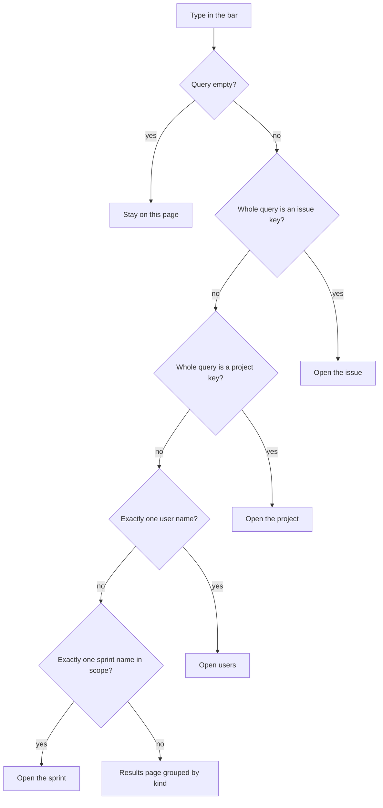
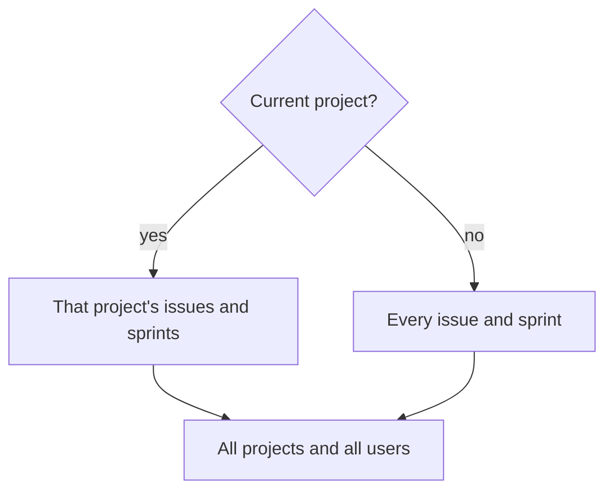

# ADR 016: Find from the top bar by name

* **Status:** Accepted
* **Date:** 2026-09-02

## Background

Keel’s board, backlog, and project table are the only ways to reach an issue besides typing a URL. Once an epic has children, those lists stop being a lookup. [v1 scope](../architecture/v1-scope.md) deferred “advanced search and saved filters” because basic per-project navigation was enough to ship; it did not forbid a single find field. The top bar already holds section links and the acting-user picker ([ADR 001](ADR-001.md), [ADR 011](ADR-011.md)). Every page must keep working without JavaScript ([ADR 009](ADR-009.md)).

## Problem Statement

The owner cannot jump to `TEST-2` or find work by title (or by text in a description or comment) without already knowing which list it sits on. Projects, sprints, and users have the same gap. A query builder or saved filters would be the deferred feature; a find field in the bar is the missing lookup.

## Objective(s)

- Let the owner type in the menu and land on the thing they named, or on a short list of matches.
- Cover issues, projects, sprints, and users — keys and titles/names, plus issue descriptions, sprint goals, and comment bodies.
- Keep find usable with JavaScript disabled.

## Scope and Deliverables

### In-Scope

- A find field in the sticky top bar on every Keel HTML page that already has the chrome.
- Exact jump when the whole query is one issue key, else one project key, else a unique user display name or unique sprint name **in the current search scope**.
- Otherwise a results page grouped by kind (issues, projects, sprints, users).
- Scope: inside a project (including Create with that project selected), search that project’s issues and sprints, plus all projects and all users. On pages with no current project, search everything.
- A cap of about ten matches per kind, with a note when more exist.
- Progressive enhancement: the field may offer a few suggestions; submitting the form must still work without a script.

### Out-of-Scope

- Saved filters, a query language, operators, or “advanced search.”
- Matching attachments (none exist) or activity history.
- A per-user profile page.
- Reordering the find field with the section links.
- Changing home-icon or picker placement ([ADR 001](ADR-001.md)).

### Deliverables

- Find field in the shared chrome and a results page for non-jump searches.
- This ADR, accepted, carving simple find out of the deferred “advanced search” line in v1 scope without taking on saved filters.

## Technical Requirements

* **Must** put a find field in the top bar, between the section links and the picker, on every page that shows the chrome.
* **Must** keep the home icon far left and the picker far right; the find field **Must Not** be dragged or moved with Up/Down.
* **Must** submit as an ordinary GET so find works without JavaScript.
* **Must** refuse an empty query without opening results (the field is required).
* **Must**, when the whole query equals an issue key (like `TEST-2`), go to that issue.
* **Must**, when it is not an issue key but equals a project key, go to that project.
* **Must**, when it is neither of those but equals exactly one user display name, go to `/users`.
* **Must**, when it is none of those but equals exactly one sprint name in scope, go to that sprint.
* **Must** list rather than jump when a sprint name is shared by more than one sprint in scope.
* **Must** otherwise open a results page that repeats the query.
* **Must** match case-insensitively against: issue keys and titles, issue descriptions, comment bodies, project keys and names, project descriptions, sprint names and goals, user display names.
* **Must** show no-match as that results page with the query and a none message, not an error.
* **Must** show about ten hits per kind and say when more exist.
* **Must** open an issue for description or comment matches (the issue page, not a comment-only view).
* **Must** name the project on issue and sprint rows when the search is global.
* **May** show a short snippet of the matching description, goal, or comment.
* **May** show a few suggestions under the field after the owner has typed, without making suggestions the only way to search.
* **Must Not** require JavaScript to find something.
* **Must Not** add saved filters, a query language, or new brand colors.
* **Must Not** hide Done issues or completed sprints from find.

## Consequences

* **Good:** The owner can open `TEST-2` or find a title from any page, including after the board is too crowded to scan.
* **Good:** One field covers the named entities without a separate search section in the menu.
* **Bad:** Comment and description matches can surprise (a word in an old comment ranks beside a title). The list is a lookup, not relevance ranking beyond “in this kind.”
* **Bad:** Unique-name jump for sprints is only unique **in scope**; the same sprint name in another project is invisible while you are inside one project.
* **Risk:** A short cap per kind can hide a wanted hit; the “more exist” note is the only signal to refine the query.
* **Risk:** Treating this as full search later would collide with the still-deferred saved-filters work. This ADR stays a find field.

## System Design

### Technical Stack and Architecture

The field lives in the shared chrome in `src/keel/web/templates/base.html`, next to the existing section nav and user picker. Exact jumps and the results list are ordinary pages (same shell). No new actor or permission model; find is available to whoever can already load the HTML.

### UML Diagrams

## Supporting Documentation

* [ADR 001: Persistent top menu bar](ADR-001.md)
* [ADR 009: Server-rendered pages with vanilla JavaScript](ADR-009.md)
* [ADR 011: Ambient identity without authentication](ADR-011.md)
* [v1 scope](../architecture/v1-scope.md)
* [UI design](../design/ui.md)
