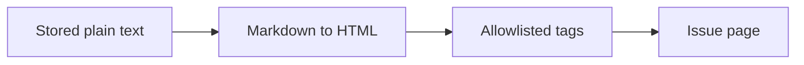

# ADR 017: Render issue descriptions and comments as Markdown

* **Status:** Accepted
* **Date:** 2026-09-02

## Background

Issue descriptions and comments are stored as plain text and shown as-is. That is enough to capture a sentence, and it is a bottleneck for notes: lists, links, and emphasis have to be faked in wrapping paragraphs. [ADR 009](ADR-009.md) already forbids loading assets from a content delivery network, so any rendering must run in process. The JSON API and the create form still exchange the stored source; only HTML pages need a rendered view.

## Problem Statement

The owner writes notes in descriptions and comments, but the issue page cannot show structure — a list, a link, or a code span — without leaving the text raw. Client-side Markdown from a CDN would contradict [ADR 009](ADR-009.md). Raw HTML in those fields would be an injection hazard even on a trusted local tool.

## Objective(s)

- Show Markdown structure in issue descriptions and comments on the HTML issue page.
- Keep the stored source as plain text so the API, Create, find, and edits are unchanged.
- Render entirely on the server, with no remote scripts or styles.
- Preserve existing line breaks so notes written before this change still read as notes.
- Strip dangerous HTML so a pasted tag cannot run script.

## Scope and Deliverables

### In-Scope

- Server-side Markdown rendering of issue descriptions and of comment bodies on the issue page.
- A Jinja filter over a small allowed-tag sanitizer.
- An editable source field for the description that still works without JavaScript.
- Styling for the rendered block using the existing brand tokens.

### Out-of-Scope

- Markdown in titles, project descriptions, sprint goals, or find snippets.
- Syntax highlighting, math, diagrams, or embedded images.
- A live preview while typing.
- Changing the JSON API or the stored text format.
- Loading fonts, highlighters, or Markdown scripts from a CDN.

### Deliverables

- A renderer in `keel.web` and a Jinja `markdown` filter.
- Issue-page markup that shows rendered description and comments.
- This ADR.

## Technical Requirements

* **Must** render issue descriptions and comment bodies as Markdown on the HTML issue page.
* **Must** store and accept the same plain-text source as today on the API and on Create.
* **Must** convert CommonMark-style emphasis, links, lists, headings, fenced code, and tables.
* **Must** keep hard line breaks so existing plain-text notes do not collapse into one paragraph.
* **Must** sanitize the HTML after conversion: no script, no event handlers, no `javascript:` links.
* **Must** keep the description source editable from the issue page without JavaScript.
* **May** autolink bare `http`/`https`/`mailto` URLs.
* **Must Not** load Markdown, fonts, or highlighters from a remote origin.
* **Must Not** render Markdown in the JSON API responses.
* **Must Not** introduce a new brand color.

## Consequences

* **Good:** Notes can use lists, links, and code without leaving the issue page, and old single-line-break comments still wrap visibly.
* **Good:** Source remains searchable and editable as text; find and the API do not need to parse HTML.
* **Bad:** What you type is not what you see until save, because there is no live preview.
* **Bad:** A heading or table in a comment is visually heavier than a plain paragraph.
* **Risk:** Sanitizer and parser updates can change which tags survive. Mitigated by pinning both libraries and covering strip/keep cases in tests.

## System Design

### Technical Stack and Architecture

Rendering is a web concern. `keel.web.markdown` turns stored text into sanitized HTML; the Jinja environment in `keel.web.context` exposes it as the `markdown` filter. The issue template shows the rendered description and comment bodies and keeps the existing description form for the source. Python-Markdown and Bleach run in process; nothing is fetched from a CDN.

### UML Diagrams

## Supporting Documentation

* [ADR 009: Server-rendered Jinja2 pages with vanilla JavaScript](ADR-009.md)
* [UI design](../design/ui.md)
