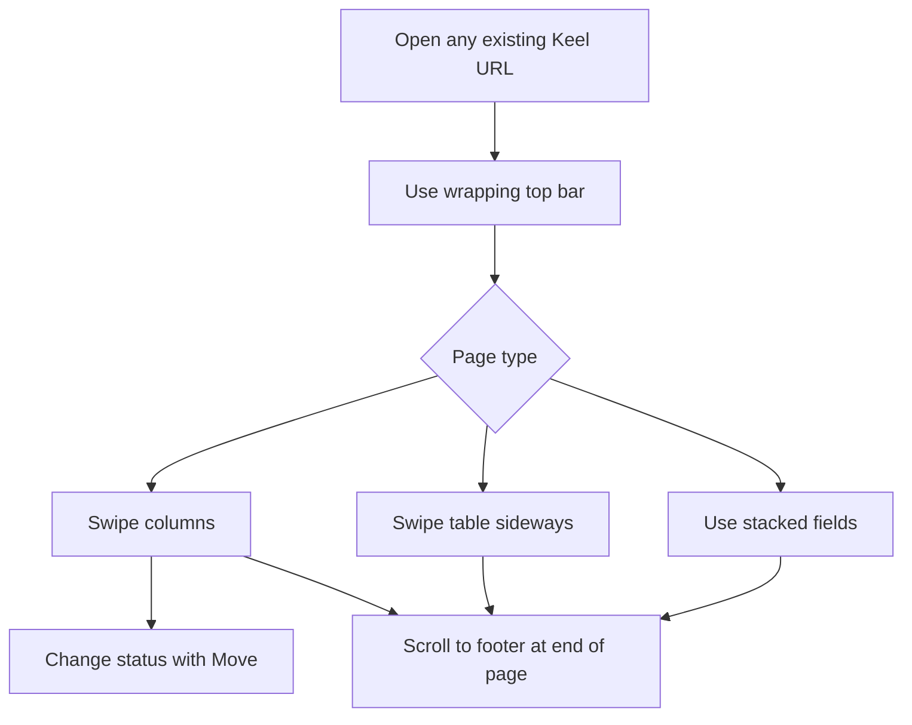
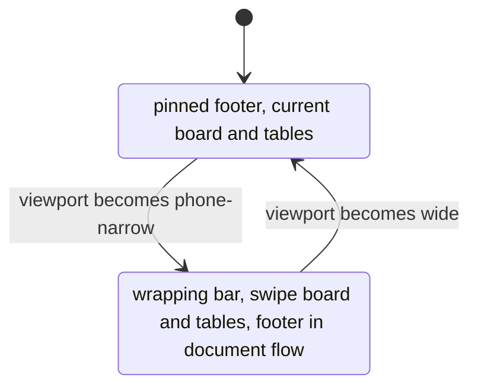

# ADR 018: Phone layout of the existing site

* **Status:** Accepted
* **Date:** 2026-09-08

## Background

Keel v1 is a personal issue tracker used in the browser: projects, issues, board, backlog, sprints, find, users, and the rest of the recorded surface. Pages share the sticky top bar of [ADR 001](ADR-001.md) and the footer of [ADR 002](ADR-002.md), and they already declare a mobile viewport in `base.html`. There is no phone layout: the bar, five-column board, and tables are sized for a desktop window. [ADR 009](ADR-009.md) keeps every action working without JavaScript, with board drag as an enhancement over a Move form.

The owner needs to use this same site on a phone, reached by URL like any other website.

## Problem Statement

On a narrow screen the current layout is not usable: the bar and a viewport-pinned footer consume the viewport, five status columns and data tables do not fit, and native card dragging is unreliable with a finger. A separate mobile product would split URLs and journeys. The site must remain one set of pages that a phone can actually operate, without replacing the current desktop site.

## Objective(s)

- Let the owner and collaborators do every existing Keel action from a phone browser.
- Keep the current desktop site exactly as it is at a wide viewport; add a phone-narrow layout only.
- Keep the same URLs, pages, and data; change layout on a phone, not product shape.
- Keep the no-JavaScript path working on a phone.

## Scope and Deliverables

### In-Scope

- A phone-narrow layout of every existing HTML page (projects, create, board, backlog, sprints, issue, search, users, license).
- Top bar still showing home, section links, Find, and the picker, wrapping onto extra rows and shrinking as needed.
- Board columns that keep a readable card width and are reached by swiping sideways, including when the board is separated by sprint.
- Status changes on the board via the existing Move control; dragging a card with a finger only if the browser supports it.
- Existing tables (project list, backlog, users, children, search results, and similar) that keep their columns and swipe sideways for the rest.
- On a phone, the version footer at the end of the page rather than pinned over the content (amends [ADR 002](ADR-002.md) for narrow viewports only).
- Wide (desktop) viewports left looking and behaving as they do today.

### Out-of-Scope

- A native iOS/Android app, a PWA / Add to Home Screen package, or a separate `/m/` (or similar) site.
- New pages, entities, or fields.
- Authentication, or any change to who can act once the URL loads.
- How the server is bound, published, or addressed (host, port, LAN, TLS, printed URLs).
- Requiring finger-drag to move a card, or a new board interaction besides swipe plus the existing Move form.
- A distinct phone visual theme or a new component library.
- Replacing, restyling, or otherwise changing the current desktop (wide-viewport) site.

### Deliverables

- This ADR.
- An amendment in [UI design](../design/ui.md) describing the narrow-viewport chrome, board, tables, and footer.
- A short note in [ADR 002](ADR-002.md) that the footer is not pinned on phone-narrow viewports.

## Technical Requirements

* **Must** keep the same URLs and the same pages; a phone must not need a different path to do the same work.
* **Must** make every existing page operable on a phone-narrow viewport: navigate, read, create, edit, filter, start/complete sprints, comment, link dependencies, find, and manage users.
* **Must** keep the top bar on every page, with the home icon, section links, Find, and the user picker all still present (they may wrap and shrink).
* **Must** keep the top bar sticky; the wrapping bar may occupy more than one row.
* **Must** present the board as columns in workflow order, with a readable card width; columns that do not fit are reached by swiping sideways, not by squeezing five columns into one screen.
* **Must** keep “separate by sprint” as stacked horizontal strips of columns, each strip swiped the same way.
* **Must** let a phone change a card’s status with the existing status select and Move control, including when JavaScript has not run.
* **Must** keep existing tables; extra columns are reached by swiping sideways rather than restacking rows into cards.
* **Must** put the footer at the end of the page on a phone-narrow viewport so it does not cover the board or forms.
* **Must** leave wide viewports looking and behaving as they do today, including the pinned footer, the current board, and the current tables — no desktop redesign.
* **Must** switch to the phone layout whenever the viewport is phone-narrow, including a desktop window resized down; switch back when it is wide again.
* **Must** keep today’s empty, error, and none-found presentation on the same pages.
* **May** let finger-dragging a card change status where the browser’s drag-and-drop works.
* **May** let section-link reorder (drag or Up/Down) keep working on the wrapping bar.
* **May** wrap board filters and issue/create fields so they stay in the screen width.
* **Must Not** introduce a second site, app, or set of URLs for phones.
* **Must Not** make any phone action reachable only by dragging or only with JavaScript.
* **Must Not** hide section links, Find, or the picker on a phone.
* **Must Not** pin the footer over content on a phone-narrow viewport.
* **Must Not** drop or defer any existing desktop capability on a phone.
* **Must Not** change the current site for a wide (desktop) viewport: layout, chrome, board, tables, and footer stay as they are.

## Consequences

* **Good:** One mental model and one bookmark: the phone is the same Keel, just laid out for a small screen.
* **Good:** A squeezed desktop window also becomes usable instead of overflowing, which is an improvement over today.
* **Good:** Board status and every other action still work if JavaScript or dragging fails.
* **Bad:** A wrapping bar plus horizontal swipes for the board and for tables is more scrolling than the desktop. Some lists will feel like two-axis scrolling.
* **Bad:** The footer is no longer always on screen on a phone; the version and license link are reached by scrolling to the end.
* **Risk:** Native card drag will be inconsistent across phone browsers. Mitigated by treating Move as the supported phone path.
* **Risk:** A tall wrapping bar still steals height. Mitigated by shrinking controls and not pinning the footer.

## System Design

### Technical Stack and Architecture

This feature only changes how existing HTML surfaces present on a narrow viewport. A wide window is the current site and is not restyled. The shell is still `base.html` (top bar, Find, picker, main, footer). The board remains `board.html` with columns and the Move fallback. Lists stay tables. Forms on create, issue, sprints, and users stay the same posts to `/web`. No new roles, routes, or data. Layout rules belong with the existing brand stylesheet behind a phone-narrow media query; drag remains the existing board script, optional on a phone.

### UML Diagrams

## Supporting Documentation

* [ADR 001: Persistent top menu bar](ADR-001.md)
* [ADR 002: Persistent version footer](ADR-002.md)
* [ADR 009: Server-rendered pages with vanilla JavaScript](ADR-009.md)
* [UI design](../design/ui.md)
* [v1 scope](../architecture/v1-scope.md)
