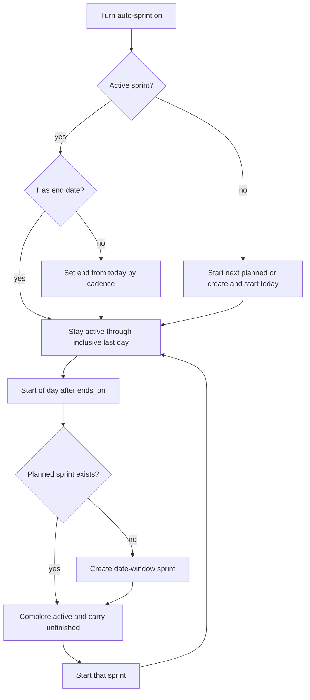
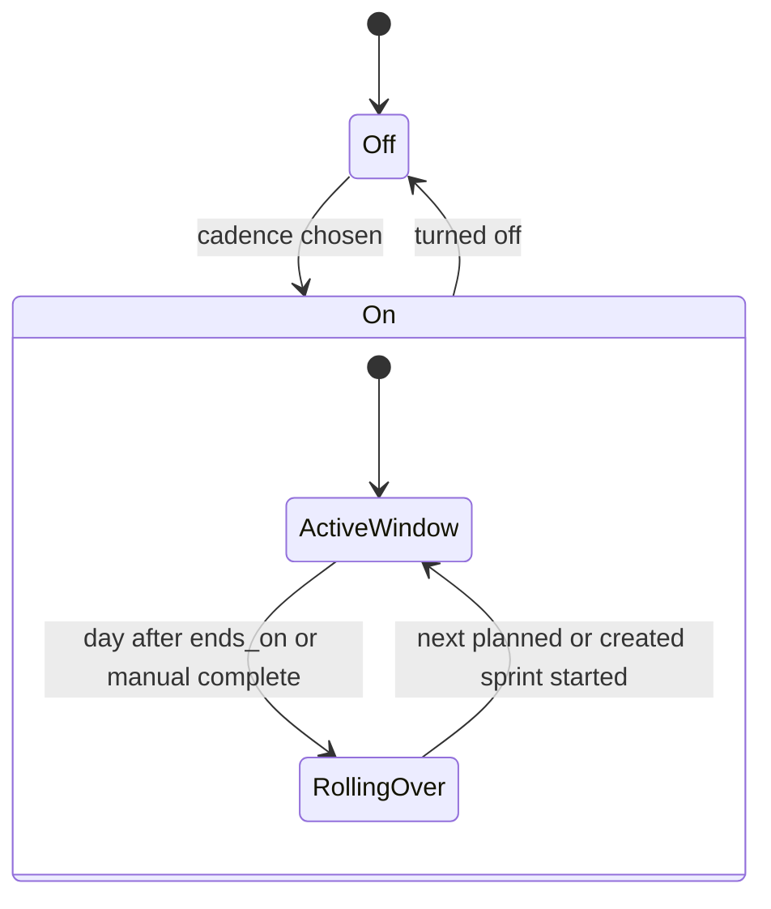

# ADR 019: Auto-sprint cadence

* **Status:** Accepted
* **Date:** 2026-09-12

## Background

Keel already has per-project sprints with a manual lifecycle: create as *planned*, start (*planned* to *active*), complete (*active* to *completed*). At most one sprint is active. Completing carries unfinished issues into the earliest remaining planned sprint, or back to the backlog if none is planned ([ADR 013](ADR-013.md), [ADR 005](ADR-005.md)). Dates are optional. The project page already has a settings panel for name and description; the sprints page lists sprints by state and can show a notice after a complete.

Keel is meant to run continuously on a server. Rollover is still date-driven, and the process may be down across a boundary.

## Problem Statement

Sprint open and close are only manual. A project that works in a regular rhythm still needs someone to complete and start sprints on time. There is no project-level cadence, so windows drift or sit active past their end dates, and there is no agreed behavior when the next sprint was never planned or when the server missed the day.

## Objective(s)

- Let a project opt into a cadence so sprints close and open without a Start or Complete click.
- Keep today’s one-active-sprint rule and unfinished-work carry-over.
- Prefer an already-planned sprint at rollover; create a new window only when none is planned.
- Keep every existing manual sprint action available.
- Recover from downtime with one catch-up rollover, not a chain of empty completed sprints.

## Scope and Deliverables

### In-Scope

- A per-project auto-sprint setting: off (default), weekly, every two weeks, monthly, or every N days.
- Turning it on, off, and changing cadence mid-window, with the behaviors below.
- Automatic complete then start at the cadence boundary, including creating the next sprint when none is planned.
- Immediate open when auto-sprint is on and there is no active sprint.
- Catch-up to the current window after downtime.
- Cadence controls on the project page; status and next close date on the sprints page; an in-page notice after an automatic rollover.

### Out-of-Scope

- Auto-filling a new sprint from the backlog (beyond unfinished carry-over).
- Email or other notifications ([v1 scope](../architecture/v1-scope.md) defers them).
- Overlapping or multiple active sprints.
- Choosing a weekday or a day-of-month independently of the current sprint’s dates.
- Burndown, velocity, or reporting.
- Per-user cadence or permission to change it.

### Deliverables

- This ADR as the behavior source of truth.
- Cadence on the project, rollover and catch-up in services, and the project/sprints surfaces.

## Technical Requirements

* **Must** keep auto-sprint off until it is turned on for that project.
* **Must** offer weekly, every two weeks, monthly, and custom every N days, with N an integer of at least 1.
* **Must** use the current (or next planned) sprint’s end date as the first automatic close, then repeat the cadence from there.
* **Must**, when there is no dated sprint to align to, count the first window from the day auto-sprint is turned on (or from today when inventing dates).
* **Must** treat `ends_on` as a full last day: the sprint stays active through that date; rollover runs at the start of the following calendar day.
* **Must**, on rollover, complete the active sprint with the same unfinished-work rule as today, then start the earliest remaining planned sprint; if none is planned, create one and start it so carry-over lands in that window, not the backlog.
* **Must** name an auto-created sprint with its date window (for example `12 Sep – 26 Sep 2026`) and leave the goal blank. The new sprint is otherwise empty except for carried unfinished work.
* **Must** date an auto-created next window as start = day after the closed sprint’s end, end = that start plus one cadence (weekly = 7 inclusive days, two weeks = 14, N days = N inclusive days, monthly = same day-of-month next month, clamped to the last day of that month).
* **Must**, when turning auto-sprint on with no active sprint, immediately start the next planned sprint, or create and start a window that starts today and lasts one cadence.
* **Must**, if the already-active sprint has no end date when auto-sprint is turned on, set `ends_on` from today by the same inclusive cadence rule, and not change an existing start date.
* **Must**, while auto-sprint is on, keep one sprint active: after a manual complete or after the active sprint is deleted, start or create the next window the same way, without waiting for the next calendar boundary.
* **Must** leave manual create, start, complete, delete, and date edits available. After a manual complete or date edit, the next automatic close follows the then-current sprint’s end date.
* **Must**, when auto-sprint is turned off, leave the current sprint as it is and stop future automatic rollovers.
* **Must**, when cadence changes mid-window, leave the current sprint’s dates alone; the new length applies only after that close.
* **Must**, if the process was down across one or more boundaries, catch up once: complete the overdue active sprint, open a single current window (start today, one cadence) if the next planned sprint is missing or already past its end, and not create a chain of empty completed sprints for missed intervals.
* **Must** show cadence on the project settings panel and, on the sprints page, that auto-sprint is on and the next close date.
* **Must** show an in-page notice after an automatic rollover (same pattern as today’s complete notice).
* **May** leave extra planned sprints in place, including ones whose dates are already past, for the user to edit or delete.
* **May** let the user keep creating extra planned sprints while auto-sprint is on.
* **Must Not** auto-schedule backlog issues into a new sprint except via existing carry-over of unfinished work.
* **Must Not** allow two active sprints, or any lifecycle other than planned → active → completed.
* **Must Not** send email or external notifications for rollover.
* **Must Not** treat permission as a separate state; anyone who can use the project can change cadence.

## Consequences

* **Good:** A project can run a regular sprint rhythm without remembering to click Complete and Start; planned sprints are still used when they exist; unfinished work still has a home.
* **Good:** Manual control remains, so a cycle can end early or a name/goal/date can still be edited.
* **Bad:** Auto-created sprints have no goal and are not filled from the backlog, so planning for the new window is still a separate step.
* **Bad:** Catch-up skips missed periods, so sprint history will not show empty sprints for downtime.
* **Risk:** Changing dates by hand while auto-sprint is on can move the next close in ways that feel surprising; the sprints page must show the next close date clearly.
* **Risk:** Monthly clamping (for example a window that started on the 31st) can make adjacent windows slightly different lengths.

## System Design

### Technical Stack and Architecture

This is a behavior change on existing surfaces, not a new product area. Cadence lives with project settings on `project.html`. Status, next close date, and rollover notices live on `sprints.html`. Start and Complete remain on `sprint_detail.html`. Lifecycle rules stay those of `keel.services.sprints` and [ADR 013](ADR-013.md). `keel.services.auto_sprint` prepares the next window, carries unfinished work, and starts it. While the app is running, each database-backed request and a background poll advance overdue projects using the server’s local calendar date, so a missed day is caught up once rather than replayed.

### UML Diagrams

## Supporting Documentation

* [ADR 005: Boards, sprints, and backlog as views over one issue pool](ADR-005.md)
* [ADR 013: Planning realization — sprint lifecycle](ADR-013.md)
* [UI design](../design/ui.md)
* [v1 scope](../architecture/v1-scope.md)
