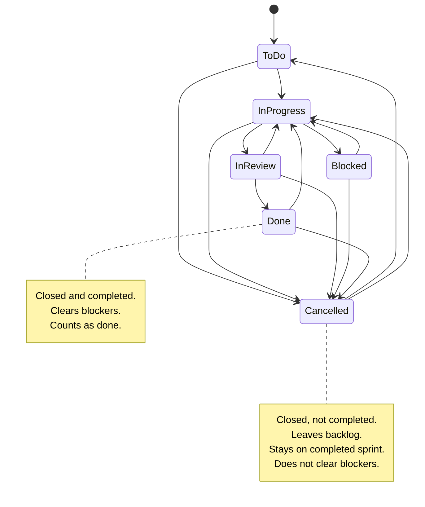
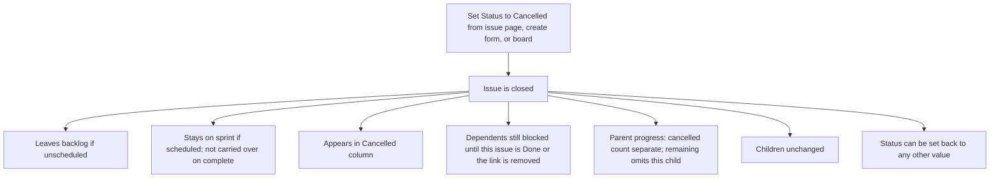

# ADR 020: Cancelled status

* **Status:** Accepted
* **Date:** 2026-09-12

## Background

Keel uses one shared, fixed workflow. [ADR 013](ADR-013.md) set five statuses — *To Do*, *In Progress*, *In Review*, *Blocked*, *Done* — and made *Done* the single terminal status for backlog membership, sprint carry-over, blocker resolution, and parent progress. [ADR 004](ADR-004.md) still forbids per-project workflows and enforced transition rules. Anyone who can edit an issue can set Status from the issue page, the create form, or by moving a board card.

There is no way to close work that will not be done without recording it as Done.

## Problem Statement

Abandoned work and finished work share one closed status. That inflates Done on the board, in project counts, in parent progress (“N of M done”), and in sprint history, and it would clear blockers as if the blocking work had shipped.

## Objective(s)

- Let people mark an issue Cancelled from the same Status control they already use.
- Keep Cancelled distinct from Done everywhere the user sees status.
- Close cancelled work so it leaves the backlog and does not carry over when a sprint completes.
- Keep cancelled blockers unresolved until the blocker is Done or the link is removed.
- Show cancelled descendants separately from done descendants on a parent.

## Scope and Deliverables

### In-Scope

- *Cancelled* as a sixth shared status, available on every project.
- Board column, create-issue menu, issue Status menu, project status counts, sprint issue lists, API issue status, and parent rollup copy.
- Closed-set rules for backlog and sprint completion (Done and Cancelled).
- Completed-only rules for blockers and “done” progress (Done only).

### Out-of-Scope

- Per-project workflows, custom statuses, or a separate resolution field ([ADR 004](ADR-004.md)).
- Enforced transition rules (Cancelled stays reversible).
- A required reason or comment when cancelling.
- Automatically changing children when a parent is cancelled.
- Automatically clearing remaining time on the cancelled issue itself.
- Burndown, velocity, and other reporting still deferred by v1 scope.

### Deliverables

- This record.
- Amendments to the five-status / single-terminal wording in [ADR 013](ADR-013.md), progress wording in [ADR 012](ADR-012.md), unresolved-blocker wording in [ADR 014](ADR-014.md), and the Status glossary entry.

## Technical Requirements

* **Must** add *Cancelled* to the shared status set, labeled “Cancelled”, after *Done* in workflow order.
* **Must** offer Cancelled in every Status menu that lists statuses today, including create (default remains To Do).
* **Must** show a Cancelled board column and change status when a card is dropped there, including an empty column.
* **Must** treat *Done* and *Cancelled* as closed: unscheduled closed issues are not in the backlog; on sprint complete, closed issues stay on that sprint and are not unfinished carry-over.
* **Must** treat only *Done* as completed for blockers: a Cancelled blocker still counts as unresolved until it is Done or the dependency is removed.
* **Must** count cancelled descendants separately from done descendants on a parent (for example “2 of 5 done, 1 cancelled”).
* **Must** omit cancelled descendants’ remaining time from the parent remaining total; the cancelled issue’s own remaining field is unchanged.
* **Must** leave a parent’s children unchanged when the parent is cancelled.
* **Must** allow moving an issue out of Cancelled to any other status, same as today.
* **May** keep current “N of M done” wording when the cancelled count is zero.
* **Must Not** treat Cancelled as Done in project counts, board columns, or progress.
* **Must Not** require a reason to cancel.
* **Must Not** cascade cancel (or any other status) to children.
* **Must Not** introduce per-project statuses or transition restrictions.

## Consequences

* **Good:** Abandoned work is visible as Cancelled instead of fake Done; sprint history can keep cancelled items without calling them delivered; parent progress can show done and cancelled apart.
* **Bad:** Closed and completed are no longer the same idea, so “terminal” in older ADRs is no longer one status. Two closed columns sit at the end of every board.
* **Risk:** A cancelled blocker still blocks, which is easy to miss if people assume closed means resolved. The existing unresolved-blocker marker stays the signal. A cancelled parent with live children can look inconsistent; that is accepted because nothing cascades.

## System Design

### Technical Stack and Architecture

Existing Status surfaces only: issue page and create-issue Status selects, board columns and drag-and-drop (and the no-JavaScript status fallback), project status counts, backlog (membership), sprint issue lists and complete/carry-over, issue-page descendant rollup, and the issue API status and rollup fields. No new screens or roles.

`keel.domain.enums` holds the six statuses. *Done* is `COMPLETED_STATUS`. *Done* and *Cancelled* are `CLOSED_STATUSES`. Board columns still come from iterating the enumeration. Backlog and sprint completion exclude closed statuses. Blocker counts and descendants-done still use completed only.

### UML Diagrams

Closed vs completed (what the user should expect):

Main journeys:

## Supporting Documentation

* [ADR 004: Shared fixed workflow](ADR-004.md)
* [ADR 012: Issue identity, effort, rollup, deletion](ADR-012.md)
* [ADR 013: Planning realization](ADR-013.md)
* [ADR 014: Cross-project dependencies](ADR-014.md)
* [Glossary](../architecture/glossary.md)
