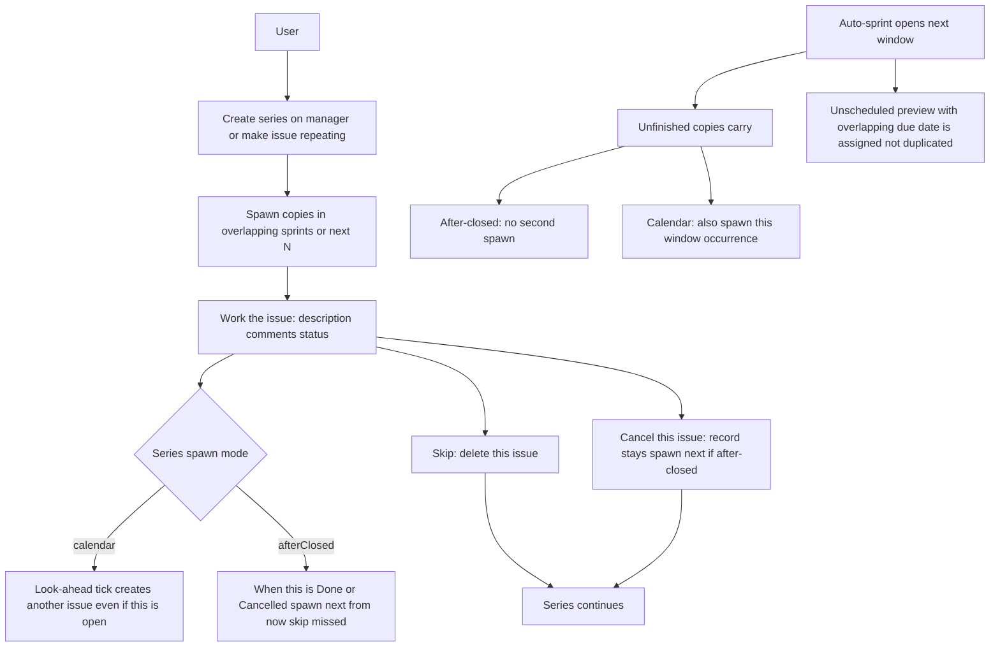
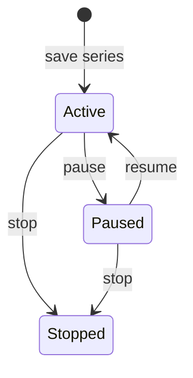
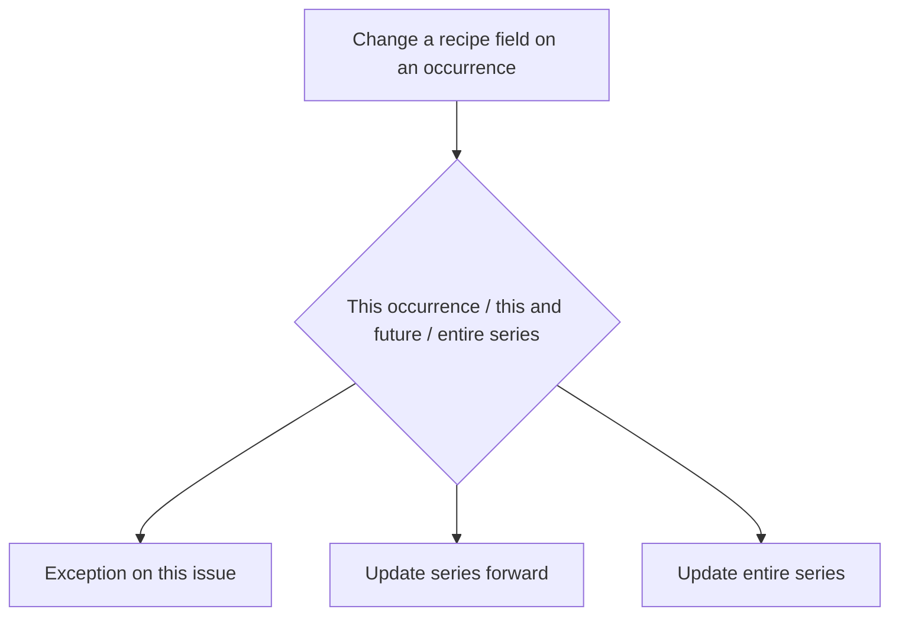

# ADR 021: Repeating work via Scheduling Manager

* **Status:** Accepted, amended by [ADR 024](ADR-024.md)
* **Date:** 2026-09-14

> **Amended 2026-09-14.** The issue-page recipe is no longer an always-open panel. **Make this repeating** and **Edit series** open the same form in a same-page overlay ([ADR 024](ADR-024.md)). Schedules pages are unchanged.

## Background

Keel is a personal, Jira-flavored issue tracker for one owner plus up to two collaborators. Work is Epic / Story / Subtask ([ADR 003](ADR-003.md)), shown on a shared board, backlog, and sprints ([ADR 013](ADR-013.md)). *Done* and *Cancelled* are closed; only *Done* is completed ([ADR 020](ADR-020.md)). Projects may opt into **auto-sprint** so a single dated window opens and closes on a cadence ([ADR 019](ADR-019.md)); that does not pre-create future sprints.

That model fits one-off product work. It does not fit chores and other jobs that come back on a cadence, which is part of what Keel is for. Users still want those jobs in the **same** project and board as product work (custom boards are a far-future non-goal). Copies must be allowed to differ: “Pay bills” this month may need a different description and comments than last month.

## Problem Statement

Keel has no way to express repeating work. If the same issue were reset to To Do, instance-specific notes would collide and Done would stop meaning finished. If only a new Chore type could repeat, repeating *product* work would be mis-typed. Keel needs a recipe that is not a board card, and a new issue for each cycle, using the types that already exist, without fighting one-active-sprint rollover or spawning a ticket per year of calendar.

## Objective(s)

- Let a user define a **series** (schedule + template) that **spawns** Epic, Story, or Subtask issues when due.
- Keep recurrence **orthogonal to type** (no Chore type in this feature) and **orthogonal to project sprint cadence** (a daily chore may live in a weekly auto-sprint).
- Let each occurrence be edited on its own; let recipe changes follow **Outlook-style** this occurrence / this and all future / entire series.
- Place copies in the **sprint that overlaps** a user-chosen date (creation date or due date), using the windows auto-sprint and manual planning actually have, with **N** as the fallback so Keel does not materialize years of issues.

## Scope and Deliverables

### In-Scope

- Per-project **Scheduling Manager** page (create, list, edit, pause, resume, stop).
- Series templates that spawn existing issue types.
- Two spawn modes **per series:** calendar (create even if the last copy is open, within look-ahead) and after-previous-**closed** (when the copy is Done or Cancelled, spawn the **next** scheduled occurrence from now; do not backfill missed weeks).
- Look-ahead: spawn into overlapping planned/active sprints; otherwise only the next **N** upcoming issues; never duplicate a cycle when a new auto-sprint window opens.
- Issue-page repetition details and Office-style edit/delete scopes.
- Create a series from the manager, or **make an existing issue repeating** (that issue is the first occurrence; its fields seed the template).
- Outlook-like **recurrence dialog**, including custom patterns (daily / weekly / monthly / yearly / custom interval). Optional series end: never, on a date, or after N times.
- Skip this cycle by **deleting this issue** (Office “delete this occurrence”).

### Out-of-Scope

- A new Chore (or other) issue type.
- Custom boards.
- Changing Auto-sprint ([ADR 019](ADR-019.md) already shipped) or Cancelled ([ADR 020](ADR-020.md) already shipped).
- Email, push, or other reminders; extra overdue chrome beyond the existing due date.
- “Delete entire series” mass-deletion of all spawned issues.
- Rotating assignees, reminder windows, or spawning a tree of children from one tick.
- Backfilling occurrences for sprint intervals auto-sprint skipped during downtime.

### Deliverables

- This ADR as the behavior source of truth.
- Series persistence, spawn catch-up beside auto-sprint, the project Schedules pages, and issue-page series controls.

## Technical Requirements

* **Must** represent repeating work as a **series** (recipe + cadence), not as an immortal issue that resets.
* **Must** spawn a **new issue** per occurrence (Epic, Story, or Subtask as chosen on the series). A copy may be **Done** or **Cancelled**; both leave it closed. Status changes are this occurrence only.
* **Must Not** add an issue type for this feature.
* **Must Not** reuse project `sprint_cadence` as the series recurrence; the two cadences are independent.
* **Must** mix spawned issues into the same project board, backlog, and sprints as one-off work; today’s type/assignee/sprint filters remain the way to focus.
* **Must** give each project a Scheduling Manager page in the same nav family as board, backlog, and sprints (not the auto-sprint controls on the project or sprints pages).
* **Must** store on the series: type, title, default description, assignee, optional parent, cadence, spawn mode, sprint assignment basis (creation date or due date), and look-ahead **N**.
* **Must** show on each spawned issue that it belongs to a series, a human cadence summary, and a way to open that series on the manager page.
* **Must Not** copy comments or dependency links from the template or from the previous copy onto the next issue.
* **Must**, on save of a new series, immediately create copies that already fall in current overlapping sprints, or the next N if none do, subject to the creation-date vs due-date rules below.
* **Must**, in calendar mode, create every occurrence inside the current look-ahead even if older copies are still open.
* **Must**, in after-closed mode, keep at most the catch-up rule: closing a late copy (**Done** or **Cancelled**) creates only the **next** occurrence from now, not the missed ones. An unfinished after-closed copy **Must** ride auto-sprint/ADR 013 carry-over and **Must Not** cause a second spawn at rollover. Reopening a closed copy **Must Not** retract an already-spawned next issue.
* **Must** assign a new copy to a planned or active sprint whose dates overlap the chosen basis date **inclusively** (`starts_on` through `ends_on`); **Must Not** assign it to a completed sprint.
* **Must**, when no such sprint exists, leave the copy **unscheduled** with a due date from the cadence, and only keep the next N upcoming issues for that series.
* **Must** treat each series cycle as unique: if an unscheduled preview’s due date later overlaps a newly opened sprint, assign **that** issue rather than spawning another for the same cycle.
* **Must Not** backfill copies for auto-sprint catch-up gaps (missed windows that were never opened).
* **Must**, when sprint basis is **due date**, allow N-previews to sit unscheduled until a window covers `due_at`.
* **Must**, when sprint basis is **creation date**, birth a future cycle only when that cycle is due (or after-closed), and assign it to the window overlapping the **birth day** — not pre-create it into the current sprint.
* **Must** offer Outlook scopes for recipe-affecting edits: **This occurrence** | **This and all future** | **Entire series**.
* **Must** treat title, default description, cadence, spawn mode, sprint basis, parent, and assignee-on-the-recipe as recipe fields that trigger those scopes when changed from an occurrence. Instance-only comments and **status** never do.
* **Must** implement **This occurrence** as an exception (this issue only). **This and all future** updates the series from this occurrence forward and already-spawned open copies in that range. **Entire series** updates the recipe and occurrences.
* **Must** support pause (no new copies), resume, and stop (no new copies, existing issues remain).
* **Must Not** provide a bulk delete of every issue in the series in this feature. Stop is the way to end the recipe. Delete on an issue is this occurrence only.
* **Must** set cadence through an Outlook-style recurrence form, including custom intervals, not a raw cron string as the primary UI.
* **Must Not** add email, messaging, or push reminders. The due date and existing board/backlog/sprint views are how work is seen.
* **May** let a series run forever or end on a date or after a count of occurrences.
* **May** seed a series from an existing issue.
* **Must Not** put the series recipe itself on the board as a card.

## Consequences

* **Good:** Chores and repeating product work use one mechanism; each cycle can differ; Done stays meaningful; the default board can still show everything; recipes are edited in one place.
* **Good:** Auto-sprint’s single window plus N replaces an unbounded future-sprint pipeline, so repeating work will not mint thousands of issues.
* **Bad:** Users must learn series vs occurrence (Office prompt). Calendar mode can stack open copies, including a carried copy plus a new one after rollover. Reopening a Cancelled or Done copy can leave two open after-closed copies. Type filter cannot hide “chores” until a later type or custom boards. Creation-date series do not show weeks of future copies on this week’s board.
* **Risk:** Extra **manual** planned sprints still expand look-ahead (user-controlled). **Risk:** Issue-page autosubmit would silently rewrite a series unless recipe edits require the Office confirm. **Risk:** Claiming an N-preview into a newly opened sprint must stay distinct from pulling unrelated backlog work (ADR 019).

## System Design

### Technical Stack and Architecture

The feature adds a project **Schedules** page beside board, backlog, and sprints. Spawned work is ordinary issues. Auto-sprint remains on project settings and the sprints page ([ADR 019](ADR-019.md)). Status rules stay those of [ADR 020](ADR-020.md). `keel.services.series` owns recipes, Outlook-scoped edits, skip dates, and spawn. Catch-up runs in the same request session and background poll as auto-sprint so a rollover can receive copies.

### UML Diagrams

## Supporting Documentation

* [ADR 003: Unified issue model with a typed hierarchy](ADR-003.md)
* [ADR 013: Planning realization — statuses, board and backlog composition, sprint lifecycle](ADR-013.md)
* [ADR 019: Auto-sprint cadence](ADR-019.md)
* [ADR 020: Cancelled status](ADR-020.md)
* [UI design](../design/ui.md)
* [ADR 024: Issue-page repeating recipe in an overlay](ADR-024.md)
