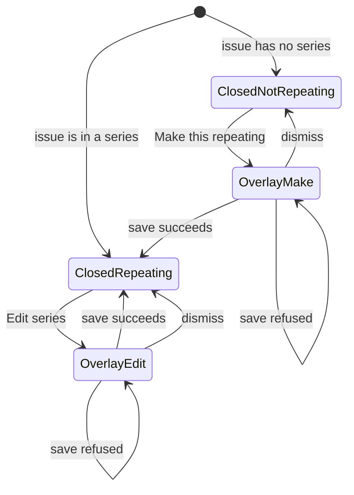
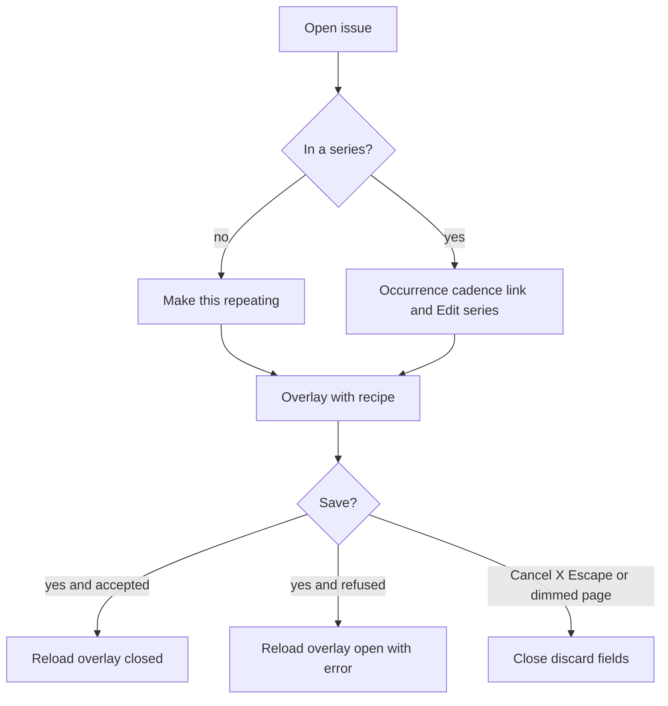

# ADR 023: Issue-page repeating recipe in an overlay

* **Status:** Accepted
* **Date:** 2026-09-14

## Background

[ADR 021](ADR-021.md) puts repeating work on a per-project Scheduling Manager and also on the issue: an existing issue can become the first occurrence, and a spawned issue can edit the recipe with Outlook scopes. That recipe is the same long form used on schedules (`_series_recipe.html`: copies, cadence, ends, and on an existing series the apply-to scope). On the issue it was always an open panel between the facts list and Description, whether or not the reader needs it. Description already hides its editor behind an Edit control. The schedules list already keeps its long create form off the default view with `?tab=new` ([UI design](../design/ui.md)).

## Problem Statement

The issue page is for this occurrence — title, facts, description, children, links, comments. The repeating recipe is long and sits in the way on every visit. People who are not changing cadence still scroll past it. The recipe still needs to be reachable from the issue, including when JavaScript has not run.

## Objective(s)

- Give the issue page back vertical space so Description and the rest sit closer to the facts.
- Keep every existing repeating action available from the issue (start a series, edit the recipe with scopes, open the schedule).
- Open the recipe as a same-page overlay, not a new browser window and not a second page.
- Stay usable without JavaScript and on a phone-narrow viewport.

## Scope and Deliverables

### In-Scope

* Issue detail only (`/issues/{key}-{number}`).
* Closed state: **Make this repeating** when the issue is not in a series; occurrence/cadence/link summary plus **Edit series** when it is.
* Same-page overlay holding the existing recipe form and its submit control (**Make repeating** or **Save series**).
* Overlay open, dismiss, and refused-save behavior described below.
* UI design note so the issue page matches this layout.

### Out-of-Scope

* Changing series rules, spawn modes, look-ahead, Outlook scopes, or skip-by-delete ([ADR 021](ADR-021.md)).
* The schedules list, schedule detail recipe, or Create issue.
* A separate browser window, a dedicated `/repeat` page, or moving recipe edit solely to Schedules.
* Autosubmitting the recipe (still an explicit save).
* Overlays for other issue sections (description, comments, dependencies).

### Deliverables

* This ADR as the behavior source of truth.
* The issue page showing the compact control and overlay instead of an always-open recipe panel.
* An update to [UI design](../design/ui.md) describing the issue overlay.

## Technical Requirements

* **Must** stop rendering the repeating recipe as an always-open panel on the issue.
* **Must**, when the issue is not in a series, show one **Make this repeating** control between the facts and Description; **Must Not** show recipe fields until the overlay opens.
* **Must**, when the issue is in a series, show a short summary on the page: occurrence date, series title linking to the schedule, human cadence, spawn mode, and that deleting this issue skips this cycle; plus an **Edit series** control.
* **Must** open the existing recipe (same fields and POST as today: `/web/issues/{id}/repeat` or `/web/issues/{id}/series`) in a same-page overlay titled **Make this repeating** or **Edit series**.
* **Must** include Cancel and a close control in the overlay; **Must** also close on Escape and on a click on the dimmed page; those dismissals **Must** discard unsaved fields with no confirm.
* **Must** keep the rest of the issue inert while the overlay is open (modal).
* **Must**, on a refused recipe, re-open the overlay on the reloaded issue and show the error inside the overlay, not only at the top of the page.
* **Must**, on a successful save, return to the issue with the overlay closed (summary + **Edit series** after a new series; otherwise the updated summary).
* **Must** provide a no-JavaScript path: the trigger is a real link (query on the issue URL) that renders the overlay open; Cancel is a link back to the issue without that query. JavaScript **May** open and close the overlay without navigating.
* **Must Not** make the recipe reachable only through JavaScript ([ADR 009](ADR-009.md)).
* **Must Not** autosubmit the recipe.
* **Must Not** change what a recipe save does to occurrences, or how pause/resume/stop work on Schedules.
* **Must** keep the overlay usable on a phone-narrow viewport (most of the screen, fields wrapping as other long forms do).
* **May** move keyboard focus into the overlay when it opens and back to the trigger when it closes.

## Consequences

* **Good:** Most issue visits show description and comments sooner; repeating is still one click away.
* **Good:** The always-visible series line still answers “is this repeating, and which schedule?” without opening anything.
* **Bad:** Starting or editing a series is an extra click compared with the always-open panel.
* **Bad:** Easy dismiss can throw away a long unfinished recipe with no warning.
* **Risk:** A refused save that fails to re-open the overlay will look like the error vanished. The reload **Must** keep the overlay-open query (or equivalent) when the post is refused.
* **Risk:** First overlay in the product; if it is easy to miss Cancel vs the dimmed page, people may close it by accident. Accepted given the chosen dismiss rule.

## System Design

### Technical Stack and Architecture

This feature only changes how `issue_detail.html` presents the recipe already posted to `/web/issues/{id}/repeat` and `/web/issues/{id}/series`. Surfaces: issue detail (entry), schedule detail (unchanged link target). No new service, schema, or route family is required. The overlay is a native `dialog`; `?repeat=1` opens it without JavaScript, and `assets/js/overlay.js` upgrades that to `showModal()` when the script runs.

### UML Diagrams

## Supporting Documentation

* [ADR 009: Server-rendered Jinja2 pages with progressively enhanced vanilla JavaScript](ADR-009.md)
* [ADR 018: Phone layout of the existing site](ADR-018.md)
* [ADR 021: Repeating work via Scheduling Manager](ADR-021.md)
* [UI design](../design/ui.md)
