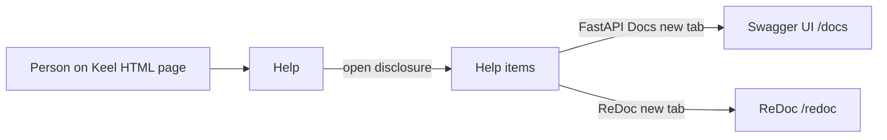
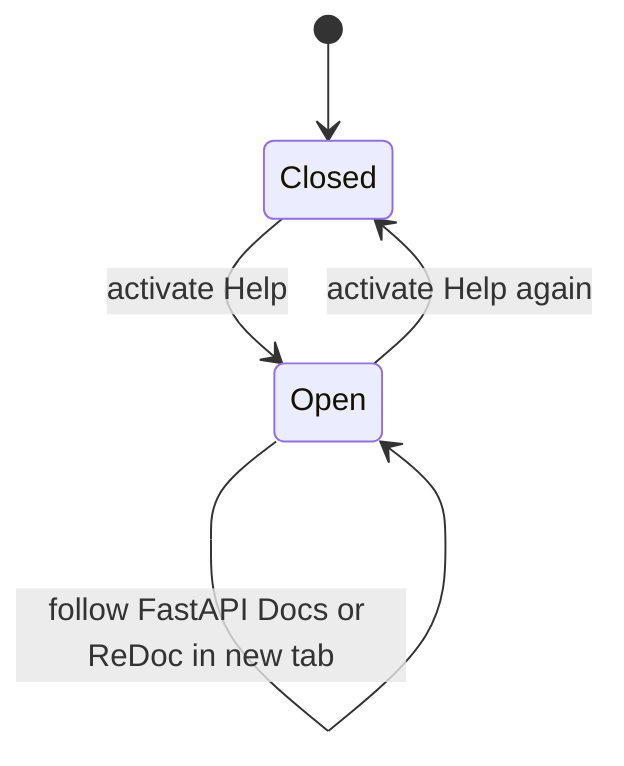

# ADR 023: Help menu links to FastAPI API docs

* **Status:** Accepted
* **Date:** 2026-09-14

## Background

Keel is a FastAPI application. Swagger UI at `/docs` and ReDoc at `/redoc` are already registered (branded favicon, no Keel chrome). People on Keel HTML pages have no in-app way to reach those pages. The sticky top bar ([ADR 001](ADR-001.md)) already carries section links, Find, and the ambient user picker ([ADR 011](ADR-011.md)). The picker sits in a right-aligned cluster (`.keel-topbar__right`). There is no Help control today. License is only in the footer.

## Problem Statement

Someone who needs the list of available API calls must already know `/docs` or `/redoc`. The bar has no Help entry point, and nothing points at the FastAPI-generated API documentation from the application shell.

## Objective(s)

- Give every Keel HTML page a **Help** control in the top bar, right-aligned immediately before the user picker.
- From Help, let people open **FastAPI Docs** (Swagger UI) and **ReDoc**.
- Keep Help usable with JavaScript off, on phone and desktop, without putting Keel chrome on the docs pages themselves.

## Scope and Deliverables

### In-Scope

- A **Help** disclosure on all Keel-authored HTML pages that use the shared top bar.
- Two items: **FastAPI Docs** → `/docs`, **ReDoc** → `/redoc`.
- Placement in the existing right-aligned cluster, immediately before the Acting as picker.
- Styling consistent with other top-bar controls (`.keel-topbar__control` look and feel).
- Phone: Help remains in that cluster and wraps with the rest of the bar as today.

### Out-of-Scope

- Other Help destinations (product handbook, license, keyboard shortcuts, in-app guided tours).
- Putting Help in the reorderable section nav (cookie order, drag handles).
- Changing `/docs`, `/redoc`, or OpenAPI content, auth, or adding Keel chrome there.
- Login, roles, or hiding Help from anyone who can load a Keel HTML page.
- A JavaScript-only dropdown, a design-system menu library, or a new architecture.

### Deliverables

- Help disclosure in the top bar with the two labeled links.
- User-visible behavior recorded in this ADR.

## Technical Requirements

* **Must** show a **Help** control on every Keel HTML page that shows the shared top bar.
* **Must** place Help in the right-aligned cluster (`.keel-topbar__right`), immediately **before** the user picker.
* **Must** keep Help out of the drag-reorderable section list (home, Find, and picker stay fixed; Help is also fixed).
* **Must** offer two items: **FastAPI Docs** (opens `/docs`) and **ReDoc** (opens `/redoc`).
* **Must** work with JavaScript unavailable (native disclosure, not a scripted-only menu).
* **Must** start closed; opening Help reveals the two items without leaving the current Keel page.
* **Must** open each docs URL in a **new tab** so the Keel page remains in the original tab.
* **Must** keep `/docs` and `/redoc` without the Keel top bar and footer (existing ADR 001 rule).
* **Must** remain reachable on a phone-narrow top bar (wrap with the right cluster; same labels and destinations).
* **Must** use the same host and port as the running app (relative `/docs` and `/redoc`).
* **May** leave Help visible when the user picker is not rendered.
* **May** leave the Help disclosure open after a link is followed in the original tab (native disclosure).
* **May** overlay the open menu on page content rather than growing the sticky bar.
* **Must Not** add further Help items in this slice.
* **Must Not** require a login or a specific acting user to see Help or follow the links.
* **Must Not** treat missing docs as a Keel error state in the menu (if FastAPI docs are disabled later, the links simply 404 like any other URL).
* **Must Not** load menu behavior from a CDN or a front-end component library.

## Consequences

* **Good:** API documentation is discoverable from the shell people already use; Help is reserved for later help links without crowding the section nav.
* **Bad:** A one-purpose Help menu with only two items; people who expected in-app Keel help (how to file an issue) will not find it here.
* **Risk:** Opening stock FastAPI pages in a new tab can look like a different product (no Keel chrome). Native disclosure may stay open or not match a typical “click outside to close” menu.

## System Design

### Technical Stack and Architecture

This feature only touches the existing shared shell: the sticky top bar on Keel HTML pages (`base.html`), the right-aligned cluster that already holds the user picker, and the already-served FastAPI docs URLs. Section nav, Find, identity, and the docs pages themselves stay as they are. No new service, store, or API.

### UML Diagrams

## Supporting Documentation

* [ADR 001: Persistent top menu bar](ADR-001.md)
* [ADR 009: Server-rendered pages with progressive enhancement](ADR-009.md)
* [ADR 011: Ambient identity and the user picker](ADR-011.md)
* [ADR 018: Phone layout of the existing site](ADR-018.md)
* [UI design](../design/ui.md)
