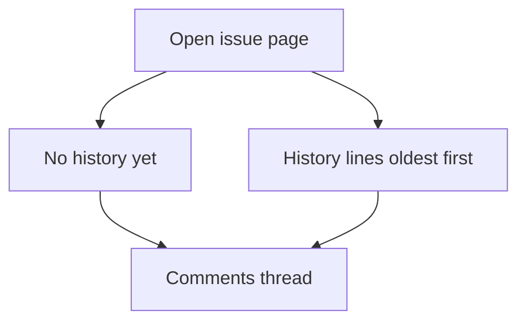
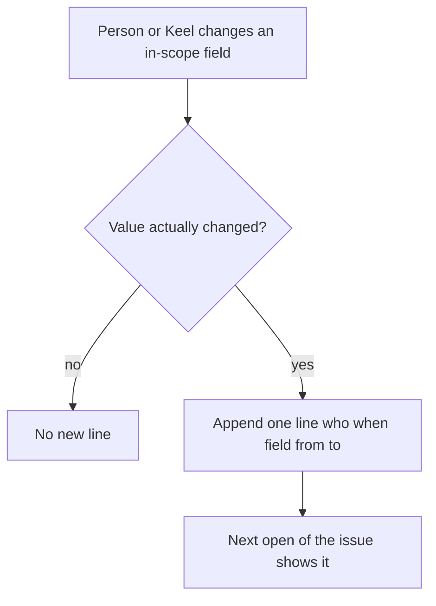

# ADR 025: Lightweight per-issue field history

* **Status:** Accepted
* **Date:** 2026-09-15

> **Amendment.** Title and description changes are recorded the same way as the other in-scope fields. Label-set changes are recorded as field `labels` ([ADR 028](ADR-028.md)).

## Background

Keel is a personal tracker for one owner plus up to two collaborators. The issue page ([UI design](../design/ui.md)) shows current fields — title, description, status, assignee, sprint, estimate, remaining, due date, parent, type — and they save as soon as they change. Metadata is Created on, Updated on, reporter, and key. Comments ([ADR 017](ADR-017.md)) capture discussion when someone writes a note. Identity is the picker user ([ADR 011](ADR-011.md)).

[v1 scope](../architecture/v1-scope.md) deferred “activity history / audit log” because a trusted 1–3 person tool does not need compliance trails, global feeds, or “who viewed this.” [ADR 012](ADR-012.md) likewise left activity history out and treats delete as irreversible. Updated on only says that something changed, not what or to which value. Sprint complete and auto-sprint carry unfinished work to the next window or the backlog ([ADR 013](ADR-013.md), [ADR 019](ADR-019.md)); series copies can be claimed into an overlapping sprint ([ADR 021](ADR-021.md)). None of that is visible later on the issue.

## Problem Statement

A week later, KEEL-12 shows “In Review, assigned to Alex, 2h remaining” with no record of when that happened or what it used to be. Comments do not fill that gap unless someone used them as a log. The need is reconstructive planning — why is this still open, who had it last sprint, was remaining cut or never updated, was it Cancelled or Done and reopened — not forensic accountability.

## Objective(s)

- On the issue page, show a short changelog of field changes: who, when, field, from → to.
- Record those facts at the moment the field actually changes, from every Keel surface that can change them.
- Keep comments as discussion; keep a product-wide audit log deferred.
- Stay inside the personal-tool boundary: per-issue, handful of fields, append-only, not searchable, not undo, not notifications.

## Scope and Deliverables

### In-Scope

- A per-issue history list on the HTML issue page, in its own heading immediately above Comments.
- Lines for actual changes to **status**, **assignee**, **sprint**, **estimate**, **remaining**, **due date**, **parent**, **type**, **title**, **description**, and **labels**.
- Sprint rows for explicit Complete carry-over (picker user) and for automatic auto-sprint rollover and series sprint-claim (label **Keel**).
- Empty state when an issue has no recorded lines yet (new issues and existing issues with no backfill).
- Amend v1-scope so this slice is in v1 and the full audit log stays deferred.

### Out-of-Scope

- A product-wide activity stream, search, or “who did what when” across issues.
- Created, reporter, views, failed requests, or a row per autosubmit POST that did not change a value.
- Mixed comment+history feed, undo/restore, notifications, or find indexing of history.
- Reconstructing changes that happened before this feature exists.
- JSON/CLI listing of history (recording from those writes is in; a dedicated read API is not required for this slice).

### Deliverables

- This ADR as the behavior source of truth.
- History shown on the issue page; lines written when the in-scope fields change.
- v1-scope (and the ADR 012 out-of-scope line) updated to point here.

## Technical Requirements

* **Must** show history only on that issue’s page, as a short list next to comments, with heading **History** immediately above **Comments**.
* **Must** list lines oldest first, newest last.
* **Must** make each line one fact: who, when, field, from → to, in the shape `{when}, {who} — {field} {from} → {to}`.
* **Must** use the acting picker user as who for a person-driven change (issue page, board, inbox, backlog, explicit sprint Complete, API/CLI with ambient identity).
* **Must** name who as **Keel** for automatic auto-sprint rollover carry-over and for series claiming an unscheduled copy into an overlapping sprint.
* **Must** append a line only when an in-scope field’s value actually changes: status, assignee, sprint, estimate, remaining, due date, parent, type, title, description, labels.
* **Must** record sprint carry-over when unfinished issues move on Complete (to the next planned sprint or to Unscheduled).
* **Must** show Unassigned, Unscheduled, No parent, and none for empty estimate/remaining/due/description, using the same status/type labels the issue page already uses.
* **Must** show a quiet empty state `No history yet.` when there are no lines.
* **Must** keep the stored from/to/who labels readable after a later rename of a user, sprint, or parent.
* **Must** delete an issue’s history with the issue, as comments already are.
* **Must** leave comments, find, board notifications-by-looking, and Created/Updated metadata as they are.
* **May** append several lines from one save when several in-scope fields change together, each with the same who and when.
* **May** use the same timestamp formatting as comment meta (`when`).
* **Must Not** record create/birth values, no-op saves, failed writes, or page views.
* **Must Not** mix history into the comment thread, offer undo from a line, let a user edit or remove a line, or search history from Find.
* **Must Not** add a site-wide activity feed, an audit log of every mutation, or notifications that someone moved a field.

## Consequences

* **Good:** Opening an issue answers “how did this get here?” without relying on comments or on Updated on.
* **Good:** The full audit log stays deferred; create, views, and no-op autosubmits are still not logged.
* **Bad:** History starts empty for issues that already exist; last week’s In Review still has no trail until the next change.
* **Bad:** Remaining-time, due-date, title, and description edits can make a long list on a busy ticket; there is no collapse. Description lines store the full snapshot, so a long note sits in the trail.
* **Risk:** Attributing automatic rollover to Keel hides which picker user happened to load a page that triggered catch-up. Accepted so a board open is not blamed for carry-over. Explicit Complete still names the person.
* **Risk:** Snapshotted labels can disagree with a renamed user or sprint. Accepted so old lines stay a true record of what was shown.

## System Design

### Technical Stack and Architecture

This feature touches the existing **issue page** (`/issues/{key}-{number}`, `issue_detail.html`): a History heading above Comments. Writers are the same places those fields already change: issue-page autosubmit, board/inbox status, backlog/issue sprint controls, sprint Complete, auto-sprint rollover, series sprint claim, and the JSON/CLI issue update path. Identity stays [ADR 011](ADR-011.md). Persistence follows the comments pattern: an append-only table of snapshotted lines, cascaded when the issue is deleted. There is no JSON listing of history in this slice.

### UML Diagrams

User flow — reading history:

User flow — a field change:

## Supporting Documentation

* [v1 scope](../architecture/v1-scope.md)
* [UI design](../design/ui.md)
* [Data model](../design/data-model.md)
* [ADR 011: Ambient identity without authentication](ADR-011.md)
* [ADR 012: Issue realization](ADR-012.md)
* [ADR 017: Render issue descriptions and comments as Markdown](ADR-017.md)
* [ADR 019: Auto-sprint cadence](ADR-019.md)
* [ADR 021: Repeating work via Scheduling Manager](ADR-021.md)
