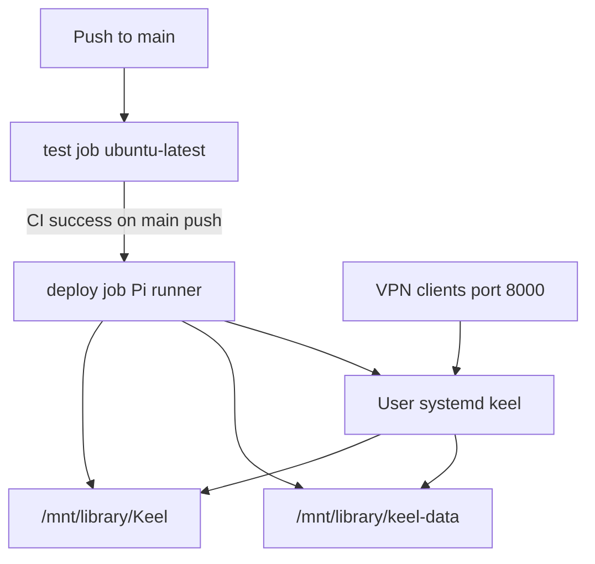
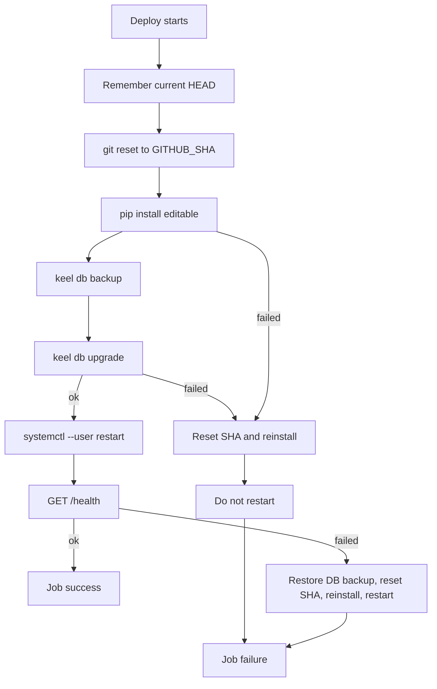
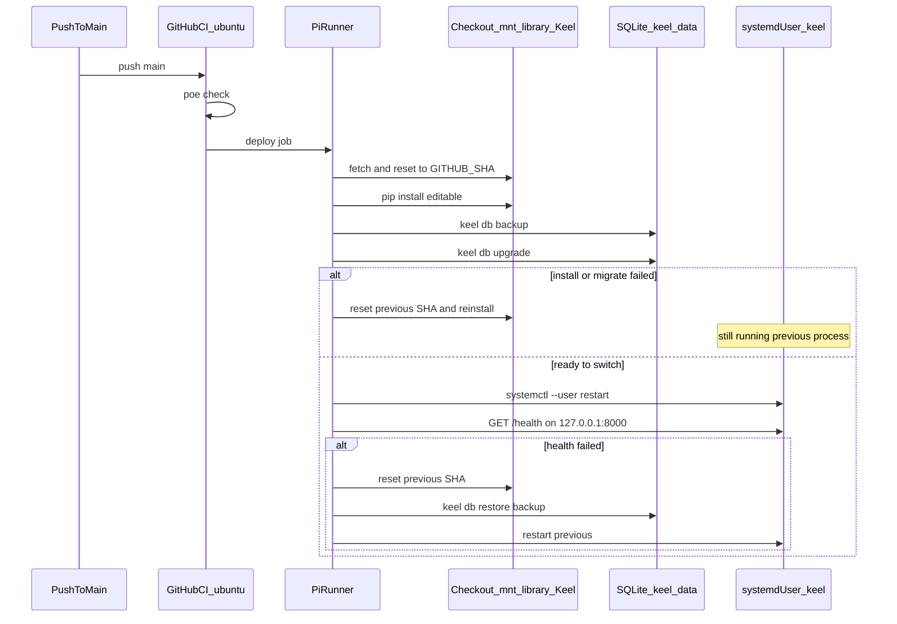

# ADR 026: Automated production deploy on Raspberry Pi

* **Status:** Accepted
* **Date:** 2026-09-15

## Background

Keel is a self-hosted issue tracker for one owner plus up to two collaborators on a trusted network ([context](../architecture/context.md)). v1 has no authentication. The documented run path is `keel serve` ([ADR 009](ADR-009.md)); host, port, LAN, and TLS were left out of [ADR 018](ADR-018.md). Persistence is one SQLite file with explicit Alembic upgrades ([ADR 007](ADR-007.md)); `keel serve` refuses a stale schema. Backup/restore already exist ([ADR 015](ADR-015.md)).

The owner has a Raspberry Pi 4 on 24/7, a GitHub Actions self-hosted runner named `raspberrypi` (labels `self-hosted`, `Linux`, `ARM64`), and a clone at `/mnt/library/Keel`. Production should be that machine on the local VPN. CI today is [`.github/workflows/ci.yml`](../../.github/workflows/ci.yml) (`poe check` on `ubuntu-latest` for pushes to `main` and pull requests). There is no deploy path; the Pi currently has Python 3.11.

## Problem Statement

Merging to `main` does not update the live site. Production needs a reboot-safe process, a database file that git never overwrites, schema upgrades applied before serve, and a failure mode that does not replace a healthy site with a broken one — without manual steps on each update.

## Objective(s)

- Deploy the `main` commit that passed CI onto the Pi with no operator action after merge.
- Keep Keel running across reboots and across deploys.
- Keep production data off the git working tree.
- Leave a healthy previous process running when an update cannot be completed safely.

## Scope and Deliverables

### In-Scope

- Dedicated GitHub Actions Deploy workflow on the existing self-hosted runner after CI succeeds on `main`.
- User systemd unit running `keel serve` bound to `0.0.0.0:8000`.
- Production env and SQLite under `/mnt/library/keel-data/`.
- One-time bootstrap: Python 3.12+, venv, data dir, linger, enable the unit (run over SSH when implementing).
- Backup, migrate, restart, and `/health` check as part of deploy.
- README operations notes that do **not** include VPN hostname or IP.

### Out-of-Scope

- Docker/Compose, nginx/Caddy, TLS, binding port 80, or publishing off the VPN.
- Authentication, secrets management beyond a local env file, or GitHub Environments.
- Running the full test suite on the Pi.
- Automatic pruning of database backups.
- Documenting or committing the VPN hostname or IP.
- Changing application behavior, schema, or the ubuntu CI job.

### Deliverables

- This ADR.
- `deploy` job in `.github/workflows/deploy.yml`, triggered after CI succeeds on `main`.
- `scripts/deploy-prod.sh` and `scripts/bootstrap-prod.sh`.
- `deploy/keel.service`.
- Production env file created on the Pi at bootstrap (not committed).
- README section describing production without network identifiers.

## Technical Requirements

* **Must** deploy only after the CI workflow succeeds for a `push` to `main`, via a dedicated Deploy workflow (`workflow_run` on [`.github/workflows/ci.yml`](../../.github/workflows/ci.yml)).
* **Must** run the deploy job on `runs-on: [self-hosted, Linux, ARM64]`.
* **Must** update the production clone at `/mnt/library/Keel` to `$GITHUB_SHA` (not the runner `_work` directory as the live tree).
* **Must** run the app as a user systemd service (`keel serve` from that clone’s `.venv`), enabled with lingering so it survives reboot and logout.
* **Must** bind `0.0.0.0:8000` via `KEEL_HOST` / `KEEL_PORT` in `/mnt/library/keel-data/keel.env`.
* **Must** store SQLite at `/mnt/library/keel-data/keel.db` (`KEEL_DATABASE_URL`), outside the git checkout.
* **Must** `keel db backup` then `keel db upgrade` before restarting, because serve refuses a stale schema ([ADR 007](ADR-007.md)).
* **Must** restart via `systemctl --user` with `XDG_RUNTIME_DIR` set, then confirm `GET http://127.0.0.1:8000/health` returns success.
* **Must** on install or migrate failure: reset the checkout to the previous SHA, reinstall, **not** restart, and fail the job (previous process stays up). Restore the pre-deploy backup if migrate already ran.
* **Must** on post-restart health failure: restore the backup, reset to the previous SHA, reinstall, restart, and fail the job.
* **Must** serialize deploys (`concurrency`, do not cancel an in-flight deploy).
* **Must** install production dependencies only (`pip install -e .`, no `[dev]`).
* **Must Not** write VPN hostname, tailnet name, or IP addresses into the repository.
* **Must Not** require a manual Pi step for ordinary `main` updates after bootstrap.
* **Must Not** run `poe check` or pytest on the Pi as part of deploy.
* **May** install Python 3.12 with `uv` during bootstrap.
* **May** add a distinctive runner label later if a second ARM64 runner appears.
* **Must Not** introduce Docker, a reverse proxy, or a second database engine for this deploy.

## Consequences

* **Good:** Merge to `main` is the release; the Pi stays the source of truth for data; CI still runs on GitHub-hosted ubuntu; a failed update does not require someone to SSH to bring the old site back.
* **Bad:** Successful deploys have a short outage during restart (no zero-downtime/blue-green). User systemd depends on linger and `XDG_RUNTIME_DIR` in Actions. The Pi is a single point of failure.
* **Risk:** Alembic plus SQLite cannot always roll back a half-applied revision in-engine; the file backup is the recovery mechanism. An editable install is updated in place while the old process still runs — mitigated by `KEEL_RELOAD=false` and restarting only after migrate succeeds. Production git update prefers the already-authenticated Actions checkout, then GitHub HTTPS with Basic `x-access-token` auth, then `origin`; Bearer extraheaders and credential-helper prompts fail on the headless Pi.

## System Design

### Technical Stack and Architecture

Production is one Uvicorn process (`keel serve`, factory `keel.app:create_app`) managed by user systemd, env from `/mnt/library/keel-data/keel.env`. Data is the existing SQLite + Alembic stack. GitHub Actions uses two workflows: CI (`test` on `ubuntu-latest`) is unchanged; Deploy waits for that workflow to succeed on a `push` to `main`, then runs on the Pi.

Bootstrap (once): Python 3.12 via uv, `/mnt/library/Keel/.venv`, `/mnt/library/keel-data/`, copy `deploy/keel.service` to `~/.config/systemd/user/keel.service`, `loginctl enable-linger`, `keel db upgrade`, `systemctl --user enable --now keel`.

Deploy (every successful `main` CI): `scripts/deploy-prod.sh`. The Deploy workflow checks out the CI head SHA under the runner `_work` tree only so it can run that script version; the live tree remains `/mnt/library/Keel`. Objects are copied into that live clone from the Actions workspace when present, so deploy does not need a second GitHub login for the usual path.

### UML Diagrams

## Supporting Documentation

* [ADR 007: Persistence via SQLite, SQLAlchemy, and Alembic](ADR-007.md)
* [ADR 009: Server-rendered Jinja2 pages with progressively enhanced vanilla JavaScript](ADR-009.md)
* [ADR 015: Database backup and restore](ADR-015.md)
* [ADR 018: Phone layout of the existing site](ADR-018.md)
* [README](../../README.md)
* [CI workflow](../../.github/workflows/ci.yml)
* [Deploy workflow](../../.github/workflows/deploy.yml)
