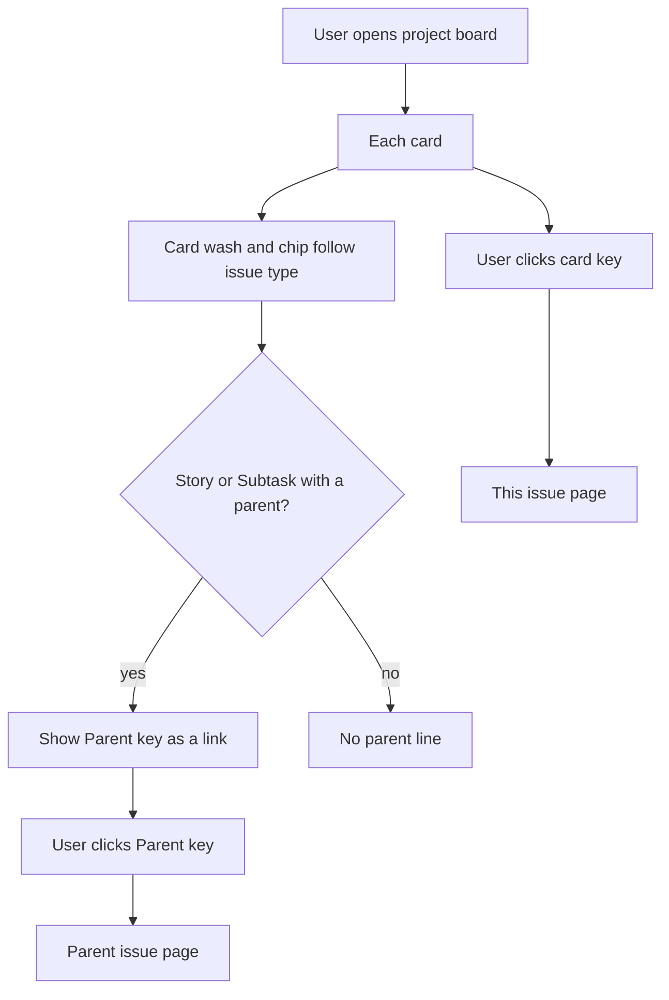
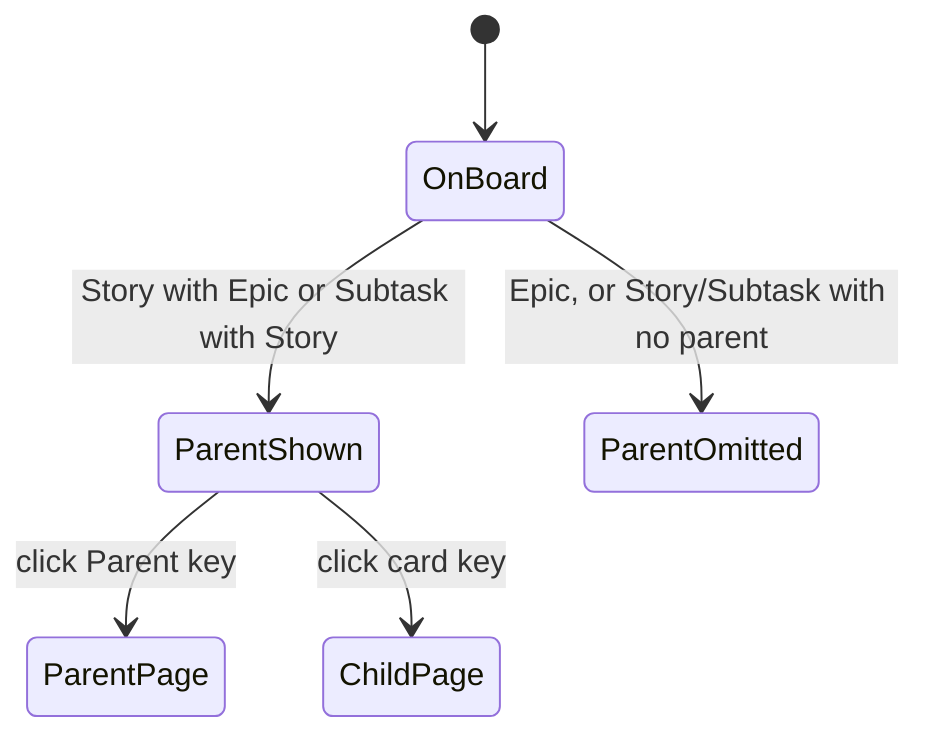
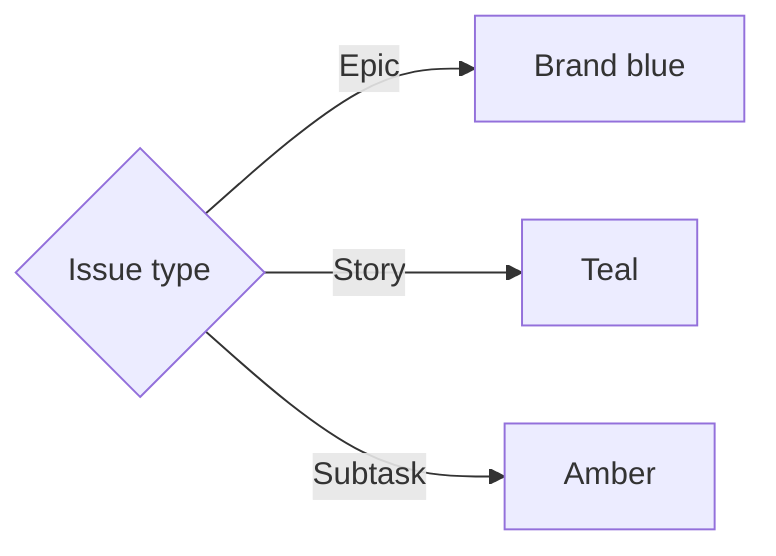

# ADR 027: Parent key on Kanban cards and type colors

* **Status:** Accepted
* **Date:** 2026-09-15

## Background

Keel's issue hierarchy is Epic → Story → Subtask via an optional parent ([ADR 003](ADR-003.md), [ADR 012](ADR-012.md)). A Story's parent, when set, is an Epic; a Subtask's parent, when set, is a Story; Epics never have a parent. Parent is already stored on the issue and shown on the issue page. The project Kanban board ([ADR 005](ADR-005.md)) presents issues as cards with key, title, type, assignee, estimate, unresolved blockers, and due date. Parent is not visible there.

Type is shown as the same blue chip (or plain table text) for every issue. The recorded brand palette ([ADR 001](ADR-001.md), [brand colors](../brand-colors.md)) is only blue, white, and sheet gray, which is not enough to tell Epic, Story, and Subtask apart by color.

## Problem Statement

A user working the board cannot tell which Epic a Story belongs to, or which Story a Subtask belongs to, without opening the issue. They also cannot tell issue types apart at a glance: Epic, Story, and Subtask currently share one color.

## Objective(s)

- Make a card's parent visible on the board when one exists, and let the user open that parent from the card.
- Keep cards without a parent looking the same aside from type color.
- Make Epic, Story, and Subtask visually distinct by color wherever type is shown, without relying on color alone.

## Scope and Deliverables

### In-Scope

* Story cards that have an Epic parent, and Subtask cards that have a Story parent: **Parent {key}** linking to the parent's issue page.
* The existing Kanban page (`/projects/{key}/board`), including type/assignee/sprint filters and separate-by-sprint lanes.
* Distinct type colors: Epic brand blue, Story teal, Subtask amber.
* Board cards: a light wash of the type hue and a matching type chip.
* The same type hues on every other surface that shows type (filters, lists, issue page, Create, schedules, search).
* Recording those type hues next to the existing brand tokens.

### Out-of-Scope

* Parent key on backlog, inbox, sprint detail lists, or other non-board surfaces.
* Filtering or grouping the board by parent or Epic.
* Changing parent from the board.
* Showing **No parent** (or any placeholder) when parent is unset.
* Parent on Epic cards (Epics never have a parent).
* User-chosen or per-project type colors.
* Recoloring the top bar, footer, or other chrome that is not a type label.
* New screens.

### Deliverables

* Board cards show **Parent {key}** as a link when a Story or Subtask has a parent.
* Epic / Story / Subtask are colored as specified everywhere type appears.
* Type hues recorded in the brand color scheme.
* Accepted ADR 027 in `docs/adr/`. This record **amends** [ADR 001](ADR-001.md) so recorded type identity hues are allowed; the bar still uses only logo blues.

## Technical Requirements

**Parent on the board**

* **Must** show **Parent {key}** on a Story card when that Story has an Epic parent, using the same project-key form as the card's own key (for example `KEEL-3`).
* **Must** show **Parent {key}** on a Subtask card when that Subtask has a Story parent, in the same form.
* **Must** make that key a link to the parent's issue page (`/issues/{key}`), the same destination pattern as the card's own key.
* **Must** omit the parent line when a Story or Subtask has no parent.
* **Must** keep the parent line off Epic cards.
* **Must** keep the parent link usable without JavaScript, and must not start a card drag (same treatment as the card's own key).
* **Must** still show **Parent {key}** when filters hide the parent's type or when separate-by-sprint puts parent and child in different lanes.
* **May** place the parent line with the card's existing meta so it stays compact on a phone-narrow column.
* **Must Not** show **No parent** or other empty-parent copy on the card.
* **Must Not** add a parent filter, Epic swimlane, or parent editor on the board.
* **Must Not** recolor the parent key to the parent's type; it stays ordinary link text on the child card.

**Type colors**

* **Must** use three distinct hues: Epic = brand blue, Story = teal, Subtask = amber, recorded as tokens with the brand palette.
* **Must** tint each board card with a light wash of its type hue, and color the type chip to match that hue.
* **Must** apply the same type hues wherever the type word or type control is shown (board filters, backlog, inbox, sprint and project lists, schedules, search, issue page, Create).
* **Must** keep the type word visible; color is not the only cue.
* **Must** keep title, key, meta, and links readable on the washed card (dark text on a light wash).
* **Must** keep type-colored chips and labels readable (including on a phone-narrow column).
* **May** use a stronger chip fill than the card wash so the chip reads as the type mark.
* **May** color a closed type dropdown by the currently selected type on Create and the issue page.
* **Must Not** change the top bar or footer palette.
* **Must Not** let people pick their own type colors in this feature.
* **Must Not** change status, assignee, estimate, blockers, due date, or drag-to-status behavior except for the card wash and type coloring.

## Consequences

* **Good:** Board scanning shows parent and type without opening a card; type is consistent across Keel; parent is one click away.
* **Bad:** Cards with a parent gain a line of chrome; two keys appear on those cards, distinguished by the **Parent** prefix. The UI now carries hues that are not on the logo sheet. Tinted cards are more colorful than today's white cards.
* **Risk:** Washes that are too strong hurt text contrast; washes that are too weak fail to distinguish types. Teal must stay distinct from brand blue. Amending ADR 001's "no second palette" rule needs the new hues written down so they do not sprawl.

## System Design

### Technical Stack and Architecture

Parent display only touches the existing project Kanban at `/projects/{key}/board` (`board.html`). Type color touches that board plus every other Keel HTML surface that already shows type. Parent is already a field on the issue. No new page, role, or entry point. How the template obtains the parent key, and how type tokens are named in CSS, are implementation leftovers.

### UML Diagrams

Card parent display (independent of type color, which always applies):

Type color (every surface that shows type):

## Supporting Documentation

* [ADR 001: Persistent top menu bar](ADR-001.md) (amended by this record for type identity hues)
* [ADR 003: Unified issue hierarchy](ADR-003.md)
* [ADR 005: Board, sprint, and backlog as views](ADR-005.md)
* [ADR 012: Parent rules and issue identity](ADR-012.md)
* [Brand colors](../brand-colors.md)
* [UI design](../design/ui.md)
* [Kanban use cases](../architecture/use-cases.md)
