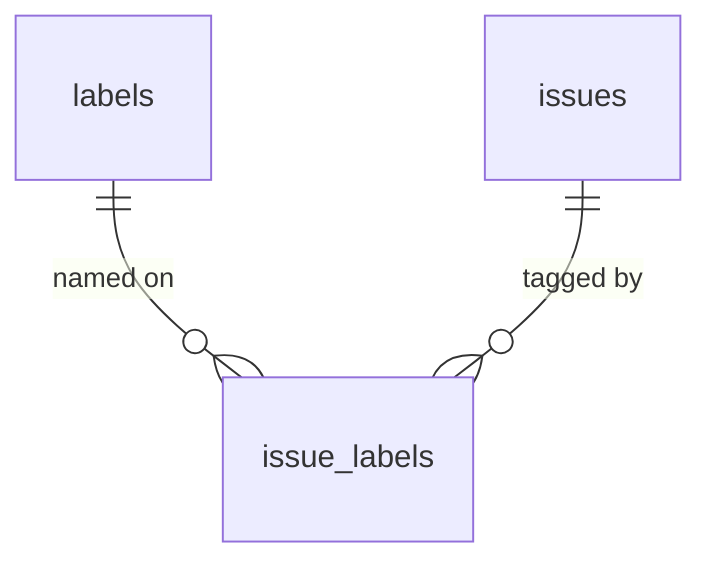
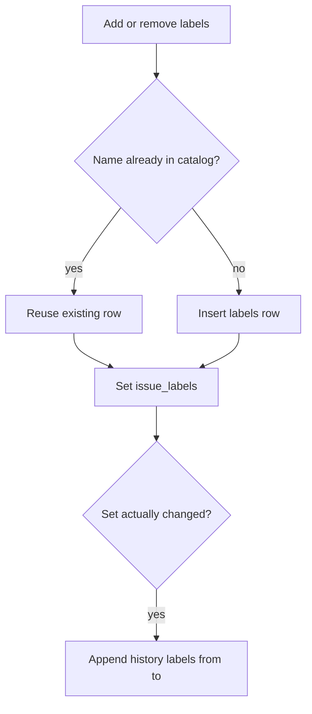
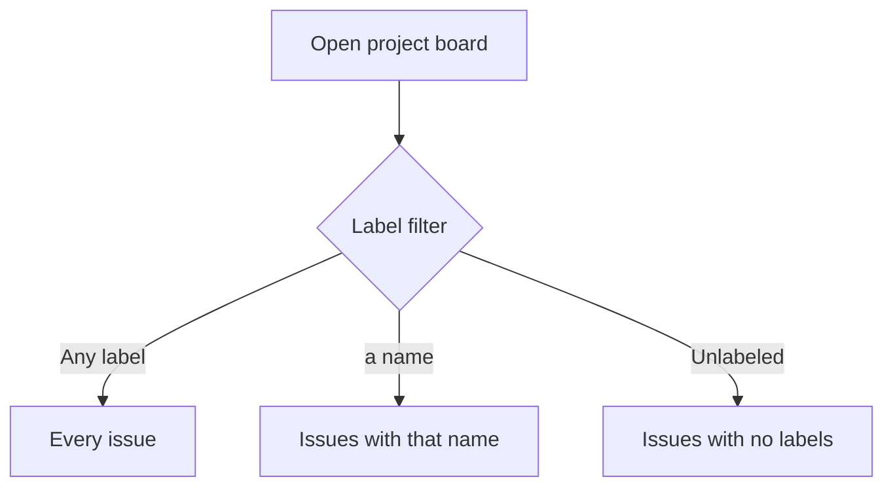

# ADR 028: Issue labels

* **Status:** Accepted
* **Date:** 2026-09-15

## Background

Keel classifies work with type (Epic, Story, Subtask), parent, status, assignee, and sprint. [v1 scope](../architecture/v1-scope.md) deferred labels, components, and releases because extra classification was not needed yet. KEEL-2 asks for a labels field on issues and the ability to filter by those labels. The existing board already filters by type, assignee, and sprint ([ADR 005](ADR-005.md), [ADR 027](ADR-027.md)). Field changes on an issue are recorded in the per-issue history trail ([ADR 025](ADR-025.md)).

## Problem Statement

Issues have no free-form tags. Related work that does not share a parent, sprint, or assignee cannot be grouped, and the board cannot be restricted to a tag such as `urgent` or `plumbing`.

## Objective(s)

- Let an issue carry zero or more reusable labels.
- Let people add and remove labels on create and on the issue page.
- Let the board and the issue list be filtered to one label, or to issues with no labels.
- Record label changes in the existing history trail.

## Scope and Deliverables

### In-Scope

* A global catalog of label names, created when a name is first applied to an issue.
* Many labels on one issue; the same label on issues in any project.
* Create, issue page, JSON API, and board filter/display.
* History lines when an issue's label set actually changes.

### Out-of-Scope

* Per-project label catalogs, colors, descriptions, or a labels admin page.
* Filtering by more than one label at a time, saved filters, or Find jumps to a label ([ADR 016](ADR-016.md) stays a lookup field).
* Components, versions/releases, or label-based permissions.
* Copying labels onto repeating series recipes or spawned occurrences ([ADR 021](ADR-021.md)).
* Renaming or deleting a label independently of the issues that use it.

### Deliverables

* Accepted ADR 028 in `docs/adr/`.
* Schema, API, issue page, create form, and board filter as specified.
* v1 scope updated so labels are in v1; components and releases stay deferred.

## Technical Requirements

* **Must** store labels as named catalog rows plus an issue–label link, not as a comma-separated column on `issues`.
* **Must** keep the catalog global (shared across projects), like users.
* **Must** create a catalog row when a new name is applied; applying an existing name reuses that row.
* **Must** normalize names: trim, lowercase, collapse internal whitespace to a single hyphen.
* **Must** accept names of 1–40 characters matching letters, digits, hyphen, and underscore, starting with a letter or digit.
* **Must** refuse an illegal name with `issue.invalid` (HTTP 422).
* **Must** allow zero or more labels per issue, with each name at most once on that issue.
* **Must** show labels on the issue page with add (ordinary submit) and per-label remove.
* **Must** accept an optional comma-separated labels field on Create.
* **Must** include `labels` (sorted names) on issue JSON; create and `PATCH` accept a list of names that replaces the set. An omitted `PATCH` field leaves labels alone; `[]` clears them.
* **Must** list the catalog at `GET /api/v1/labels`.
* **Must** filter `GET /api/v1/projects/{id}/issues` and the project board by one label name, or by unlabeled issues.
* **Must** keep the board filter as one control (Any label, Unlabeled, or a specific name), applied at query time like assignee and sprint.
* **Must** show an issue's labels on its board card when it has any.
* **Must** append a history line on field `labels` when the set changes, snapshotted as sorted comma-separated names, or `none` when empty.
* **Must** delete an issue's label links with the issue; unused catalog rows may remain.
* **May** offer existing names in a datalist on the issue page add field.
* **Must Not** require a predefined list before the first use of a name.
* **Must Not** add label colors, a bulk editor, or a multi-select label filter in this slice.
* **Must Not** search history or Find for label catalog rows as their own result kind.

## Consequences

* **Good:** Cross-cutting tags work without inventing extra parents or sprints. Board filtering stays one control, consistent with assignee and sprint.
* **Bad:** Global names mean `urgent` in HOUSE and `urgent` in KEEL are the same label. Unused names linger in the catalog until reused.
* **Risk:** Free-form names can sprawl (`bug`, `bugs`, `bugfix`). Accepted for a 1–3 person tool; a rename UI is deferred.
* **Risk:** Lowercasing discards the first-typed capitalization. Accepted so filters and uniqueness stay case-insensitive.

## System Design

### Technical Stack and Architecture

Two new tables: `labels` (id, unique name, created_at) and `issue_labels` (issue_id, label_id). Services in `keel.services.labels` attach names; `keel.domain.labels` holds the pure name rules. The JSON API and `/web` forms call that service, as other issue fields do. The board adds a `label` query parameter beside `assignee` and `sprint`. History reuses [ADR 025](ADR-025.md) with field name `labels`.

### UML Diagrams

## Supporting Documentation

* [v1 scope](../architecture/v1-scope.md)
* [Domain model](../architecture/domain-model.md)
* [Data model](../design/data-model.md)
* [API reference](../design/api.md)
* [UI design](../design/ui.md)
* [ADR 007: Persistence via SQLite, SQLAlchemy, and Alembic](ADR-007.md)
* [ADR 016: Find from the top bar](ADR-016.md)
* [ADR 025: Lightweight per-issue field history](ADR-025.md)
