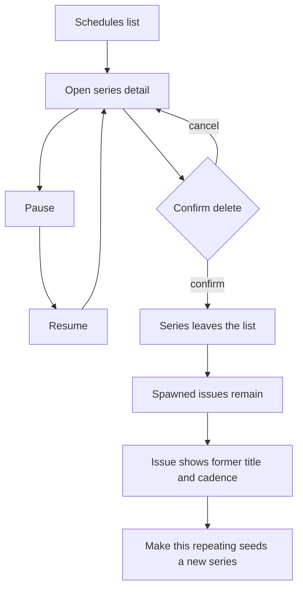
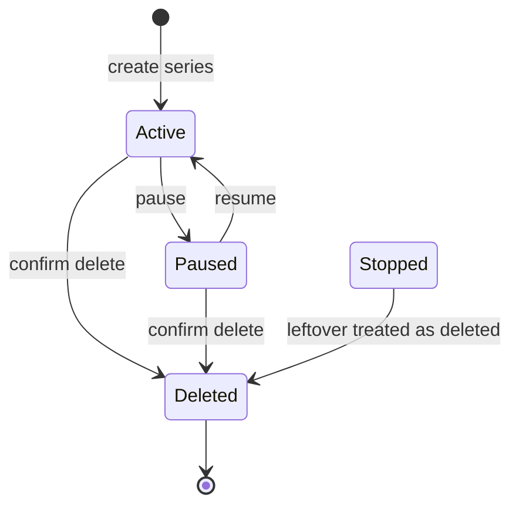

# ADR 028: Delete a schedule without deleting spawned issues

* **Status:** Accepted
* **Date:** 2026-09-15

## Background

Keel’s Scheduling Manager ([ADR 021](ADR-021.md)) lets a user create a repeating **series** that spawns ordinary issues. Pause stops new copies and Resume continues them. **Stop** is currently final: the series stays on the list, the recipe cannot change, and resume is refused. ADR 021 also said Stop is how to end a recipe and forbade bulk-deleting every spawned issue.

Users still need a way off the schedules list. They do not want that action to delete work already on the board. They also do not want a terminal Stopped row they cannot remove. Pause/Resume already cover a temporary halt.

## Problem Statement

A stopped series cannot be resumed, cannot be deleted, and still occupies the schedules list. There is no user-visible way to remove a recipe without implying the spawned issues should go with it. Users cannot retire a schedule and keep the history of work it created.

## Objective(s)

- Let a user **delete** a series so it disappears from that project’s schedules list.
- Keep every issue the series already spawned.
- On those issues, show that they came from that series (title and cadence) without a live recipe to open or edit, and still allow **Make this repeating**.
- Keep **Pause** and **Resume** as the only way to temporarily halt and continue spawning.
- Remove **Stop** as a user-facing state going forward.

## Scope and Deliverables

### In-Scope

- Delete on the schedule **detail** page, with confirmation, while the series is active or paused.
- Remove the deleted series from the schedules list (and from any other live-recipe entry points).
- Preserve spawned issues; show a former-series note (title and cadence) plus Make this repeating.
- Treat existing **Stopped** series as already deleted: they do not appear on the list; their issues get the same former-series treatment.
- Remove the Stop control and the stopped-only “recipe cannot change” detail copy.

### Out-of-Scope

- Bulk-deleting spawned issues (still forbidden).
- Restoring a deleted series.
- Changing Pause/Resume spawn behavior (no new copies while paused; resume continues as today).
- A Delete control on the schedules **list**.
- New roles, authentication, or phone-only layout work beyond existing pages.

### Deliverables

- This ADR as the behavior source of truth (revises ADR 021 on Stop vs ending a recipe).
- Schedules detail Delete (confirm) and list without that series.
- Issue-page former-series note with Make this repeating still available.
- Existing Stopped series hidden from the list as deleted.

## Technical Requirements

* **Must** keep Pause (no new copies) and Resume (series becomes active and spawning continues as today).
* **Must** offer Delete on the schedule detail page for an **active** or **paused** series.
* **Must** ask for confirmation before Delete. Cancel leaves the series unchanged on the detail page.
* **Must**, after confirmed Delete, remove the series from that project’s schedules list and send the user back to the list with a success notice.
* **Must Not** delete, close, or cancel issues the series already spawned. Board, backlog, and sprint placement of those issues stay as they are.
* **Must** show on each of those issues a former-series note with the series **title** and **cadence** summary, with no link to a live recipe and no recipe editor.
* **Must** still offer **Make this repeating** on those issues so one of them can seed a new series. That new series is separate; other former issues do not join it unless the user repeats the same action there (existing seed rules).
* **Must Not** show Stop, a Stopped badge as a listed state, or copy that a stopped recipe cannot change, for series that remain on the list.
* **Must** treat leftover Stopped series as already deleted: they **Must Not** appear on the schedules list; their spawned issues **Must** get the same former-series note and Make this repeating.
* **Must Not** provide a way to resume or open a deleted (or leftover Stopped) series as a live recipe.
* **Must Not** bulk-delete every issue in the series.
* **May** say in the confirm copy that existing issues remain and that this cannot be undone.
* **May** allow a new series with the same title after delete.
* **Must Not** attach leftover issues to a newly created series that happens to share a title.

## Consequences

* **Good:** Users can retire a chore recipe without losing tickets already on the board. Pause/Resume stay simple. The schedules list only shows recipes that can still run or be paused.
* **Bad:** Delete is not undoable. Former issues remember title and cadence but cannot open the old recipe. Users who relied on Stop as a locked, still-visible archive lose that listed tombstone.
* **Risk:** Existing Stopped series vanish from the list when this ships; anyone using Stop as an archive will only see the note on spawned issues. **Risk:** Make this repeating on one former issue can look like “restoring the schedule” when it actually starts a new series.

## System Design

### Technical Stack and Architecture

Same product surfaces as ADR 021: project **Schedules** list and detail in the top nav family, issue repeating overlay ([ADR 024](ADR-024.md)), ambient identity. Pause and Resume stay on the detail page; Stop is replaced by Delete. Spawned work remains ordinary issues. Persistence of the former-series note is not specified here.

### UML Diagrams

## Supporting Documentation

* [ADR 021: Repeating work via Scheduling Manager](ADR-021.md)
* [ADR 011: Ambient identity without authentication](ADR-011.md)
* [ADR 024: Issue-page repeating recipe in an overlay](ADR-024.md)
