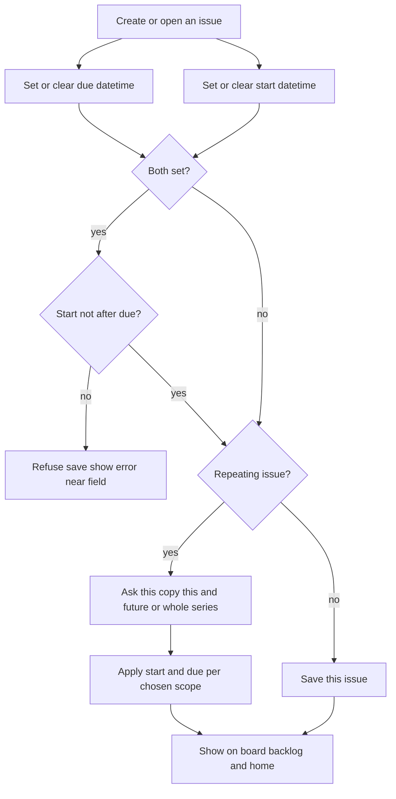
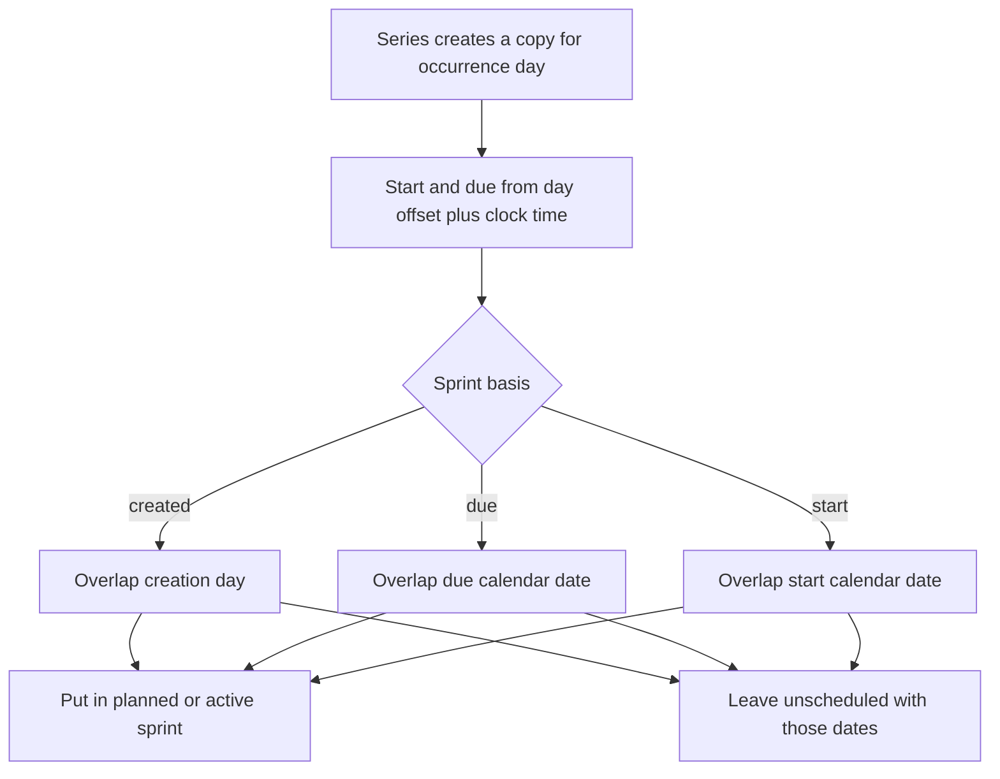
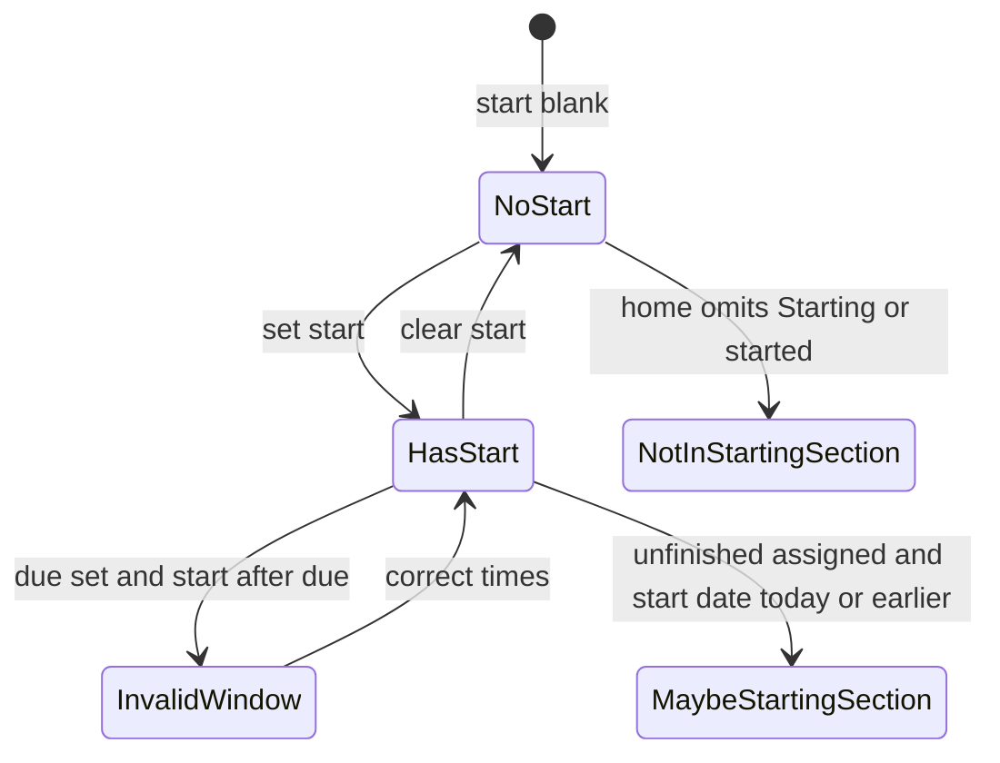

# ADR 029: Issue start date/time and series start/due offsets

* **Status:** Accepted
* **Date:** 2026-09-15

## Background

Keel issues already carry an optional due date/time. People set it on Create and on the issue page (`datetime-local`, clearable). Board cards already show due when it is set. Home lists unfinished assigned work whose due calendar date is today or earlier ([ADR 022](ADR-022.md)). Repeating series spawn copies with `due_at` at midnight on the occurrence day and assign sprints by creation date or due date ([ADR 021](ADR-021.md)). The repeating recipe lives in an overlay ([ADR 024](ADR-024.md)). Changing due on a repeating issue currently saves that copy only and does not ask which occurrences to update. There is no way to say when work should **start**, and the scheduler cannot express a start-to-due window per cycle.

## Problem Statement

Work often has a start as well as a due. Without a start field, people cannot schedule when to begin, lists cannot show that window, and home cannot surface work that has started or should have started. The scheduler also cannot give each copy a start and a due other than midnight on the occurrence day, or put copies in the sprint that overlaps the start.

## Objective(s)

- Let people set, change, and clear an optional **start date/time** on any issue.
- Keep start and due an **ordered window** when both are set.
- Show start wherever people already scan dates (issue, create, board, backlog, home).
- Add a home section for assigned work whose start is today or earlier.
- Let a series recipe define start and due as **day offset + clock time** from the occurrence day, and let sprint assignment overlap the start date.

## Scope and Deliverables

### In-Scope

* Optional start date/time on every issue type, on Create and the issue page.
* Ordered validation with due: either field may be blank; if both are set, start must not be after due.
* Start (and due, where the list does not already show it) on board cards, backlog rows, and home inbox rows.
* A new home section for the picker user’s assigned unfinished issues whose start calendar date is today or earlier.
* Series recipe fields: start offset days + clock time, due offset days + clock time, relative to the occurrence day (offsets may be negative, zero, or positive).
* Changing start or due on a repeating issue asks This occurrence / This and all future / Entire series, then applies that choice.
* A third series sprint basis: put copies in the sprint overlapping the **start** calendar date.

### Out-of-Scope

* Reminders, notifications, or extra overdue chrome beyond listing.
* Auto-changing status when start or due arrives.
* Timezone picker, calendar export, Gantt, or parent/child date rollup.
* Filters or find-by-date.
* Changing auto-sprint windows, series cadence, or spawn modes except using the new start/due values when placing copies.
* Dates on the short “add a child” form.

### Deliverables

* This ADR as the behavior source of truth.
* Start on the existing create, issue, board, backlog, and home surfaces.
* Series recipe start/due offsets and start-date sprint basis on Schedules and the issue repeating overlay.

## Technical Requirements

* **Must** give every issue an optional start date/time, the same precision as due (`datetime-local` in the UI).
* **Must** allow start without due, due without start, both, or neither.
* **Must** refuse a save when both are set and start is after due, with the error shown near the field (create, issue page, recipe, and JSON API alike).
* **Must Not** treat a blank start as a validation error.
* **Must Not** change status, assignee, sprint, or estimate when start or due changes.
* **Must** offer start on Create in the existing Dates and effort group, beside due; title remains the only required create field.
* **Must** show start on the issue page beside due. For a one-off issue, start and due **May** autosubmit on change, with Save as the no-JavaScript fallback (same pattern as due today).
* **Must** pair the two inputs so the picker cannot offer a due before start when both have values; the service **Must** still refuse that combination if posted without the script.
* **Must** show start on board cards when it is set (due already shows this way).
* **Must** show Start and Due columns on the backlog table.
* **Must** show start on home inbox rows (empty cell when unset).
* **Must** add a home section **Starting or started**: unfinished issues assigned to the picker user whose start calendar date is today or earlier; **Must Not** list issues with no start; **Must Not** list Done or Cancelled there.
* **Must** hide that section when it has no rows; the same issue **May** also appear in Due or overdue or other sections.
* **Must** keep home membership by **calendar date**, not clock time (same accepted risk as [ADR 022](ADR-022.md)).
* **Must** store on each series recipe a start day-offset and clock time and a due day-offset and clock time, both relative to `occurrence_on`.
* **Must**, when spawning a copy, set start and due from that occurrence day plus those offsets and times.
* **Must** refuse saving a recipe whose offsets would make start after due on a copy.
* **Must** treat start and due as recipe fields. Changing them from a repeating issue **Must** require This occurrence / This and all future / Entire series and **Must Not** autosubmit.
* **Must** implement This occurrence as an exception on that copy only. **Must** implement This and all future / Entire series by taking the posted datetimes, computing offsets relative to **this** copy’s occurrence day, saving those offsets on the recipe, and applying computed start/due to already-spawned **open** copies in range ([ADR 021](ADR-021.md) scope rules). Closed copies **Must Not** be rewritten.
* **Must** treat leftover copies after the recipe is deleted as ordinary issues ([ADR 028](ADR-028.md)): start and due save on that issue only, without a scope prompt.
* **Must** offer sprint basis values: creation date, due date, or start date. Start-date basis **Must** assign a copy to a planned or active sprint whose dates overlap the start calendar date inclusively, and **Must** leave N-previews unscheduled until a window covers start.
* **Must Not** put the series recipe itself on the board.
* **Must** keep existing series behaving as today until edited: 0-day offset, 00:00 for both start and due (due remains midnight on the occurrence day; start is also midnight that day until changed).
* **Must** work without JavaScript and on the existing phone-narrow layout ([ADR 018](ADR-018.md)).

## Consequences

* **Good:** People can schedule a start-to-due window on one-off and repeating work, and see it on the issue, lists, and home.
* **Good:** Repeating chores can start before the due day without inventing extra occurrence dates.
* **Bad:** Due on a repeating issue no longer saves immediately; people must choose a scope, which is a behavior change from today.
* **Bad:** Board cards and backlog rows get more date text, so dense boards are busier.
* **Bad:** Existing series will show a start equal to due (midnight) until someone edits offsets.
* **Risk:** Computing recipe offsets from one copy’s posted datetimes can surprise if someone meant “move this copy by one day” but chose Entire series. Mitigated by the existing Outlook-style prompt.
* **Risk:** Calendar-date “starting or started” can still list an issue after its start clock time, matching the due-section trade-off in [ADR 022](ADR-022.md).

## System Design

### Technical Stack and Architecture

This feature extends existing product surfaces: Create (`/create`), issue page (`/issues/{key}-{number}`), board cards, backlog table, home inbox (`/`), Schedules recipe (`_series_recipe.html` on `/projects/{key}/schedules` and the issue repeating overlay ([ADR 024](ADR-024.md))), and the JSON issue API. Start is another issue field beside due; series offsets live on the recipe people already edit.

### UML Diagrams

## Supporting Documentation

* [UI design](../design/ui.md)
* [ADR 021: Repeating work via Scheduling Manager](ADR-021.md)
* [ADR 022: Home page as a personal work inbox](ADR-022.md)
* [ADR 024: Issue-page repeating recipe in an overlay](ADR-024.md)
* [ADR 028: Delete a schedule without deleting spawned issues](ADR-028.md)
* [Domain model](../architecture/domain-model.md)
* [Data model](../design/data-model.md)
