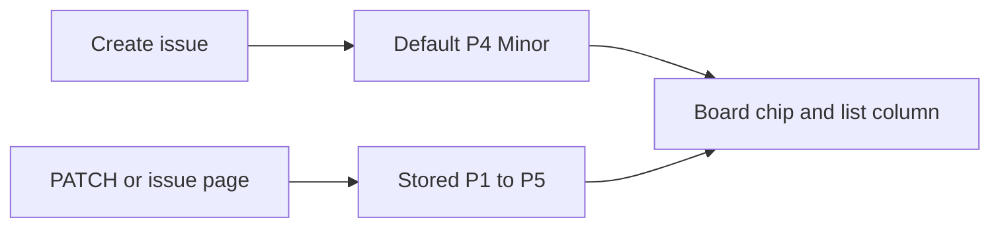
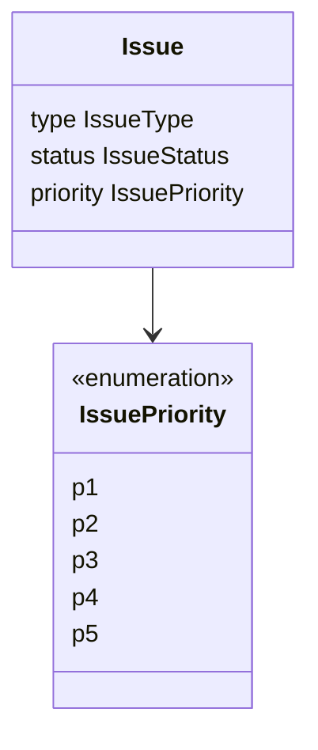

# ADR 030: Issue priority as a required ranked field

* **Status:** Accepted
* **Date:** 2026-09-16

> **Amendment.** New issues default to *P4 — Minor* instead of *P3 — Major*. Existing rows keep the rank they already have.

> **Amendment.** Priority is stored on the series recipe and copied onto spawned issues ([Series recipe priority](series-recipe-priority.md)). The original out-of-scope note below is historical.

## Background

An issue already carries type, workflow status, assignee, start and due dates, and effort ([ADR 012](ADR-012.md), [ADR 013](ADR-013.md), [ADR 029](ADR-029.md)). Those say what the work is and where it sits in the workflow. They do not say how urgent it is relative to other open work. KEEL-1 asked for a priority field so rank can be observed on the issue and on the surfaces that list issues.

## Problem Statement

Without a first-class rank, every open issue looks equally important. Status *Blocked* is a workflow state, not urgency. Due dates and sprint membership are scheduling, not rank. Keel needs a small, shared set of priority values on every issue, visible wherever an issue is shown, and editable from the same paths that already change type and status.

## Objective(s)

- Give every issue a required priority from a fixed five-level scale.
- Make that rank visible on the issue page, create form, board cards, and issue lists.
- Keep the same values on the JSON API as on the pages.

## Scope and Deliverables

### In-Scope

* A required `priority` attribute on Issue.
* Five ranked values: P1 Blocker, P2 Critical, P3 Major, P4 Minor, P5 Trivial.
* Create, read, and update through the JSON API and the server-rendered pages.
* Display on board cards, the project issue list, backlog, sprint, home inbox, and child tables.
* Recording priority changes in the existing per-issue history ([ADR 025](ADR-025.md)).

### Out-of-Scope

* Per-project or user-defined priority scales.
* Sorting the backlog, board columns, or inbox by priority (lists keep their existing order).
* Filtering the board by priority (the list API may filter; the board keeps type, assignee, and sprint).
* Storing priority on a series recipe; spawned copies take the default until edited.
* Using priority as a substitute for due dates, blockers, or sprint membership.

### Deliverables

* This ADR as the behavior source of truth.
* Domain enumeration, schema column, Alembic revision, API and page wiring.
* Updates to the data model, API reference, UI design, domain model, and glossary.

## Technical Requirements

* **Must** store priority as a lowercase string guarded by a `CHECK` constraint, matching type and status ([data model](../design/data-model.md)).
* **Must** use the values `p1`, `p2`, `p3`, `p4`, `p5` on the wire and in storage, in that rank order (highest first).
* **Must** label them *P1 — Blocker*, *P2 — Critical*, *P3 — Major*, *P4 — Minor*, and *P5 — Trivial*.
* **Must** default new issues to *P4 — Minor*. Copies spawned from a series take the recipe rank ([Series recipe priority](series-recipe-priority.md)), which itself defaults to *P4 — Minor*.
* **Must** backfill existing rows to *P3 — Major* when the column is added; **Must Not** leave priority nullable. **Must Not** rewrite those rows when the default later becomes P4.
* **Must** expose `priority` on issue create, read, and patch bodies; **Must** accept `priority` as a list filter on `GET /api/v1/projects/{project_id}/issues`.
* **Must** let the create form and issue page set priority through the same autosubmit pattern as type and status.
* **Must** show the rank on board cards (compact `P1`–`P5` chip) and as a Priority column on issue tables.
* **Must** append a history line when priority actually changes, using the same acting-user rule as other in-scope fields ([ADR 025](ADR-025.md)).
* **Must Not** invent additional ranks, aliases, or a numeric 1–5 field beside the enumeration.
* **Must Not** treat a missing PATCH field as a reset; absent leaves the stored rank alone.
* **May** use distinct chip colors so P1 reads hotter than P5, without leaving the existing brand tokens for chrome.

## Consequences

* **Good:** Rank is visible without opening the issue. Existing work was backfilled to P3 so the column could be required from day one; new work now starts as *P4 — Minor*.
* **Bad:** Five labels must be learned; Blocker as P1 can be confused with the *Blocked* status.
* **Risk:** Defaulting new work to P4 can hide items that should have been Major until someone raises them. Accepted so the common case needs no extra click.
* **Risk:** Series copies used to ignore the source issue's rank. That is superseded: the recipe stores priority and copies it onto spawned issues ([Series recipe priority](series-recipe-priority.md)).

## System Design

### Technical Stack and Architecture

`IssuePriority` lives in `keel.domain.enums` next to type and status. The ORM column, Pydantic schemas, issue service, JSON routes, and `/web` forms all pass that enumeration through. Board cards read `issue.priority` from the same board projection already used for type. Changes go through `update_issue`, which records history the same way as status.

### UML Diagrams

## Supporting Documentation

* [Data model](../design/data-model.md)
* [API reference](../design/api.md)
* [UI design](../design/ui.md)
* [Domain model](../architecture/domain-model.md)
* [ADR 012: Issue realization](ADR-012.md)
* [ADR 022: Home page as a personal work inbox](ADR-022.md)
* [ADR 025: Lightweight per-issue field history](ADR-025.md)
* [Series recipe priority](series-recipe-priority.md)
