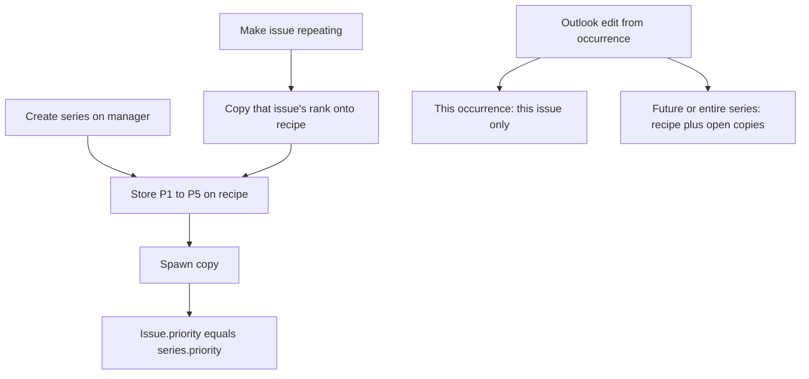
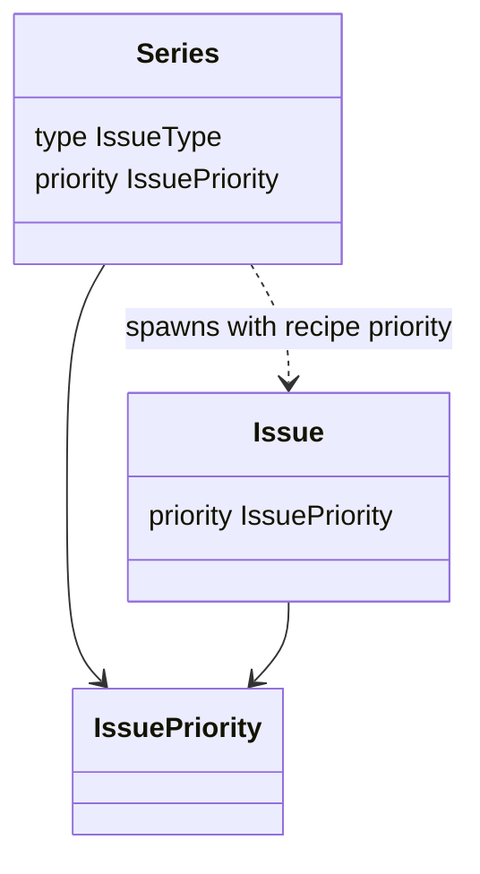

# ADR 032: Series recipe priority

* **Status:** Accepted
* **Date:** 2026-09-16

## Background

Every issue has a required P1–P5 priority ([ADR 030](ADR-030.md)). Repeating work is a series recipe that spawns ordinary issues ([ADR 021](ADR-021.md)). ADR 030 left priority off the recipe on purpose: spawned copies took the issue default (*P3 — Major*) until someone edited the copy. KEEL-15 asked for that rank to be set on the schedule, the same way type, title, and assignee already are.

## Problem Statement

A weekly chore that is always *P2 — Critical* still appears as *P3 — Major* on every new copy. The create form, issue page, and JSON issue API can set rank, but the Scheduling Manager cannot. Rank has to be fixed after each spawn, which defeats the recipe.

## Objective(s)

- Store a required priority on the series recipe, using the same five-level scale as issues.
- Let the schedules pages and series JSON API set that rank.
- Copy the recipe rank onto newly spawned issues, and seed it from an existing issue when that issue is made repeating.

## Scope and Deliverables

### In-Scope

* A required `priority` attribute on Series, default *P3 — Major*.
* Create, read, and update through the series JSON API and the schedules pages.
* Spawned copies inherit the recipe rank.
* Making an existing issue repeating copies that issue's rank onto the recipe.
* Outlook-scoped recipe edits from the issue overlay treat priority like title: this occurrence, this and all future, or the entire series.

### Out-of-Scope

* Per-series or per-project priority scales (the issue enumeration is reused).
* Sorting or filtering the schedules list by priority.
* Rewriting already-spawned copies when the manager saves the recipe (same as type and assignee today).
* Changing how the standalone issue-page priority control works: that remains this occurrence only, like status.

### Deliverables

* This ADR as the behavior source of truth.
* Series column, Alembic revision, service spawn/edit wiring, API and page forms.
* Updates to the data model, API reference, UI design, domain model, and glossary.

## Technical Requirements

* **Must** store series priority as a lowercase string guarded by a `CHECK` constraint, matching issues ([ADR 030](ADR-030.md)).
* **Must** use the values `p1`–`p5` and the labels *P1 — Blocker* through *P5 — Trivial*.
* **Must** default a new series to *P3 — Major* when the caller omits it; **Must** backfill existing series to *P3 — Major*; **Must Not** leave the column nullable.
* **Must** expose `priority` on series create, read, and patch bodies; absent PATCH leaves the stored rank alone; **Must Not** treat `null` as a clear (rank is required).
* **Must** show a Priority select on New series and on the recipe form, defaulting to *P3 — Major* on create.
* **Must** show the rank on the schedules list.
* **Must** spawn each new copy with `priority` copied from the series.
* **Must**, when an existing issue is made repeating, copy that issue's priority onto the recipe (the overlay does not ask again).
* **Must** treat recipe priority as an Outlook-scoped field when changed from an occurrence overlay; **Must Not** treat the issue page's own priority control as a recipe edit.
* **Must Not** invent extra ranks or a second scale for series.

## Consequences

* **Good:** A repeating job keeps the same urgency without a second pass on every copy. Existing series stay at P3, matching the issue default.
* **Bad:** Saving the manager recipe does not rewrite already-spawned copies, so a rank change there only affects future ticks unless the user uses Outlook scopes from an occurrence.
* **Risk:** The overlay's standalone issue priority control and the recipe priority can diverge on one occurrence. Accepted so this-occurrence exceptions stay possible, the same as assignee.

## System Design

### Technical Stack and Architecture

`IssuePriority` is reused. The series ORM column, Pydantic schemas, `create_series` / `update_series` / `_spawn_one`, JSON routes, and `/web` schedule forms pass that enumeration through. The shared `_series_recipe.html` Issue fieldset holds the select whenever identity fields are shown. Catch-up spawn is unchanged except that `create_issue` receives `priority=series.priority`.

### UML Diagrams

## Supporting Documentation

* [ADR 021: Repeating work via Scheduling Manager](ADR-021.md)
* [ADR 030: Issue priority as a required ranked field](ADR-030.md)
* [Data model](../design/data-model.md)
* [API reference](../design/api.md)
* [UI design](../design/ui.md)
* [Domain model](../architecture/domain-model.md)
