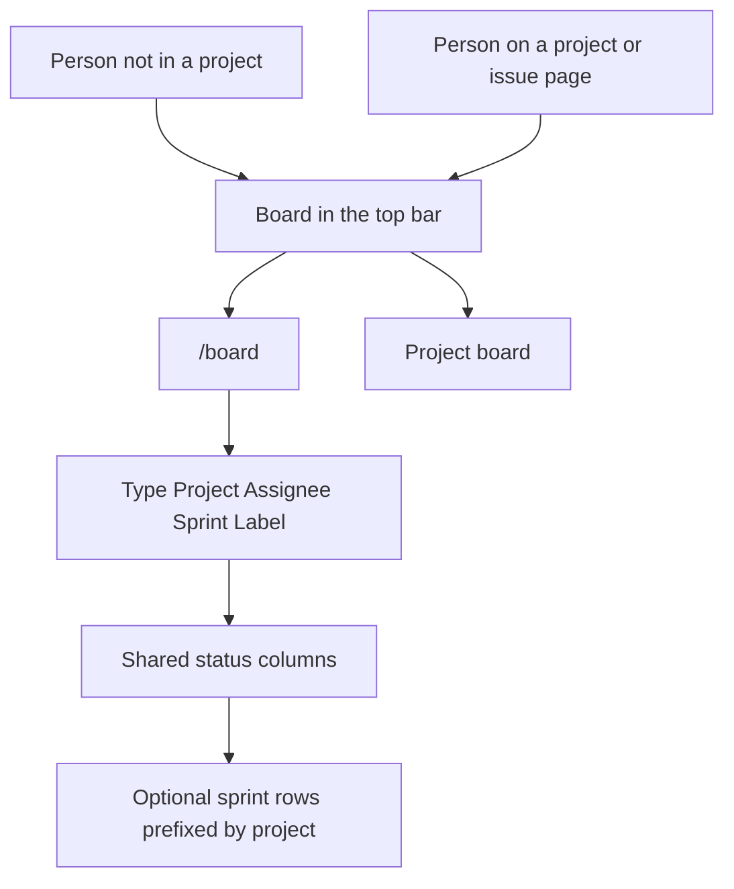
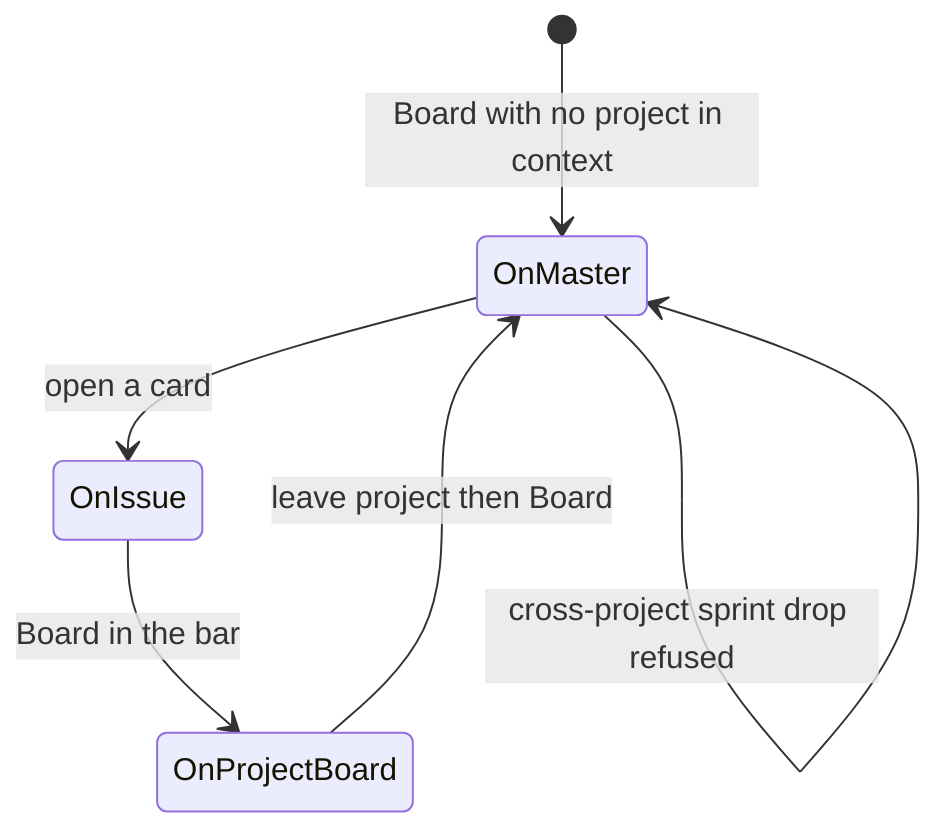

# ADR 032: Master board across all projects

* **Status:** Accepted
* **Date:** 2026-09-16

## Background

Keel already has one Kanban per project ([ADR 005](ADR-005.md), [ADR 013](ADR-013.md)) at `/projects/{key}/board`. Those Board / Backlog / Sprints / Schedules links appear only when a project is in context ([UI design](../design/ui.md)). `/` is a personal inbox across projects ([ADR 022](ADR-022.md)), not a board. Statuses are shared by every project ([ADR 004](ADR-004.md)), so columns can mix work without a second workflow. KEEL-11 asks for a master board of all projects that is reachable when you are not inside a project.

## Problem Statement

With more than one project, seeing what is moving requires opening each project's board. The inbox answers "what is on me?" as lists. There is no Kanban of everyone's current work, and Board is missing from the top bar on Home, Projects, Users, Create, and Search.

## Objective(s)

- Give people one Kanban of current work from every project.
- Make Board reachable when they are not inside a project, without adding a second nav label.
- Keep each project's board as the in-project Board target.
- Keep `/` as the personal inbox.

## Scope and Deliverables

### In-Scope

- An HTML Kanban at `/board`, heading **Board**.
- Board always listed in the reorderable top bar: `/board` when there is no current project; `/projects/{key}/board` when there is.
- Cards from all projects, minus Done/Cancelled issues whose sprint is completed.
- Existing type, assignee, sprint, and label filters, plus a single Project filter (Any project or one project).
- Separate by sprint with project-prefixed lane titles; same-project sprint drops only.
- Empty, error, no-JavaScript, and phone-narrow behavior consistent with the project board and inbox.

### Out-of-Scope

- Changing `/` or replacing the inbox with a board.
- A distinct Master nav item, or opening the master board from inside a project via Board.
- Applying the completed-sprint hide rule to `/projects/{key}/board` (future update).
- Hiding unscheduled Done/Cancelled, or hiding closed items that are still in an active sprint.
- Changing an issue's project from the board.
- Saved views, pagination, WIP limits, or swimlanes other than sprint.
- A stored extra Board row, board admin, or permissions.
- JSON collection for a global board. Drag still uses the existing issue `PATCH`.

### Deliverables

- This ADR as the behavior source of truth.
- The `/board` page in the existing server-rendered UI.
- Updates to UI design, capabilities, use cases, and glossary so the master board is named.

## Technical Requirements

* **Must** serve a Kanban at `/board` with heading **Board**, using the same six status columns as a project board.
* **Must** show Board in the reorderable top bar on every page. **Must** link it to `/board` when the page has no current project, and to that project's board when it has one (including issue pages).
* **Must Not** add a separate Master (or Home) section link. **Must Not** send Board to `/board` while a project is in context.
* **Must** include issues from every project by default. **Must Not** limit the page to the picker user's assignments.
* **Must Not** show Done or Cancelled issues whose sprint is in the completed state. **Must** still show unscheduled Done/Cancelled and Done/Cancelled in an active sprint.
* **Must Not** change what `/projects/{key}/board` includes in this story.
* **Must** offer filters: type (multi-checkbox, all on by default), Project (Any project or one project), assignee (Anyone / Unassigned / a person), sprint (Any sprint / Unscheduled / one sprint), label (Any label / Unlabeled / one name). **Must** apply filters at query time, not by hiding rendered cards.
* **Must** prefix sprint names in the Sprint control with the project key. **Must** limit that list to the selected project's sprints when a Project is chosen.
* **May** keep Separate by sprint off by default. **Must** prefix each sprint lane title with the project key when it is on.
* **Must** allow status change by drag (when the board script has run) or Move, including across projects, because the workflow is shared.
* **Must** allow a drop onto another sprint lane to set sprint only when the issue and the lane are the same project. **Must** refuse a cross-project sprint drop, leave the card where it was, and show the usual board error. **Must Not** change an issue's project.
* **Must** keep card content as on the project board (key, title, type, assignee, parent key, estimate, blockers, due, labels). **Must Not** require an extra project chip; the key already names the project.
* **Must** treat `/board` as having no current project: Find unscoped, Create without a preselected project, Backlog / Sprints / Schedules omitted from the bar.
* **Must** work without JavaScript (Move + Apply). On a phone-narrow viewport **Must** keep swipeable columns and the Move control ([ADR 018](ADR-018.md)).
* **Must**, when there are no projects, show one quiet message with a link to `/projects`. **Must**, when projects exist but no cards match, show one quiet empty message and leave the filters available.
* **Must Not** paginate. **Must Not** edit assignee, labels, parent, or title from a card.

## Consequences

* **Good:** People can run one board for every project without hopping; Board finally exists on Home.
* **Good:** Dual-meaning Board keeps the bar from growing a second Kanban label; in-project muscle memory stays "Board means this project."
* **Bad:** After opening a card, Board in the bar is the project board; getting back to `/board` means leaving the project first (home icon, then Board).
* **Bad:** Master and project boards will disagree about closed work in completed sprints until the future project-board fix.
* **Risk:** Separate by sprint on a busy instance stacks many rows (one per sprint per project plus Unscheduled). Accepted; people can leave the control off or filter to one project.
* **Risk:** Sprint names still collide in conversation; the prefix on the control and the lane is the mitigation.

## System Design

### Technical Stack and Architecture

This feature reuses the existing server-rendered Kanban and the reorderable top bar. New surface: `/board` with no project in chrome. Unchanged: `/`, `/projects/{key}/board`, issue page, Find, Create. The master board is a **view over all issues**, not a second stored board row.

### UML Diagrams

## Supporting Documentation

* [ADR 005: Boards, sprints, and backlog](ADR-005.md)
* [ADR 013: Planning realization](ADR-013.md)
* [ADR 022: Home page as a personal work inbox](ADR-022.md)
* [UI design](../design/ui.md)
* [Capabilities](../architecture/capabilities.md)
* [Use cases](../architecture/use-cases.md)
* [Glossary](../architecture/glossary.md)
