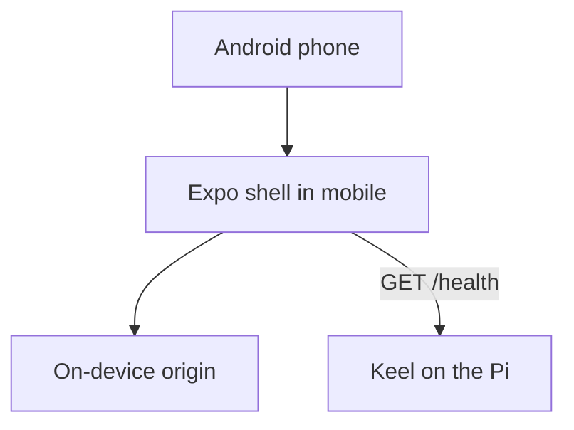
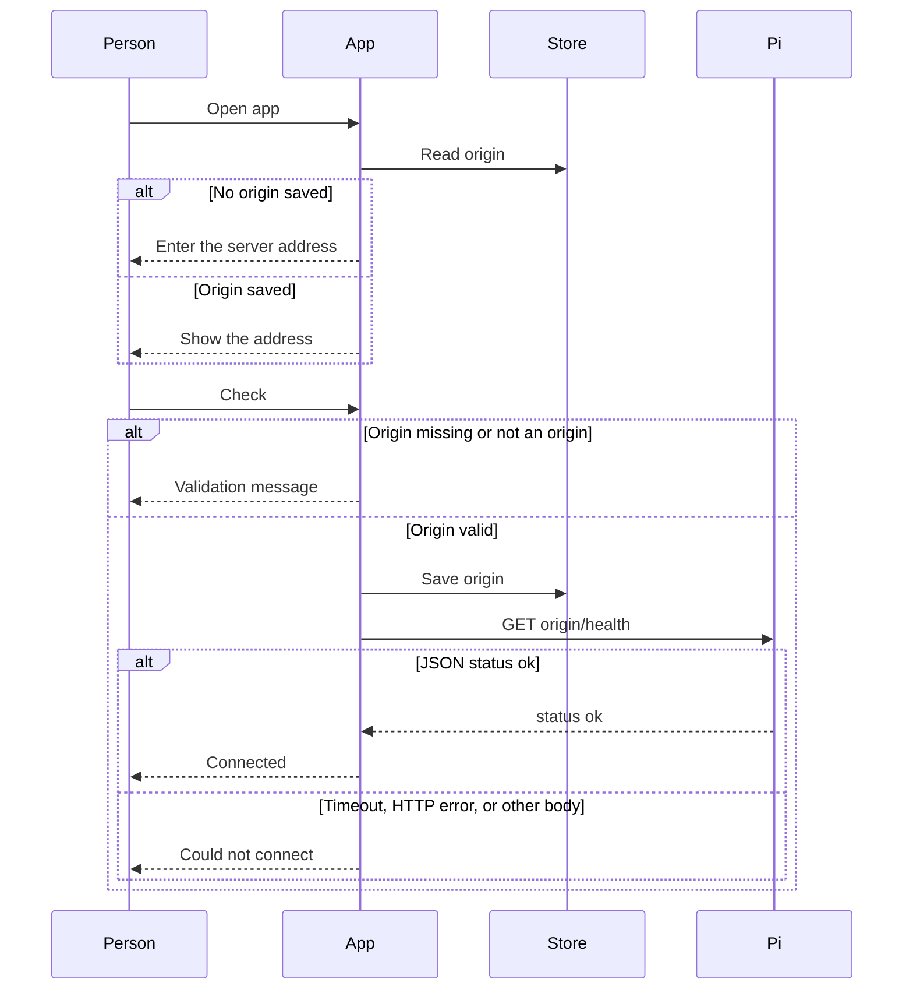

# Android app shell

* **Status:** Accepted
* **Date:** 2026-10-09

## Background

Keel is a self-hosted tracker: a FastAPI server on the home Pi, used in a browser on the LAN and over Tailscale. [Phone layout](phone-layout.md) already makes that site usable on a narrow screen, and it left a native app out of scope. KEEL-16 is the epic to add an Android app because the mobile browser is no longer enough. The epic asks for an agile pass: design the basics, then add features one at a time. KEEL-18 (notifications) stays a later story. KEEL-19 (daily tasks) is cancelled.

Sign-in today is a browser session cookie, or a personal token created after someone is already signed in ([Password login](password-login.md), [API](../design/api.md)). `GET /health` is public and returns `{"status":"ok"}` (`src/keel/web/require_login.py`). The server speaks plain HTTP.

## Problem Statement

There is no installable Android client. A from-scratch screen cannot sign in until a token is pasted or a new password login is added to the API. Wrapping the existing site would ship every current page on day one, which is the opposite of a shell with no product features. The first version has to install on a real phone, remember where the server is, and prove that address answers, without designing the rest of the app.

## Objective(s)

- Ship an installable Android shell with no tracker features.
- Remember one server address on the phone, and check that `GET /health` succeeds.
- Keep an iPhone build possible later from the same project, without producing one now.
- Leave the Python server, the website, and the existing API as they are.

## Scope and Deliverables

### In-Scope

- A new Expo (React Native) app in `mobile/` in this repository.
- One screen: the Keel name, one server-address field, and a check action.
- The saved value is an origin: scheme, host, and optional port. The check calls `GET {origin}/health`.
- Plain HTTP allowed, so a LAN or Tailscale `http://` origin works.
- A release APK built on the Windows PC with the Android SDK, signed with a keystore that stays outside git.
- Sideload onto a physical Android phone, then run the health check against the live Pi on home Wi-Fi and, after editing the address, over Tailscale.

### Out-of-Scope

- An iPhone install, a Mac build, and the Apple Developer Program.
- Sign-in, issues, boards, sprints, comments, and notifications (KEEL-18).
- Loading the existing website inside the app.
- Remembering two addresses at once. Switching between home Wi-Fi and Tailscale means editing the one field.
- Google Play, Expo EAS cloud builds, and installing only over USB from Android Studio with no shareable APK.
- Kotlin and Flutter.
- Any change to the Python server, schema, or website.
- Feature flags and data migration. There is no previous install.

### Deliverables

- This ADR.
- When implementation is requested: the Expo app under `mobile/`, and a release-signed APK that meets the requirements below.

## Technical Requirements

* **Must** be an Expo React Native app under `mobile/`, separate from the Python package.
* **Must** show a single screen with the name Keel, one editable server address, and a way to check it.
* **Must** persist that address on the device and show it again after the app is killed.
* **Must** treat the address as an origin (`http` or `https`, host, optional port, no path). Trim a trailing slash. Any other value is rejected on screen with no network call.
* **Must** request `GET {origin}/health` with a timeout of about five seconds.
* **Must** show a connected result only when the response is JSON with `status` equal to `ok`.
* **Must** show a distinct empty state when no address is saved, and a could-not-connect result when the request fails, times out, or returns anything else.
* **Must** allow cleartext HTTP on Android so the current Pi address works.
* **Must** build a release APK locally with the Android SDK.
* **Must** sign that APK with a release keystore stored outside the repository. Passwords and the keystore path come from the environment, not from git.
* **Must** keep `mobile/node_modules`, generated `mobile/android`, generated `mobile/ios`, and `*.keystore` out of git. Native Android settings that must survive prebuild (cleartext HTTP) live in Expo config.
* **Must** use the existing brand blue `#0068B0` and white from [brand colors](../brand-colors.md). This screen does not reproduce the website top bar.
* **May** include the Expo iOS config that allows plain HTTP, so a later Mac build is not blocked on the same origin. This pass does not build or install that target.
* **May** use a debug build during development. The install that is accepted on the phone is the release-signed APK.
* **Must Not** add sign-in, issue lists, or notifications in this slice.
* **Must Not** embed the Keel website.
* **Must Not** store more than one server address.
* **Must Not** send the address, or the health request, to any host other than the origin the person typed.
* **Must Not** change `/health`, login, or the JSON API.
* **Must Not** commit the signing key or its passwords.
* **Must Not** require Expo Go, EAS, or a Play Store account for the accepted install.

## Consequences

* **Good:** The phone gets a real Keel app before any tracker screen exists, and the health check proves LAN and Tailscale from that install.
* **Good:** One saved origin is the upgrade path. A later public or HTTPS address is an edit, not a new app.
* **Good:** The same Expo project can build for iPhone later. Android ships first.
* **Bad:** The shell is not useful as a tracker. Sign-in is a later slice, and it needs either a pasted token or a new API login, because the API has no username-and-password grant today.
* **Bad:** Android Studio and Node.js LTS are new prerequisites on the Windows PC. The first SDK install is large.
* **Bad:** Updates are a new APK installed over the old one. That works only while the same signing key is used.
* **Risk:** Losing the keystore means the next APK cannot upgrade the installed app. The phone would have to uninstall first.
* **Risk:** Cleartext HTTP is allowed for whatever host is typed. That matches a personal server on a private network. It is the wrong default if the address is ever a network you do not trust.
* **Risk:** An iPhone build still needs a Mac and Xcode. A free Apple ID install expires after 7 days. A lasting install on someone else’s iPhone needs the Apple Developer Program ($99 a year). Choosing Expo does not remove that.

## System Design

### Technical Stack and Architecture

The Pi keeps serving the existing FastAPI app. The new client is an Expo app in `mobile/`. It stores one origin in on-device storage and calls `GET /health` on that origin. No Keel account data is stored. The website and the JSON API stay the interfaces for real work until a later slice.

Rejected for this shell: a Kotlin window onto the website (useful immediately, but it is the full site), a Kotlin or Flutter client (Android-only, or a second language for the same sign-in gap), EAS cloud builds (source would leave the house), and Play internal testing (more account ceremony than a two-person sideload).

Prerequisites on the build PC: Node.js LTS, Android Studio with the Android SDK, and a release keystore created once outside the repo. The accepted file is the release APK from a local Gradle assemble, produced after Expo prebuild.

The audience is the people who already use Keel. This pass is accepted on one physical Android phone. The same APK can be copied to another Android phone. The epic stays open after this slice. No separate deadline was set beyond the active sprint the epic is already on.

### UML Diagrams





Folder shape when the shell is built:

```text
mobile/
  App source, Expo config, and a pure helper for origin checks
  node_modules/   gitignored
  android/        generated, gitignored
  ios/            generated, gitignored
docs/adr/android-app-shell.md
```

The Python tree under `src/keel/` stays unchanged.

## Supporting Documentation

* [Phone layout](phone-layout.md)
* [Password login](password-login.md)
* [API](../design/api.md)
* [Brand colors](../brand-colors.md)
* [System context](../architecture/context.md)
