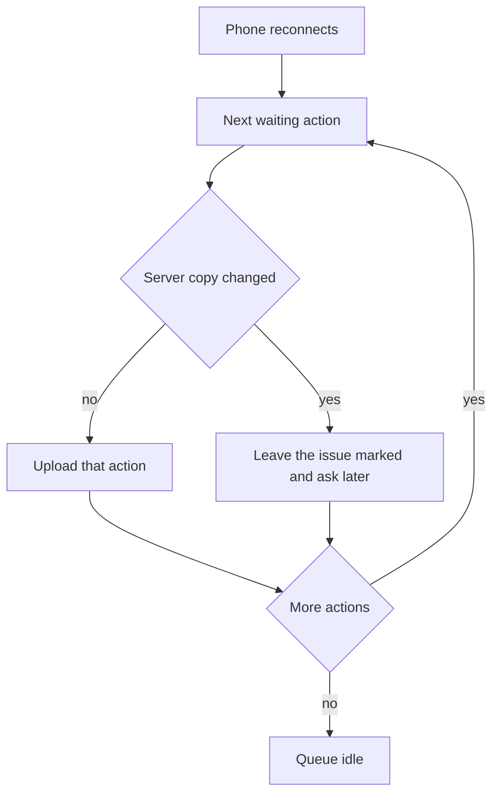
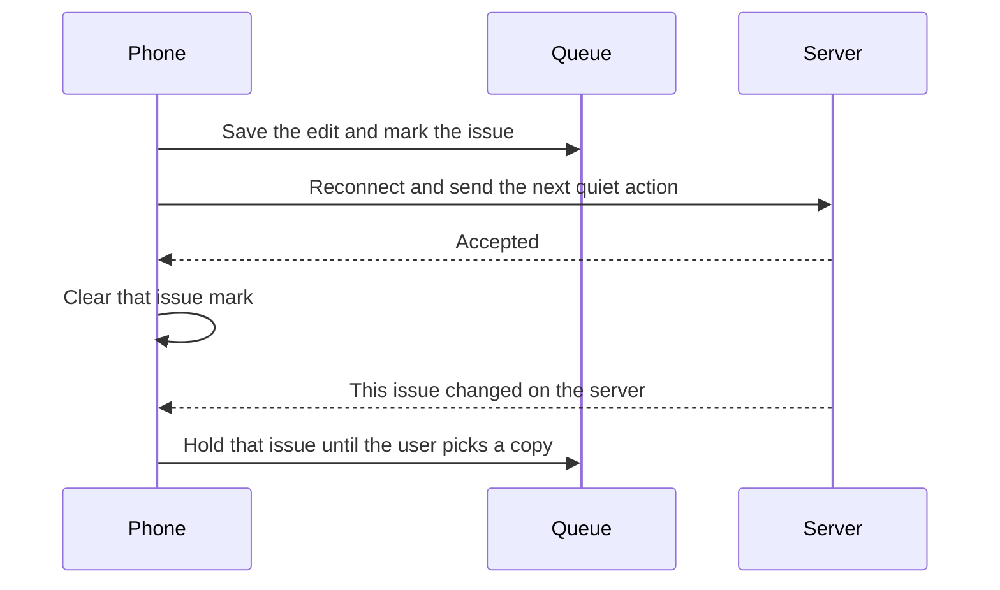

# Android app offline mode

* **Status:** Accepted
* **Date:** 2026-10-10

## Background

The Android app ([Android app shell](android-app-shell.md)) already stores one server address and a personal API token. Sign-in keeps that token until the user signs out or the token is revoked. The website is a separate, server-rendered interface. KEEL-69 asks for the phone to keep working when it cannot reach the Pi: create issues, view sprint issues, store changes on the phone, and upload them when the connection returns.

## Problem Statement

Later screens will be useless away from home, or off Tailscale, if each one assumes the Pi is reachable. The app needs one rule for what is saved on the phone, what can be done with that copy, and what happens when the phone and the server both changed the same issue.

## Objective(s)

* Every later action on data the phone has saved works with no connection, except the first sign-in.
* Changes made offline upload on their own when the phone can reach the server again.
* The user can see which issues are still waiting, and can choose which copy to keep when both sides changed.
* The user controls which projects are saved.

## Scope and Deliverables

### In-Scope

* The offline rule for the Android app, including the local copy, the waiting queue, conflict choice, project settings, and sign-out.
* The active sprint of each enabled project.

### Out-of-Scope

* Building the cache, the queue, or issue screens in this pass.
* Saving future sprints, the backlog, or completed sprints. Those screens require a connection.
* A new server sync API. The phone uses the existing JSON API.
* Changing the website.

### Deliverables

* This ADR, saved as Accepted at `docs/adr/android-offline-mode.md`.

## Technical Requirements

* **Must** treat the server as the source of truth after a change has uploaded successfully.
* **Must** save the active sprint for every project on a new install. The user may turn a project off in settings.
* **Must** ask before turning a project off while that project has waiting changes. Continuing drops that project’s waiting changes and stops saving it. Cancelling leaves the project on.
* **Must** let every later action on a saved issue work offline. The phone stores those actions in order and uploads them when it reconnects.
* **Must** require a connection for the first sign-in, and for any screen whose data is not saved (future sprints, backlog, completed sprints, and a project that has never refreshed).
* **Must** show “Not on the server yet” on each issue that is waiting, including an issue waiting on a conflict choice.
* **Must** upload issues that do not disagree with the server. When both sides changed an issue, leave that issue unsynced until the user picks the phone’s version or the server’s version. The user may leave the choice and keep using the app.
* **Must** ask before signing out while changes are waiting. Confirming signs out and keeps those changes for the next sign-in of the same user. Cancelling stays signed in.
* **Must** keep one account’s waiting changes private from another account on the same phone.
* **May** refresh the saved active sprints whenever the phone has a connection.
* **Must Not** overwrite a saved issue that has a waiting edit or an unresolved conflict during refresh.
* **Must Not** upload one account’s waiting changes after a different account signs in.
* **Must Not** build the offline cache as part of accepting this record.

## Consequences

* **Good:** Later screens share one offline behavior. The Pi stays the source of truth. No new server endpoint is required.
* **Bad:** Until a project has refreshed once, that project’s sprint is unavailable offline. Future sprints stay unavailable offline. A postponed conflict stays on the phone until the user chooses.
* **Risk:** A long wait between edits can make the two copies hard to compare. Dropping a project, or signing in as someone else, must not send the wrong queue.

## Assumptions

* The waiting queue belongs to the signed-in account. A different person signing in on the same phone does not see it and does not upload it.
* While connected, the app refreshes the active sprint of each enabled project. It leaves an issue alone when that issue has a waiting edit or an unresolved conflict.
* A new issue has no KEEL number until the server accepts it. It still shows “Not on the server yet”.
* If the server deleted the issue, the user chooses to recreate it from the phone’s copy or discard the phone’s copy. That issue stays marked until they choose.
* If the server rejects a waiting change for another reason, the app shows the error on that issue and leaves the change waiting.
* The phone also saves the lists an offline action needs (people, labels, and which sprint is active), taken at the same refresh.
* The existing sign-in lock still applies. Unlocking the phone does not need the server. The first sign-in does.

## System Design

### Technical Stack and Architecture

The phone keeps its own copy of each enabled project’s active sprint, plus the people, labels, and active-sprint identity needed to act on those issues. Waiting actions are an ordered queue tied to the signed-in user. On reconnect the phone replays that queue through the existing `/api/v1` issue routes. A conflict is a waiting edit whose server copy changed after the phone saved its base. Choosing the phone sends the phone’s current issue. Choosing the server discards the phone’s waiting edits for that issue and shows the server copy. If the server copy is gone, the choice is to recreate the issue or discard the phone’s copy. This pass adds no code and no dependency. The implementation that follows this rule chooses the on-phone store then.

### UML Diagrams

## Supporting Documentation

* [Android app shell](android-app-shell.md)
* [JSON API](../design/api.md)
* KEEL-69, issue id 250
