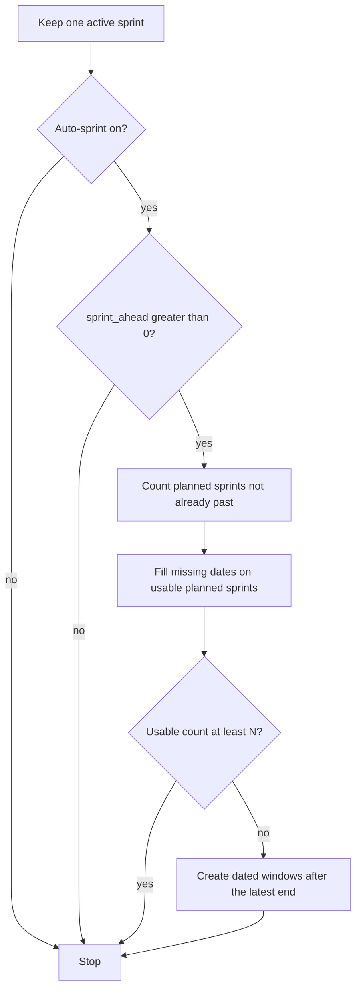
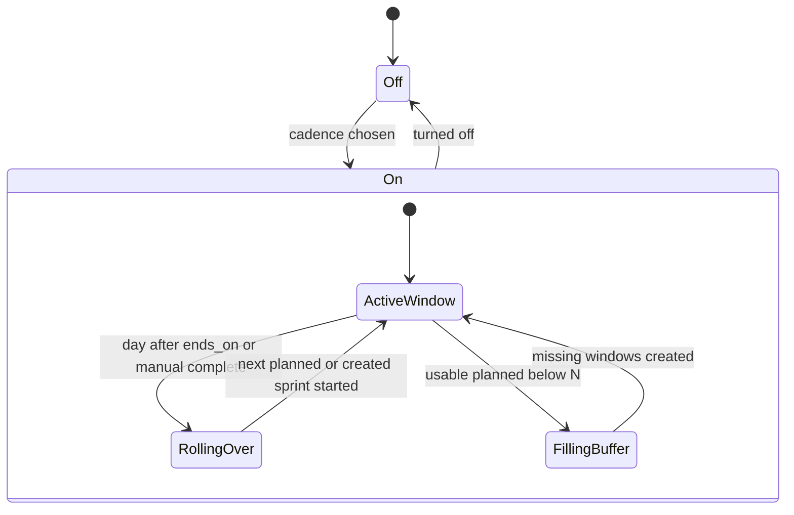

# Auto-sprint lookahead

* **Status:** Accepted
* **Date:** 2026-09-19

## Background

A project can opt into auto-sprint so one dated window stays active, closes after its last inclusive day, and opens the next planned sprint — or creates one at rollover when none is planned ([Auto-sprint cadence](auto-sprint-cadence.md)). Extra planned sprints are allowed, but Keel does not keep a buffer of them. Planning the next cycle still means creating a sprint by hand, or waiting until the current window closes.

Repeating work places copies into the sprint that overlaps a chosen date, and falls back to a recipe look-ahead count when no window exists yet ([Repeating work via Scheduling Manager](repeating-work-scheduling-manager.md)).

## Problem Statement

Auto-sprint only materializes the next window when it is needed. There is no way to ask it to keep the next N sprints already planned, so people cannot schedule work into upcoming windows until they create those sprints themselves.

## Objective(s)

- Let a project configure how many upcoming sprints auto-sprint should keep created in advance.
- Keep today’s one-active-sprint rule, unfinished-work carry-over, and catch-up (no chain of empty completed sprints).
- Prefer sprints the user already planned; create more only to fill the configured buffer.
- Leave 0 as the default so existing projects keep creating the next window only at rollover.

## Scope and Deliverables

### In-Scope

- A per-project count of upcoming sprints to keep planned while auto-sprint is on.
- Creating dated, named windows to fill that count, chained after the latest dated active or planned sprint.
- Refilling the buffer after rollover, a manual complete, or a deleted planned sprint.
- Cadence controls on the project page; the count shown with auto-sprint status on the sprints page; the same field on the project JSON resource.

### Out-of-Scope

- More than one active sprint, or changing rollover/catch-up so missed intervals become completed sprints.
- Deleting extra planned sprints when the count is lowered or auto-sprint is turned off.
- Rewriting dates on sprints the user (or a previous cadence) already dated.
- Filling calendar gaps between a current window and a far-future planned sprint.
- Auto-filling those windows from the backlog (beyond unfinished carry-over).
- Changing series spawn rules; overlapping planned windows simply become available to claim.

### Deliverables

- This ADR as the behavior source of truth.
- `sprint_ahead` on the project, buffer fill in `keel.services.auto_sprint`, and the project/sprints/JSON surfaces.

## Technical Requirements

* **Must** store a per-project `sprint_ahead` integer, default 0, of at least 0 and at most 12.
* **Must**, while auto-sprint is on, keep at least that many *usable* planned sprints: planned sprints with no end date, or whose end date is today or later.
* **Must Not** count a planned sprint that is already past its end toward the buffer.
* **Must**, when creating a window to fill the buffer, date it as start = the day after the latest end among the active sprint and usable planned sprints, end = that start plus one cadence, and name it with the date window with a blank goal — the same rule as an auto-created rollover sprint.
* **Must**, when a usable planned sprint is missing dates, fill only the missing side from that same chain, and **Must Not** change dates that are already set.
* **Must** refill the buffer after an automatic rollover, a manual complete while auto-sprint is on, a deleted sprint that auto-sprint replaces, and when the count is raised.
* **Must**, when the count is 0, keep today’s behavior: create the next window only when none is planned at open/rollover.
* **Must**, when the count is lowered or auto-sprint is turned off, leave extra planned sprints in place and stop creating more.
* **Must Not** complete extra windows during catch-up; catch-up still opens one current window and then fills the planned buffer after that window.
* **Must** show the count on the project settings panel next to cadence, and on the sprints page when auto-sprint is on and the count is greater than 0.
* **Must** expose `sprint_ahead` on project JSON read and PATCH.
* **May** let the user keep creating extra planned sprints by hand; those count toward the buffer when they are still usable.
* **Must Not** auto-schedule backlog issues into the extra windows except via existing carry-over of unfinished work.
* **Must Not** treat permission as a separate state; anyone who can change cadence can change the count.

## Consequences

* **Good:** Upcoming sprints exist before the current window closes, so work can be scheduled into them and repeating copies can overlap those dates.
* **Good:** 0 preserves the shipped auto-sprint behavior for every existing project.
* **Bad:** A far-future planned sprint becomes the chain’s anchor, so Keel will not insert missing windows in the gap before it.
* **Bad:** Lowering the count or turning auto-sprint off does not delete the extra sprints, so the list can stay longer than the setting.
* **Risk:** Changing cadence mid-window leaves already-dated upcoming sprints at the old length; the new length applies to windows created after that.
* **Risk:** A large count (weekly × 12) adds many planned sprints to the board’s sprint filter and Separate-by-sprint rows.

## System Design

### Technical Stack and Architecture

This is a setting on the existing auto-sprint path, not a new product area. `sprint_ahead` lives with cadence on `project.html` and the project JSON resource. Status copy lives on `sprints.html`. `keel.services.auto_sprint.ensure_open` still keeps one active sprint, then fills the planned buffer. Rollover, catch-up, and carry-over stay those of [Auto-sprint cadence](auto-sprint-cadence.md) and [Planning realization](planning-realization.md).

### UML Diagrams

## Supporting Documentation

* [Auto-sprint cadence](auto-sprint-cadence.md)
* [Planning realization](planning-realization.md)
* [Repeating work via Scheduling Manager](repeating-work-scheduling-manager.md)
* [UI design](../design/ui.md)
* [API reference](../design/api.md)
