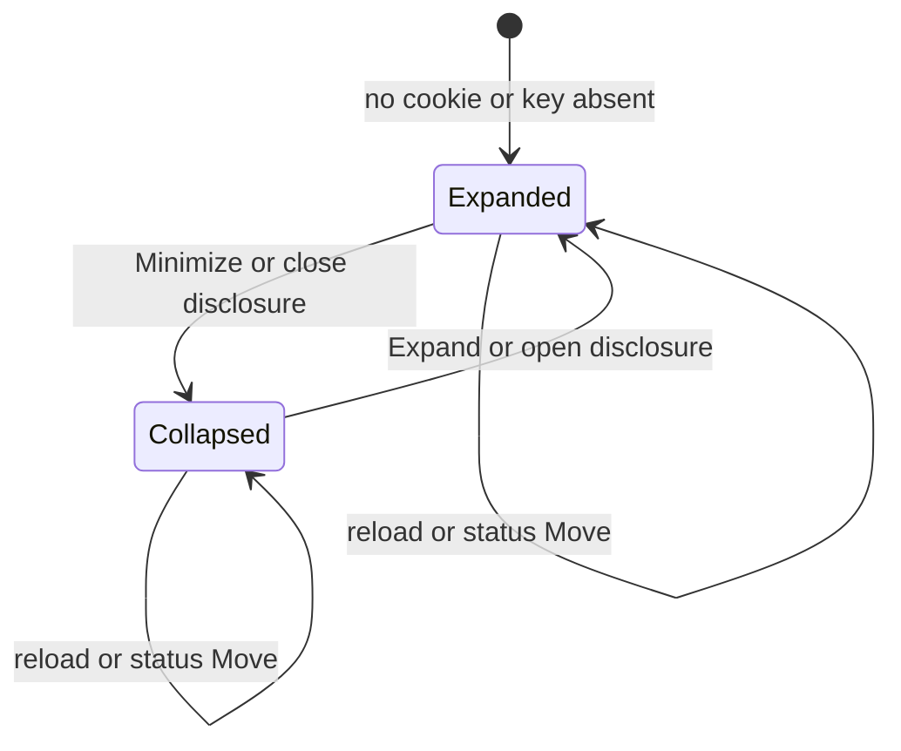
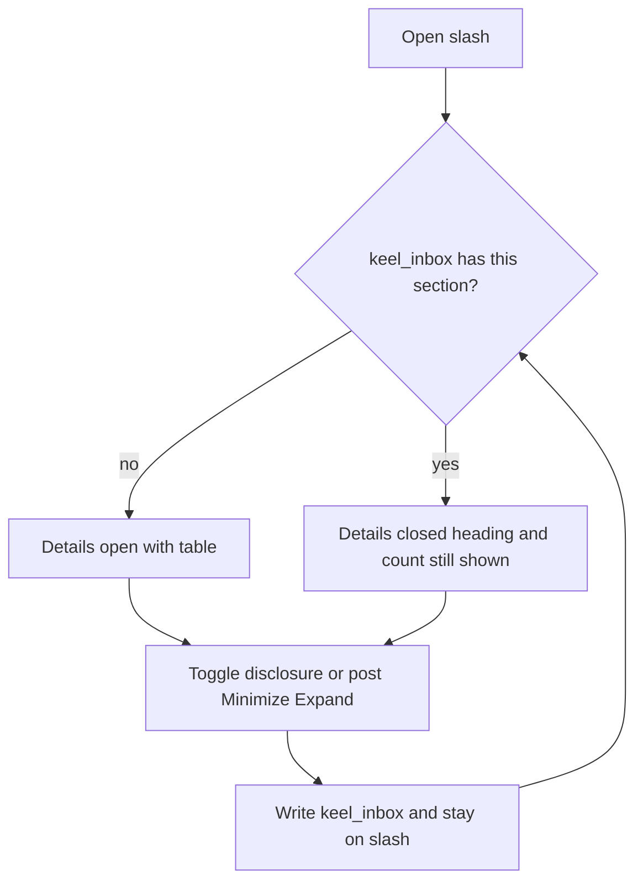

# Collapsible home inbox sections

* **Status:** Accepted
* **Date:** 2026-09-18

## Background

`/` is the acting user's personal inbox ([ADR 022](personal-work-inbox.md), [ADR 029](ADR-029.md)): stacked sections for due or overdue, starting or started, assigned, blocked, active sprint, and waiting this cycle. Empty sections are omitted; a busy day still stacks several tables. Status changes post and re-render `/`. Top-bar section order already persists in a browser cookie, not a user row ([ADR 001](persistent-top-menu-bar.md)). Native disclosure already hides Help and the issue description editor without JavaScript ([ADR 023](ADR-023.md), [ADR 009](server-rendered-jinja2.md)).

KEEL-32 asks to minimize those home panels so people do not have to scroll past lists they are not looking at.

## Problem Statement

Every non-empty inbox section is always fully open. Assigned to me repeats issues that also sit in Due or overdue and Blocked, so a long assigned table sits in the middle of the page. There is no way to keep a heading and hide its rows, and a collapse that only lasts until the next status change would not solve the scroll.

## Objective(s)

- Let people minimize any non-empty home section while leaving its heading visible.
- Keep that choice across reloads, picker changes, and status posts from `/`.
- Keep the page usable without JavaScript and on a phone-narrow viewport.

## Scope and Deliverables

### In-Scope

* Native disclosure on each non-empty home section.
* A browser cookie holding which sections are collapsed.
* A `/web/inbox` form so the choice persists when JavaScript has not run.
* A small home-only script that persists a disclosure toggle without a round trip.
* Row counts on the heading so a collapsed section still shows how much it holds.
* Doc updates so the UI map and use cases describe collapse.

### Out-of-Scope

* Collapsing panels on other pages (board, issue, projects, schedules).
* Reordering, renaming, or removing home sections.
* Hiding a section with no heading, or changing which issues belong in which section.
* Storing the preference on the user row or in the database.
* Filters, tabs, or saved views on `/`.

### Deliverables

* This ADR as the behavior source of truth.
* Collapsible sections on `/` in the existing server-rendered UI.
* Updates to the UI design and use cases.

## Technical Requirements

* **Must** wrap each non-empty home section in a native disclosure whose summary is that section's existing heading.
* **Must** default every section to expanded when the cookie is missing or empty.
* **Must** keep the heading visible when the section is collapsed; **Must Not** omit the section the way an empty section is omitted.
* **Must** show the row count on the heading of every rendered section.
* **Must** persist the collapsed set in a `keel_inbox` cookie on this browser, the same regardless of who is selected in the picker (same rule as `keel_nav`).
* **Must** store only known section keys (`due`, `starting`, `assigned`, `blocked`, `sprint`, `waiting`), dotted, dropping unknowns; an empty cookie means nothing is collapsed.
* **Must** restore collapsed/expanded from that cookie on every render of `/`, including after a status change that returns here.
* **Must** work without JavaScript: a Minimize or Expand control posts to `/web/inbox` and redirects to `/`.
* **May** hide that control after `inbox.js` has run and persist instead from the disclosure's `toggle` event.
* **Must** keep the tables in the page so expanding does not need a second fetch; collapsed is a closed disclosure, not a missing list.
* **Must** keep empty-section hiding and the quiet empty home unchanged.
* **Must** keep membership, overlap, status Move, Find, and phone-narrow swipeable tables as they are ([ADR 022](personal-work-inbox.md), [ADR 018](phone-layout.md)).
* **Must Not** add filters, pagination, or a Home nav item.
* **Must Not** persist collapse in SQLite or key it to the acting user.

## Consequences

* **Good:** People can keep Due or overdue open and fold Assigned to me so the page stops being a long stack of the same keys.
* **Good:** The preference survives a status Move because it lives in a cookie, not in the current DOM.
* **Bad:** The same browser shares collapse across picker users, so switching who you are does not restore another person's layout.
* **Risk:** A collapsed Due or overdue heading can be easy to skip. The count on the heading is the mitigation; the default remains expanded.

## System Design

### Technical Stack and Architecture

This feature only changes how `/` presents sections that [ADR 022](personal-work-inbox.md) already defines. Cookie parse/encode lives next to `keel/web/nav.py`. `POST /web/inbox` sets the cookie and redirects, matching `/web/nav`. `inbox.js` loads only on home, sets `data-keel-inbox`, and posts the closed keys; CSS hides the Minimize/Expand forms after that marker, the same pattern as nav Up/Down. No new table, JSON route, or service.

### UML Diagrams

## Supporting Documentation

* [UI design](../design/ui.md)
* [Use cases](../architecture/use-cases.md)
* [ADR 022: Home page as a personal work inbox](personal-work-inbox.md)
* [ADR 009: Server-rendered Jinja2 pages with vanilla JavaScript](server-rendered-jinja2.md)
* [ADR 018: Phone layout of the existing site](phone-layout.md)
* [ADR 023: Help menu links to FastAPI API docs](ADR-023.md)
