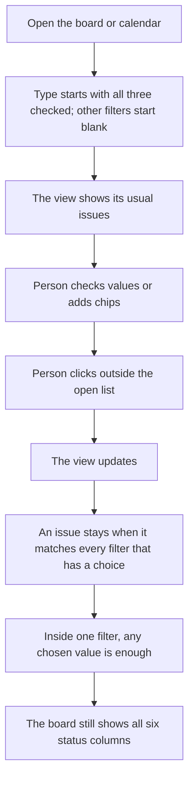

# Common filtering

* **Status:** Accepted
* **Date:** 2026-10-04

## Background

The board already narrows issues, but each control works differently: type is a row of checkboxes that start checked, assignee and label are single lookups, sprint is one choice, and the master board adds a project search. The calendar only moves through month, week, and day. It does not narrow which issues appear. Lookups already exist for labels, people, and projects.

## Problem Statement

The board and the calendar answer "which issues?" with different controls, and the calendar cannot answer it at all. A person who learns one view has to relearn the other.

## Objective(s)

- Offer one set of filters, with one set of matching rules, on the board and the calendar.
- Leave a filter unrestricted when it is blank.
- Keep the calendar's date navigation and the board's status columns.

## Scope and Deliverables

### In-Scope

* The master board (`/board`), a project board (`/projects/{key}/board`), the master calendar (`/calendar`), and a project calendar (`/projects/{key}/calendar`).
* Type, status, and priority as multi-select dropdowns.
* Sprint as a multi-select dropdown of active sprints, planned sprints, and Unscheduled. Completed sprints are not listed.
* Label, assignee, created by, and project as lookups that can hold several choices, each shown as a removable chip.
* Project chips on the master board and the master calendar only.

### Out-of-Scope

* Backlog, home, search, the sprint list, and schedules.
* Changing which issues the calendar is about before filters apply, except that Done and Cancelled stay in the set. The master calendar stays the signed-in user's dated issues. A project calendar stays that project's dated issues, for any assignee. The status filter is what removes Done or Cancelled.
* The board's Separate by sprint checkbox. It stays a layout control, not a filter.
* Saved filters, or a filtered view that is not carried in the page address.

### Deliverables

* This ADR.
* When a build is requested: the shared bar on the board and the calendar, and a short note in [UI design](../design/ui.md).

## Technical Requirements

* **Must** show the same filters on the board and the calendar: type, status, priority, sprint, label, assignee, created by, and, on the master board and master calendar only, project.
* **Must** treat a blank filter as no restriction. The view still updates. On first open, status, priority, sprint, label, assignee, created by, and project are blank.
* **Must** start the type filter with Epic, Story, and Subtask all checked, on the board and the calendar. Unchecking a type removes those issues. Checking it again brings them back. Unchecking all three shows none of them.
* **Must** keep an issue when it matches every filter that has a choice. Inside one filter, any chosen value is enough. Two labels show issues that have either label. A label and an assignee together show issues that have that label and are one of the chosen people.
* **Must** leave the view as it is while a box is checked or unchecked, a chip is added, or a chip is removed. **Must** update the view when the open list closes or the pointer leaves that list. When JavaScript has not run, an Apply control submits the form, and a chip's remove link still drops that one chip. With JavaScript, Apply is hidden.
* **Must** keep all six board columns. A status that was not chosen stays as an empty column.
* **Must** list Epic, Story, and Subtask in the type dropdown; the six workflow statuses in the status dropdown; and P1 through P5 in the priority dropdown.
* **Must** list Unscheduled, active sprints, and planned sprints in the sprint dropdown. A project board lists that project's sprints. The master board lists those sprints with the project key.
* **Must** turn a picked label, person, or project into a removable chip and clear the box so another can be added. Label still offers Unlabeled. Assignee still offers Unassigned. Created by offers the same people plus None for an issue with no reporter.
* **Must** hide the project filter on a project board and a project calendar. That page is already one project.
* **Must** leave month, week, day, Previous, Next, Today, and the date dropdowns on the calendar. Filters only narrow which issues appear on those dates.
* **May** summarize a closed dropdown with the chosen names, and show the field name when nothing is chosen.
* **Must Not** require every filter to be filled before the view updates.
* **Must Not** reload the board or the calendar on each checkbox change.
* **Must** place Project immediately after Sprint, and Label last. Assignee and Created by sit between Project and Label. A project page still omits Project. Reset all follows Label. It clears every filter and leaves the calendar date and Separate by sprint as they are.
* **Must Not** hide a board column because its status was not chosen.
* **Must Not** offer a completed sprint in the sprint dropdown.
* **Must Not** change Separate by sprint into a filter.

## Consequences

* **Good:** The board and the calendar narrow the same way. Several labels, people, or projects can be combined. A blank field no longer looks like a required choice.
* **Bad:** An issue that is still on the board inside a completed sprint cannot be isolated with the sprint filter.
* **Risk:** The type filter starts fully checked, while the other filters start blank. A person may expect status and priority to start fully checked as well.

## System Design

### Technical Stack and Architecture

The bar sits above the board columns and above the calendar grid, on both the master pages and the project pages. Project chips are omitted on the project pages. The board keeps Separate by sprint beside the bar. The calendar keeps its date controls. No new stored records: the choices live in the page address, as the board's filters do today.

### UML Diagrams

## Supporting Documentation

* [Issue and label lookup](issue-and-label-lookup.md)
* [Master board](ADR-032.md)
* [Calendar of assigned work](month-calendar.md)
* [UI design](../design/ui.md)

## Assumptions

* Created by is the issue's reporter. None means no reporter.
* "Future" sprints are planned sprints.
* A typed lookup value that was not picked is refused, as the existing lookups already do. Without JavaScript, an exact key, name, Unlabeled, Unassigned, or None still resolves.
* Several projects on the master views match if the issue is in any of them.
* The type control is a multi-select dropdown, and it opens with Epic, Story, and Subtask already checked. It is not a blank field on first open.
