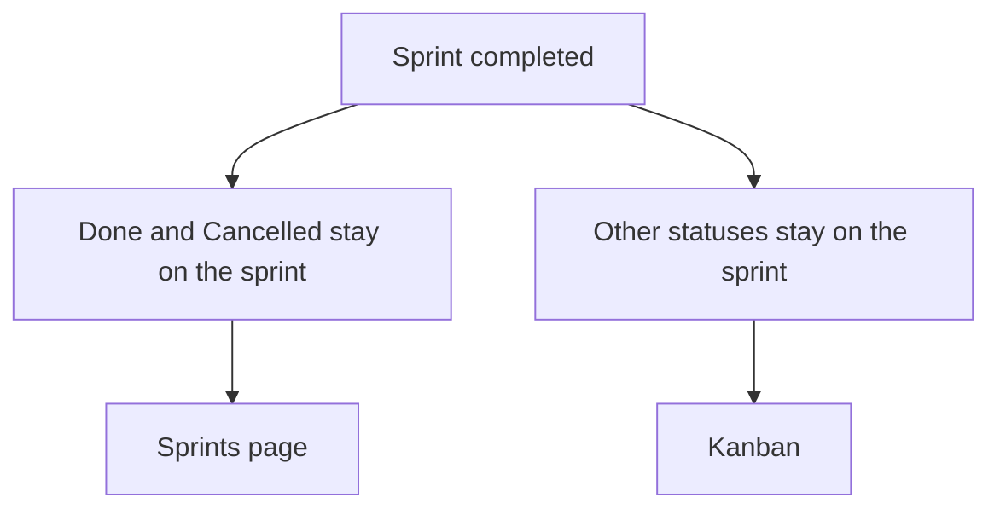

# Completed sprints off the board

* **Status:** Accepted
* **Date:** 2026-09-23

## Background

A completed sprint keeps its closed issues as the record of what it held ([ADR 013](ADR-013.md)). The Kanban stacks a row of columns per sprint. [ADR 032](ADR-032.md) already omitted Done and Cancelled issues in a completed sprint from the master board at `/board`, and left the same hide rule off the project board until a later change. An empty completed sprint was already not a lane. A completed sprint that still held closed cards was.

## Problem Statement

After a sprint is completed, its row stays on the Kanban, filled with Done and Cancelled cards. That history belongs on the sprint, not in the board people use for current work. The project board and the master board disagreed about those cards.

## Objective(s)

- Keep a completed sprint off the Kanban, on both `/board` and `/projects/{key}/board`.
- Leave closed issues attached to that sprint so the Sprints page still shows what it held.
- Keep work that is reopened on a completed sprint visible.

## Scope and Deliverables

### In-Scope

- Omitting Done and Cancelled issues whose sprint is completed from both boards.
- Omitting a completed sprint lane when it has no remaining cards.
- Omitting completed sprints from the board's sprint filter.
- The same rule on the project board JSON.

### Out-of-Scope

- Removing closed issues from the completed sprint.
- Hiding completed sprints from the Sprints page or from Find.
- Hiding unscheduled Done or Cancelled, or Done and Cancelled in an active or planned sprint.
- Changing carry-over when a sprint completes.

### Deliverables

- This ADR as the behavior source of truth.
- Both boards and the project board JSON following it.

## Technical Requirements

* **Must** omit Done and Cancelled issues whose sprint is completed from `/board` and from `/projects/{key}/board`, including the project board JSON.
* **Must** still show unscheduled Done and Cancelled, and Done and Cancelled in a planned or active sprint.
* **Must Not** show a completed sprint as a lane when it has no cards left on the board, including when the sprint filter names that sprint.
* **Must** show a completed sprint as a lane when it still has a card that is not Done or Cancelled, so reopened work stays on the board.
* **Must Not** list a completed sprint in the board's sprint filter. **Must** still list it on the Sprints page.
* **Must Not** clear a closed issue's sprint when the sprint completes.

## Consequences

* **Good:** Completing a sprint removes that sprint from the Kanban. The project board and the master board agree about closed work in completed sprints.
* **Bad:** A completed sprint that still has reopened work remains a lane, and the sprint filter does not offer it.
* **Risk:** Someone looking for last sprint's Done cards on the board will not find them. The sprint page is the record.

## System Design

### Technical Stack and Architecture

Both boards already query issues and then group the same cards into sprint lanes. The project board uses the same completed-sprint exclusion the master board already used. Lane building skips a completed sprint that has no remaining cards. The HTML sprint filter is that list with completed sprints removed. Sprint completion is unchanged.

### UML Diagrams

## Supporting Documentation

* [ADR 013: Planning realization](ADR-013.md)
* [ADR 032: Master board across all projects](ADR-032.md)
* [UI design](../design/ui.md)
