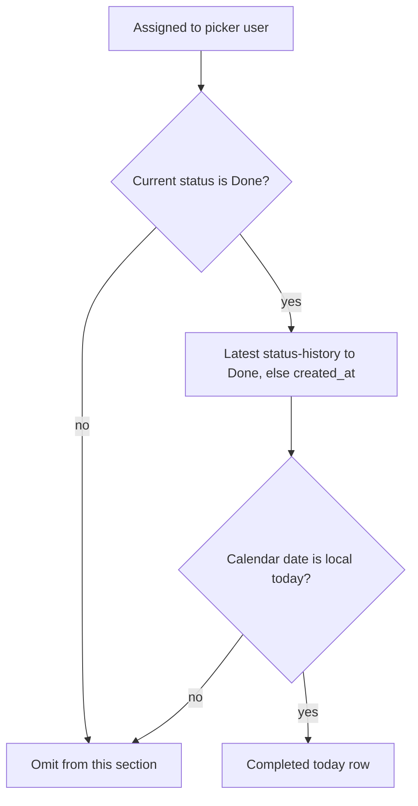
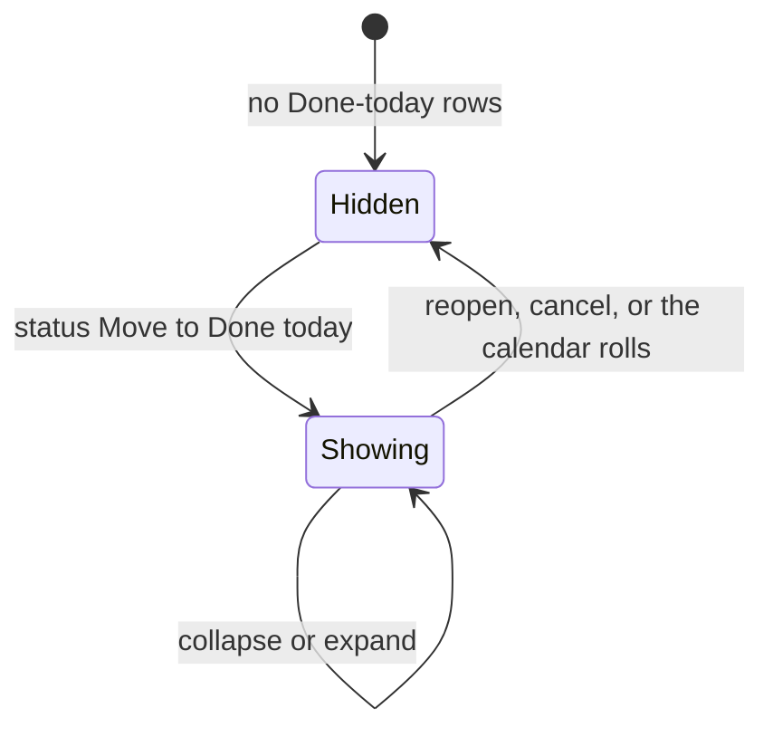

# Completed today on the home inbox

* **Status:** Accepted
* **Date:** 2026-09-19

## Background

`/` is the acting user's personal inbox ([ADR 022](personal-work-inbox.md), [ADR 029](ADR-029.md)): stacked, overlapping sections for due or overdue, starting or started, assigned, blocked, active sprint, and waiting this cycle. Empty sections are omitted. Non-empty sections fold behind their headings ([Collapsible home inbox sections](collapsible-home-inbox-sections.md)). *Done* and *Cancelled* are closed; only *Done* is completed ([ADR 020](cancelled-status.md)). Closed items already appear in **In the active sprint** when that sprint is still active, but `/` does not otherwise recap what the picker user finished today. Status changes append a field-history line ([ADR 025](ADR-025.md)); create does not.

KEEL-35 asks for a completed-today panel on that home screen.

## Problem Statement

Finishing work takes it off Assigned to me, Due or overdue, Blocked, and Waiting this cycle. Unless the issue still sits in an active sprint, it vanishes from `/` the moment it is *Done*. There is no same-day recap of what the picker user completed, so a day of closed work looks like an empty inbox.

## Objective(s)

- Show the picker user which of their assigned issues became *Done* today, without mixing in *Cancelled*.
- Keep that list on `/` with the same row chrome, collapse, and status Move as the other sections.
- Date membership from when status became *Done*, not from a later title or field edit.

## Scope and Deliverables

### In-Scope

* A seventh home section, **Completed today**, after Waiting this cycle.
* Membership from the acting user's assigned *Done* issues whose latest status change to *Done* (or created-as-*Done* with no status history) falls on the server's local calendar date.
* A Completed column on those rows.
* Collapse via the existing `keel_inbox` cookie key `completed`.
* Doc updates so the UI map and use cases mention the section.

### Out-of-Scope

* A `completed_at` column on issues, a JSON inbox API, or charts.
* Listing *Cancelled*, unassigned, or other people's issues.
* Filtering by who moved the status, or by a user timezone picker.
* Changing how the other six sections choose their rows, except that the quiet empty state also considers this section.

### Deliverables

* This ADR as the behavior source of truth.
* The section on `/` in the existing server-rendered inbox.
* Updates to the UI design, use cases, and the home inbox ADRs.

## Technical Requirements

* **Must** add a home section titled **Completed today**, rendered last among non-empty sections: after Waiting this cycle.
* **Must** include only issues whose assignee is the acting user; **Must Not** show unassigned issues here.
* **Must** include only issues whose current status is *Done*; **Must Not** list *Cancelled* or any unfinished status.
* **Must** treat completion time as the latest status-history line whose `to` label is *Done*. If status is *Done* and there is no status-history line (created already *Done*), **Must** use `created_at` instead.
* **Must** include a row when that completion time's calendar date is the local today; **Must Not** include a *Done* issue whose latest move to *Done* was on an earlier day, even if `updated_at` is today.
* **Must** hide the section when it has no rows. A home that holds only this section **Must** still render it (not the quiet empty message).
* **Must** allow the same *Done* issue to also appear in **In the active sprint** when that sprint is active.
* **Must** show the existing inbox row (key, type, priority, title, project, start, status Move) plus a **Completed** column with the completion time.
* **Must** sort rows newest completion first, then project key, then issue number.
* **Must** keep calendar-date membership, collapse, status Move, overlap, Find, and phone-narrow swipeable tables as they are ([ADR 022](personal-work-inbox.md), [Collapsible home inbox sections](collapsible-home-inbox-sections.md), [ADR 018](phone-layout.md)).
* **Must** store `completed` as a known `keel_inbox` section key.
* **Must Not** use `updated_at` as the completion time.
* **Must Not** add filters, pagination, or a Home nav item.

## Consequences

* **Good:** Closing the last open assigned item no longer makes home look empty on a productive day; the recap stays until the calendar rolls.
* **Good:** Reopening an issue (or cancelling it) removes it immediately, because current status must be *Done*.
* **Bad:** A *Done* issue in an active sprint can appear twice: in that sprint list and in Completed today.
* **Risk:** History starts empty for issues that were already *Done* before [ADR 025](ADR-025.md). Those fall back to `created_at`, so an old *Done* issue created on another day will not appear here, and a created-as-*Done* issue appears on its birth day. Accepted; there is no backfill of completion time.
* **Risk:** Local `date.today()` follows the server's timezone, the same accepted risk as due/start membership.

## System Design

### Technical Stack and Architecture

This feature only adds a section to `/`. Membership still starts from issues assigned to the picker user ([ADR 022](personal-work-inbox.md)). Completion time is read from existing `issue_history` status lines ([ADR 025](ADR-025.md)); no new table or column. Collapse reuses `keel_inbox` and `/web/inbox`. Status Move still posts to `/web/issues/{id}/status` and returns to `/`.

### UML Diagrams

## Supporting Documentation

* [UI design](../design/ui.md)
* [Use cases](../architecture/use-cases.md)
* [ADR 022: Home page as a personal work inbox](personal-work-inbox.md)
* [Collapsible home inbox sections](collapsible-home-inbox-sections.md)
* [ADR 020: Cancelled status](cancelled-status.md)
* [ADR 025: Lightweight per-issue field history](ADR-025.md)
