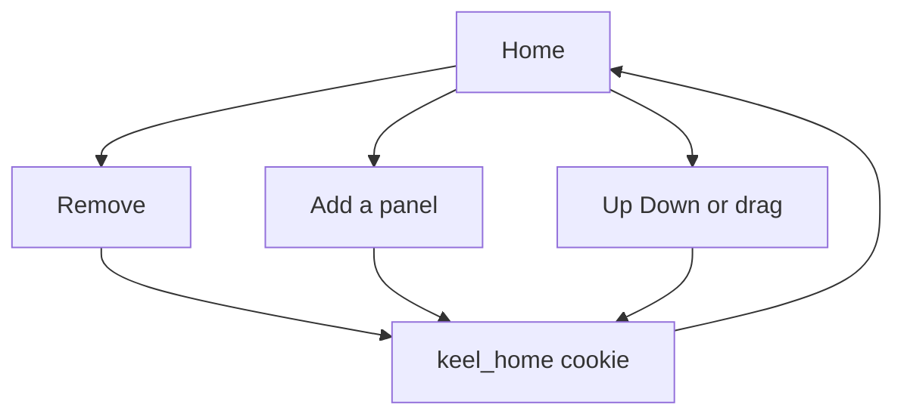

# Customizable home panels

* **Status:** Accepted
* **Date:** 2026-10-01

## Background

`/` is the acting user's personal inbox ([ADR 022](personal-work-inbox.md)). Nine sections can appear, in a fixed order: due or overdue, due this week, due this month, starting or started, assigned, blocked, active sprint, waiting this cycle, and completed today. Empty sections are omitted. Non-empty ones can be folded, and that choice lives in a `keel_inbox` cookie on this browser, not on the user row ([Collapsible home inbox sections](collapsible-home-inbox-sections.md)). The top bar is reordered the same way ([ADR 001](persistent-top-menu-bar.md)).

## Problem Statement

Everyone gets the same stack. A person who never uses Blocked, or who wants Assigned to me above Due or overdue, still has to scroll the default order. Folding a section keeps the heading. It does not take the panel off the page or move it.

## Objective(s)

- Let this browser remove a home panel and add it back.
- Let this browser reorder the panels that are on the page.
- Keep empty panels off the page, and keep collapse as it is.
- Keep the page usable without JavaScript.

## Scope and Deliverables

### In-Scope

- Remove on each rendered panel, and Add a panel for the ones that were removed.
- Up and Down on each rendered panel, and dragging a heading once `inbox.js` has run.
- A `keel_home` cookie for the enabled order and the removed set.
- Doc updates so the UI map and use cases describe the layout.

### Out-of-Scope

- New kinds of panels, or renaming the ones that exist.
- Showing a panel that has no rows.
- Storing the layout on the user row or in the database.
- Changing which issues belong in which panel.
- Reordering pages other than `/`.

### Deliverables

- This ADR as the behavior source of truth.
- The controls on `/` and the cookie that remembers them.

## Technical Requirements

* **Must** render the existing panels in the saved order, skipping a panel that was removed and skipping a panel with no rows.
* **Must** default to the current stack, with nothing removed, when `keel_home` is missing.
* **Must** offer Remove on each rendered panel. Removing it keeps it off the page until it is added, including when it still has rows.
* **Must** offer Add a panel listing every removed panel by its heading. Adding one puts it at the end of the stack. It still stays off the page while it has no rows.
* **Must** offer Up and Down that swap a panel with the next rendered panel, leaving panels that are not on the page in their slots.
* **Must** persist the layout in a `keel_home` cookie on this browser, the same regardless of who is selected in the picker.
* **Must** work without JavaScript: Remove, Add, Up, and Down post and redirect to `/`.
* **May** hide Up and Down after `inbox.js` has run, and reorder by dragging a heading instead. Remove and Add stay visible.
* **Must** keep collapse, membership, overlap, status Move, Find, and the quiet empty home as they are.
* **Must Not** persist the layout in SQLite or key it to the acting user.
* **Must Not** add a new panel type.

## Consequences

* **Good:** A person can drop panels they do not use and put the ones they do use in the order they want. The choice survives a reload and a status change.
* **Bad:** The same browser shares one layout across picker users.
* **Risk:** Removing every panel that has rows leaves a short "every home panel is hidden" line plus Add a panel, which can look like an empty inbox. The add control is on that page.

## System Design

### Technical Stack and Architecture

This is a presentation choice on `/`, next to the collapse cookie. `keel.web.home_layout` parses and updates the cookie. The forms post to `/web/home/hide`, `/web/home/show`, `/web/home/move`, and `/web/home/order`. `inbox.js` already loads only on home; it also posts a dragged order. No new table and no JSON route.

### UML Diagrams

## Supporting Documentation

* [ADR 022: Home page as a personal work inbox](personal-work-inbox.md)
* [Collapsible home inbox sections](collapsible-home-inbox-sections.md)
* [UI design](../design/ui.md)
