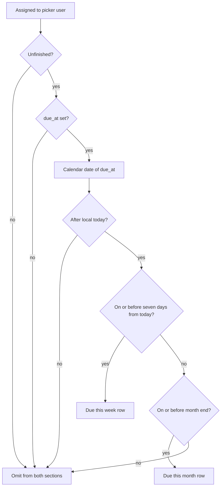

# Due this week and due this month as separate home panels

* **Status:** Accepted
* **Date:** 2026-10-02

> **Amendment.** KEEL-51: **Due this week** is the next seven days after local today, not the rest of the ISO week through Sunday. A due date inside that window was landing on **Due this month** whenever it fell after Sunday. **Due this month** is whatever remains of the calendar month after those seven days.

## Background

`/` is the acting user's personal inbox ([ADR 022](personal-work-inbox.md)). Time-sensitive sections render first, empty sections are omitted, and non-empty sections fold behind their headings ([Collapsible home inbox sections](collapsible-home-inbox-sections.md)). Calendar membership uses the server's local date.

[Due this week or this month on the home inbox](due-this-week-or-this-month-home-panel.md) added one look-ahead section whose horizon was the later of this ISO week's Sunday and this calendar month's last day. KEEL-38 records that those were supposed to be two panels. The combined section is superseded by this record.

## Problem Statement

A single **Due this week or this month** list mixes the next few days with the rest of the month. Near the end of a month it can also show a due date that falls in the next month, because the horizon takes the later of the two bounds. Opening `/` does not answer "what is left this week?" separately from "what is left this month?"

## Objective(s)

- Show unfinished assigned issues due in the next seven days in their own section.
- Show unfinished assigned issues due later this calendar month, and after this week, in a second section.
- Keep both sections on `/` immediately after Due or overdue, with the same row chrome, collapse, and status Move as the other sections.
- Leave Due or overdue unchanged so today and overdue stay the first list.

## Scope and Deliverables

### In-Scope

* Two home sections after Due or overdue and before Starting or started: **Due this week**, then **Due this month**.
* Due this week: unfinished assigned issues whose `due_at` calendar date is after local today and on or before the day seven days later.
* Due this month: unfinished assigned issues whose `due_at` calendar date is after that seventh day and on or before the last day of the current calendar month.
* A Due column on those rows (same extra column as Due or overdue).
* Collapse via `keel_inbox` keys `week` and `month`. The old `upcoming` key is no longer known.
* Doc updates so the UI map and use cases name both sections.

### Out-of-Scope

* Repeating a this-week row again under Due this month.
* Changing Due or overdue membership, or repeating today/overdue rows in either new section.
* A Sunday-start calendar week. The seven-day window is rolling from local today.
* A JSON inbox API, charts, or a user timezone picker.
* Migrating a collapsed `upcoming` cookie into `week` or `month`.

### Deliverables

* This ADR as the behavior source of truth, superseding the combined look-ahead section.
* Both sections on `/` in the existing server-rendered inbox.
* Updates to the UI design, use cases, and the home inbox ADRs.

## Technical Requirements

* **Must** render **Due this week** and **Due this month** as separate sections, in that order, after Due or overdue and before Starting or started among non-empty sections.
* **Must** include only issues whose assignee is the acting user; **Must Not** show unassigned issues in either section.
* **Must** include only unfinished issues; **Must Not** list *Done* or *Cancelled*.
* **Must** include a row in **Due this week** when `due_at` is set and its calendar date is after local today and on or before the day seven days later.
* **Must** include a row in **Due this month** when `due_at` is set and its calendar date is after that seventh day and on or before the last day of the current calendar month.
* **Must Not** include the same issue in both sections. A date inside the seven-day window belongs to the week section even when that day is still this month.
* **Must Not** include issues due today or earlier (those stay in Due or overdue). **Must Not** include issues with no due date, or issues due after both bounds.
* **Must**, when the seven-day window continues into the next month, list those next-month days under **Due this week** and **Must Not** list them under **Due this month**.
* **Must** hide a section when it has no rows. A home that holds only one of these sections **Must** still render that section (not the quiet empty message).
* **Must** allow the same issue to also appear in other sections (Assigned to me, Blocked, and so on) when those rules match.
* **Must** show the existing inbox row (key, type, priority, title, project, start, status Move) plus a **Due** column with the due time.
* **Must** sort each section by due timestamp, then project key, then issue number (same order as Due or overdue).
* **Must** keep calendar-date membership, collapse, status Move, Find, and phone-narrow swipeable tables as they are ([ADR 022](personal-work-inbox.md), [Collapsible home inbox sections](collapsible-home-inbox-sections.md), [ADR 018](phone-layout.md)).
* **Must** store `week` and `month` as known `keel_inbox` section keys, in that order, where `upcoming` used to sit. An `upcoming` value in an existing cookie **Must** be dropped.
* **Must Not** add filters, pagination, or a Home nav item.

## Consequences

* **Good:** The rest of this week and the rest of this month are visible as two lists, so a long month does not bury the next few days.
* **Good:** A week that spills into the next month no longer labels those days as "this month."
* **Good:** Today and overdue stay a short list at the top; neither new section repeats them, and the two new sections do not repeat each other.
* **Bad:** A browser that had collapsed the combined section opens both new sections until the owner minimizes them again.
* **Risk:** Local `date.today()` follows the server's timezone, the same accepted risk as due/start membership.
* **Risk:** The week panel is seven days from today, not a Monday–Sunday calendar week, so the same due date can move from **Due this week** to **Due this month** as the window slides.

## System Design

### Technical Stack and Architecture

This feature replaces the `upcoming` section of `/` with `due_week` and `due_month` on the same inbox. Membership still starts from issues assigned to the picker user ([ADR 022](personal-work-inbox.md)). Both bounds are local dates: seven days after today, then calendar month end. Collapse reuses `keel_inbox` and `/web/inbox`. Status Move still posts to `/web/issues/{id}/status` and returns to `/`.

### UML Diagrams

## Supporting Documentation

* [UI design](../design/ui.md)
* [Use cases](../architecture/use-cases.md)
* [ADR 022: Home page as a personal work inbox](personal-work-inbox.md)
* [Due this week or this month on the home inbox](due-this-week-or-this-month-home-panel.md)
* [Collapsible home inbox sections](collapsible-home-inbox-sections.md)
* [ADR 018: Phone layout of the existing site](phone-layout.md)
