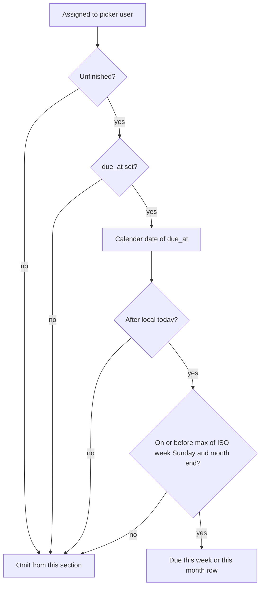
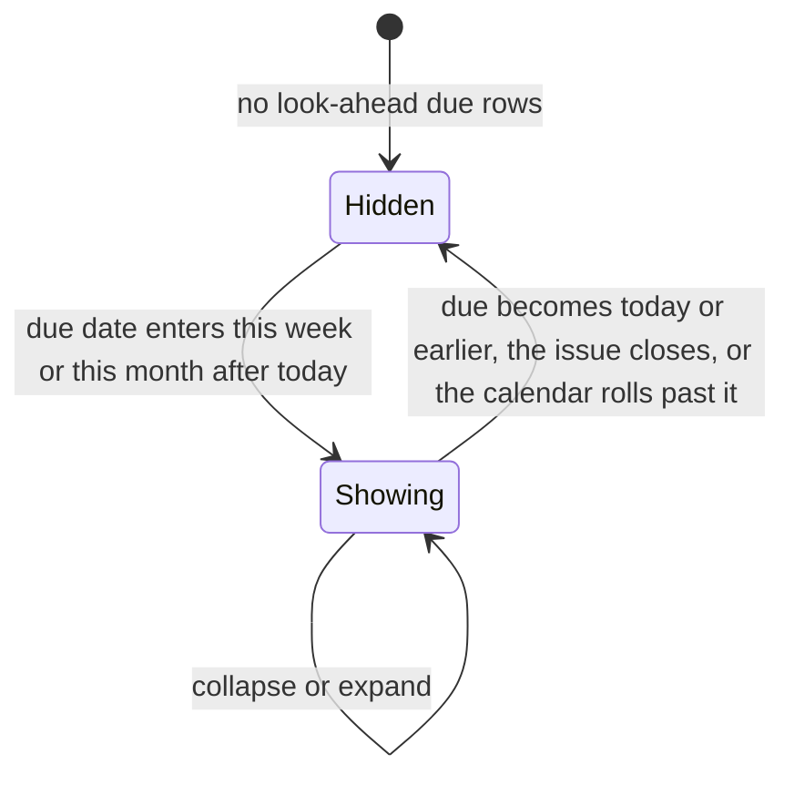

# Due this week or this month on the home inbox

* **Status:** Accepted
* **Date:** 2026-09-20

## Background

`/` is the acting user's personal inbox ([ADR 022](personal-work-inbox.md), [ADR 029](ADR-029.md), [Completed today on the home inbox](completed-today-home-panel.md)): stacked, overlapping sections. **Due or overdue** lists unfinished assigned issues whose `due_at` calendar date is today or earlier. Time-sensitive sections render first; empty sections are omitted; non-empty sections fold behind their headings ([Collapsible home inbox sections](collapsible-home-inbox-sections.md)). Calendar membership uses the server's local date, not clock time.

KEEL-26 asks for a panel of work due this week or this month, placed after the due-today list. Today and overdue already have a home. What is missing is the rest of the current week and month.

## Problem Statement

Due or overdue only answers what is on fire today. Work due tomorrow, later this week, or later this month stays buried in Assigned to me until its calendar day arrives. Opening `/` does not show the near-horizon of dated work.

## Objective(s)

- Show the picker user unfinished assigned issues due later this ISO week or later this calendar month.
- Keep that list on `/` immediately after Due or overdue, with the same row chrome, collapse, and status Move as the other sections.
- Leave Due or overdue unchanged so today and overdue stay the first list.

## Scope and Deliverables

### In-Scope

* An eighth home section, **Due this week or this month**, after Due or overdue and before Starting or started.
* Membership from unfinished assigned issues whose `due_at` calendar date is after local today and on or before the later of this ISO week's Sunday and this calendar month's last day.
* A Due column on those rows (same extra column as Due or overdue).
* Collapse via the existing `keel_inbox` cookie key `upcoming`.
* Doc updates so the UI map and use cases mention the section.

### Out-of-Scope

* Splitting this week and this month into two sections, tabs, or filters.
* Changing Due or overdue membership, or repeating today/overdue rows in this section.
* Rolling seven-day or Sunday-start weeks (Keel already treats Monday as the first weekday for recurrence).
* A JSON inbox API, charts, or a user timezone picker.

### Deliverables

* This ADR as the behavior source of truth.
* The section on `/` in the existing server-rendered inbox.
* Updates to the UI design, use cases, and the home inbox ADRs.

## Technical Requirements

* **Must** add a home section titled **Due this week or this month**, rendered after Due or overdue and before Starting or started among non-empty sections.
* **Must** include only issues whose assignee is the acting user; **Must Not** show unassigned issues here.
* **Must** include only unfinished issues; **Must Not** list *Done* or *Cancelled*.
* **Must** include a row when `due_at` is set and its calendar date is after local today and on or before the horizon: the later of this ISO week’s Sunday (Monday–Sunday) and the last day of the current calendar month.
* **Must Not** include issues due today or earlier (those stay in Due or overdue). **Must Not** include issues with no due date, or issues due after the horizon.
* **Must** hide the section when it has no rows. A home that holds only this section **Must** still render it (not the quiet empty message).
* **Must** allow the same issue to also appear in other sections (Assigned to me, Blocked, and so on) when those rules match.
* **Must** show the existing inbox row (key, type, priority, title, project, start, status Move) plus a **Due** column with the due time.
* **Must** sort rows by due timestamp, then project key, then issue number (same order as Due or overdue).
* **Must** keep calendar-date membership, collapse, status Move, overlap, Find, and phone-narrow swipeable tables as they are ([ADR 022](personal-work-inbox.md), [Collapsible home inbox sections](collapsible-home-inbox-sections.md), [ADR 018](phone-layout.md)).
* **Must** store `upcoming` as a known `keel_inbox` section key.
* **Must Not** add filters, pagination, or a Home nav item.

## Consequences

* **Good:** Dated work for the rest of this week and month is visible on `/` without waiting for Due or overdue to pick it up.
* **Good:** Today and overdue stay a short list at the top; the look-ahead does not repeat them.
* **Bad:** Near month-end, an ISO week that spills into next month can list a due date that is not “this month,” because the horizon is the later of the two bounds.
* **Risk:** Local `date.today()` follows the server's timezone, the same accepted risk as due/start membership.
* **Risk:** ISO weeks start Monday. A Sunday-centric household may call Monday–Sunday “last week / this week” differently. Accepted to match recurrence weekday math already in Keel.

## System Design

### Technical Stack and Architecture

This feature only adds a section to `/`. Membership still starts from issues assigned to the picker user ([ADR 022](personal-work-inbox.md)). Horizon math is a local date: ISO week end and calendar month end, no new table or column. Collapse reuses `keel_inbox` and `/web/inbox`. Status Move still posts to `/web/issues/{id}/status` and returns to `/`.

### UML Diagrams

## Supporting Documentation

* [UI design](../design/ui.md)
* [Use cases](../architecture/use-cases.md)
* [ADR 022: Home page as a personal work inbox](personal-work-inbox.md)
* [ADR 029: Issue start date/time and series start/due offsets](ADR-029.md)
* [Collapsible home inbox sections](collapsible-home-inbox-sections.md)
* [Completed today on the home inbox](completed-today-home-panel.md)
* [ADR 018: Phone layout of the existing site](phone-layout.md)
