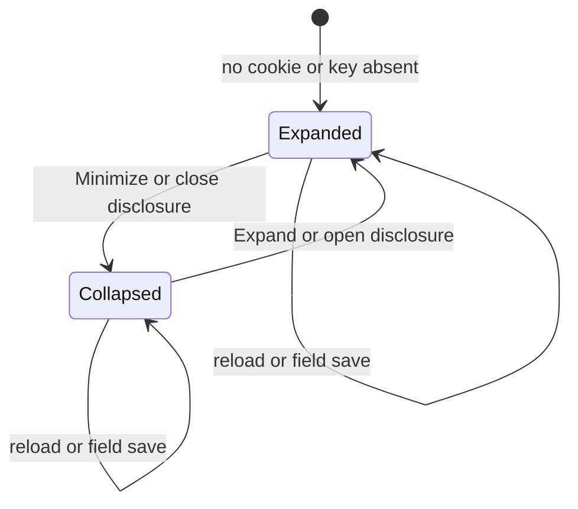

# Foldable issue panels

* **Status:** Accepted
* **Date:** 2026-10-07

## Background

The issue page stacks Description, Children, Dependencies, History, and Comments under the fields ([UI design](../design/ui.md)). Home already folds its sections behind headings and remembers that choice in a browser cookie ([Collapsible home inbox sections](collapsible-home-inbox-sections.md)). The description editor is already a disclosure; the rest of each section is always open. KEEL-60 asks to minimize individual panels on the issue page.

## Problem Statement

A long description, a child table, three dependency lists, a history trail, and a comment thread sit on one page. There is no way to keep a heading and hide the section you are not reading, and a collapse that disappears on the next field save would not help.

## Objective(s)

- Let someone fold Description, Children, Dependencies, History, or Comments while the heading stays visible.
- Keep that choice across reloads and across field saves that return to the issue.
- Keep the page usable without JavaScript and on a phone-narrow viewport.

## Scope and Deliverables

### In-Scope

* Native disclosure on those five sections.
* A count on Children, Dependencies, History, and Comments.
* A browser cookie holding which of those panels are collapsed.
* A form so the choice persists when JavaScript has not run.
* A small issue-page script that persists a disclosure toggle without a round trip.

### Out-of-Scope

* Folding the title, the field grid, the repeating note, or the repeating overlay.
* Folding Blocks, Blocked by, and Relates to separately from Dependencies.
* Removing or reordering panels.
* A different closed set per issue.
* Storing the preference on the user row or in the database.

### Deliverables

* This record.
* Foldable sections on the issue page.
* Updates to the UI design, the API route list, and the use cases.

## Technical Requirements

* **Must** wrap Description, Children, Dependencies, History, and Comments in a native disclosure whose summary is that section's heading.
* **Must** default every panel to expanded when the cookie is missing or empty.
* **Must** keep the heading visible when the panel is collapsed.
* **Must** show the row count on Children, Dependencies, History, and Comments. Description has no count.
* **Must** persist the collapsed set in a `keel_issue_panels` cookie on this browser, shared across issues and across who is signed in, the same rule as `keel_inbox`.
* **Must** store only the known keys (`description`, `children`, `dependencies`, `history`, `comments`), dotted, in that order, dropping unknowns. An empty cookie means nothing is collapsed.
* **Must** restore collapsed and expanded from that cookie on every render of an issue page, including after a field save that returns there.
* **Must** work without JavaScript: Minimize or Expand posts to `/web/issue-panels` and redirects back to the issue.
* **May** hide that control after `issue-panels.js` has run and persist instead from the disclosure's `toggle` event.
* **Must** keep the section body in the page so expanding does not need a second fetch.
* **Must Not** fold the fields above those sections, or the repeating note and overlay.
* **Must Not** persist the choice in SQLite or key it to one issue or one user.

## Consequences

* **Good:** Someone can leave Comments open and fold History so the page is the section they are using.
* **Good:** The preference survives a status or assignee save because it lives in a cookie.
* **Bad:** The same browser shares the closed set across every issue and every signed-in person.
* **Risk:** A collapsed Comments heading is easy to skip. The count on the heading is the mitigation. The default remains expanded.

## System Design

### Technical Stack and Architecture

Cookie parse and encode live in `keel.web.issue_panels`, beside the home inbox cookie. `POST /web/issue-panels` sets `keel_issue_panels` and redirects to a same-site path. `assets/js/issue-panels.js` loads only on the issue page, sets `data-keel-issue-panels`, and posts the closed keys. CSS hides Minimize and Expand after that marker. No new table, JSON route, or service.

### UML Diagrams

## Supporting Documentation

* [UI design](../design/ui.md)
* [API reference](../design/api.md)
* [Use cases](../architecture/use-cases.md)
* [Collapsible home inbox sections](collapsible-home-inbox-sections.md)
* [ADR 009: Server-rendered Jinja2 pages with vanilla JavaScript](ADR-009.md)
