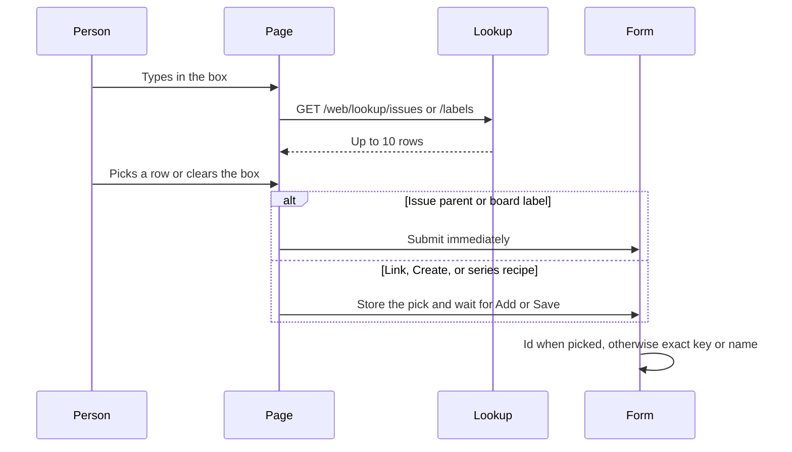

# Issue and label lookup

* **Status:** Accepted
* **Date:** 2026-10-01
* **Updated:** 2026-10-04 — assignee fields use this same lookup.

## Background

Linking an issue, choosing a parent, and filtering the board by label use `<select>` lists. The dependency list is every other issue in every project (`src/keel/web/routes/issues.py` builds `candidates` from `list_issues_globally`). Parent lists every other issue in the project on the issue page, Create, and the series recipe. The board label filter lists the whole catalog plus Any label and Unlabeled. Type, status, priority, relation, sprint, and project stay short or were left as dropdowns. Assignee joined this lookup on 2026-10-04.

## Problem Statement

Those lists grow with no fixed end. A dropdown forces someone to scroll the whole set to find one issue or label.

## Objective(s)

- Find an issue, label, or person by typing, with suggestions from the server.
- Keep the same outcomes: add a dependency, set or clear a parent, filter the board by label, set or clear an assignee, and filter the board by assignee.
- Keep the page usable when JavaScript has not run.

## Scope and Deliverables

### In-Scope

* Dependency picker on the issue page (`other_id` in `src/keel/web/templates/issue_detail.html`). The blocks / blocked-by / relates-to choice stays a dropdown.
* Parent on the issue page, Create (`src/keel/web/templates/create.html`), and the series recipe (`src/keel/web/templates/_series_recipe.html`).
* Board label filter (`src/keel/web/templates/board.html`).
* Assignee on the issue page, Create, and the series recipe, and the board assignee filter (`board.html`).

### Out-of-Scope

* Sprint, project, and every fixed list (type, status, priority, relation, cadence, recurrence).
* The top-bar Find field and the issue Labels text field.
* Changing how dependencies, parents, or labels are stored.
* A public JSON resource for this lookup.

### Deliverables

* This ADR, plus the UI notes in [UI design](../design/ui.md).
* When building is requested: a shared lookup control, two read-only suggestion routes, form handling for a picked id or an exact key/name, and tests.

## Technical Requirements

* **Must** suggest issues by key or title, labels by name, and people by display name or username, from the server as the person types. The page must not embed the full issue, label, or user list.
* **Must** require a picked row before a non-empty value is submitted while JavaScript is running. A typed key or name that was not picked is refused in the browser.
* **Must** allow an empty box. Empty parent means no parent. Empty assignee on an issue means unassigned. Empty label filter means any label. Empty assignee filter means anyone.
* **Must** save the issue-page parent and assignee, and apply the board label and assignee filters, as soon as a row is picked or the box is cleared. Linking still waits for Add. Create and the series recipe still wait for their own submit button.
* **Must** work without JavaScript as a plain text field: an exact issue key (`HOME-12`), an exact label name, `unlabeled`, an exact display name or username, or `Unassigned`. The server resolves that text. A title alone is refused.
* **Must** keep parent results in the current project and link results across projects. Omit the issue being edited.
* **Must** return at most 10 suggestions.
* **May** accept `KEY — title` on the server by reading the key before the separator, so a copied suggestion still resolves.
* **Must Not** reuse the Find redirect, search descriptions or comments, or change the issue, dependency, or label JSON APIs.

## Consequences

* **Good:** Linking and parent choice stay usable as the issue count grows. The board label filter matches the same pattern. The HTML no longer carries every issue.
* **Bad:** Without JavaScript there are no suggestions; the person must know the key or the label name. A title that was not picked does nothing until a row is chosen.
* **Risk:** A slow suggestion request leaves the list empty. The field must stay submittable with an exact key or name if that request fails.

## System Design

### Technical Stack and Architecture

The control is a text input plus a suggestion list, styled with the existing form classes. A small page script, in the same family as `src/keel/web/assets` (`userpicker.js`, `board.js`), fetches suggestions and does not run when JavaScript is absent.

A suggestion row is `KEY — title` (the key already names the project). Labels show the name. Arrow keys move, Enter picks, Escape closes, and no matches shows "No matches". Editing the text after a pick clears that pick. An empty issue query does not list issues; clearing the box is how a parent is removed. With JavaScript, an empty label box lists only Unlabeled. Typing filters names, and Unlabeled stays while the text is a prefix of that word. The current issue is omitted. Duplicate links and illegal parents still fail with the errors those actions already return. The top-bar Find page stays separate: it redirects on an exact key and also searches descriptions and comments.

Suggestion reads live on the web app, not under `/api/v1`:

* `GET /web/lookup/issues?q=&project=&exclude=` returns up to 10 `{id, key, title}`. `project` limits parent search. `exclude` drops the current issue. `q` is matched against key and title only.
* `GET /web/lookup/labels?q=` returns up to 10 names, plus `unlabeled` when the query is empty or a prefix of that word.
* `GET /web/lookup/users?q=` returns up to 10 `{id, label}` rows. `id` is null and `label` is `Unassigned` when the query is empty or a prefix of that word. Other rows match display name or username and label the display name.

Posted fields:

* JavaScript adds a hidden id (`parent_id`, `other_id`, or `assignee_id`) when a row is picked, and removes it when the text changes or the box is cleared. The server uses that id when it is present. The board assignee filter has no hidden id; the text is the query, the same way the label filter works.
* The text field is always submitted (`parent_query`, `other_query`, `label`, `assignee_query`, or `assignee` on the board). If the hidden id is absent, the server treats the text as an exact key, `KEY — title`, an exact label name, `unlabeled`, an exact display name or username, `Unassigned`, or empty. Any other text is the existing form error path ("Choose an issue to link." / the parent, label, and person equivalents).

The relation dropdown, Add, and the current dependency tables stay. Issue-page parent and the board filter keep `data-keel-autosubmit`, but the script submits on pick or clear, not on each keystroke. Create and the series recipe keep their existing submit button.

### UML Diagrams

## Supporting Documentation

* [Find from the top bar](find-from-the-top-bar.md)
* [UI design](../design/ui.md)
