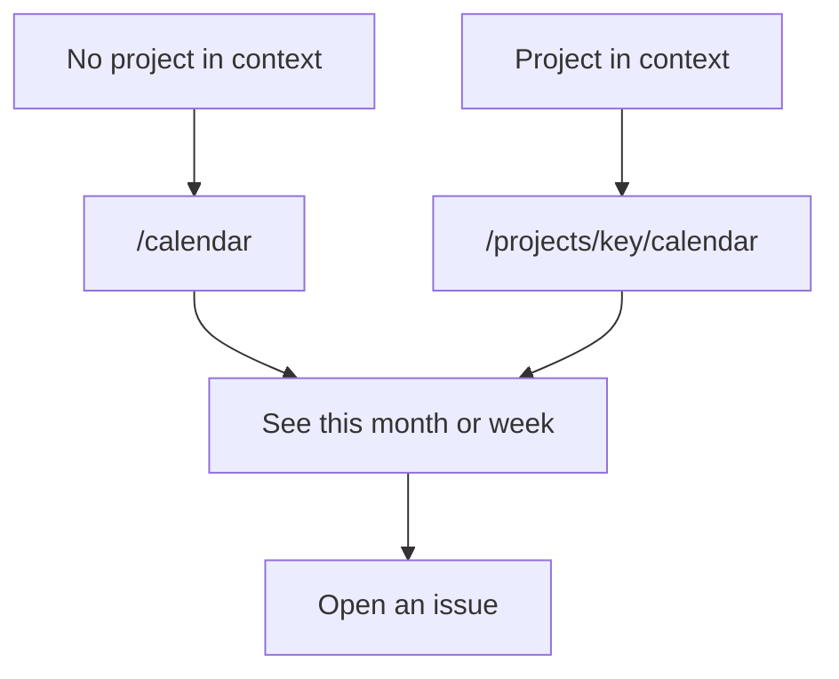

# Calendar of assigned work

* **Status:** Accepted
* **Date:** 2026-10-02

## Background

`/` lists the acting user's work in stacked sections, including what is due and what has started ([ADR 022](personal-work-inbox.md)). The board is a status view. Neither one lays dated work out on the days it covers. Issues already store an optional start and an optional due date.

## Problem Statement

Planning from lists means scanning several panels to see what occupies a day. There is no month or week you can step through.

## Objective(s)

- Open a month and see unfinished issues assigned to the picker user, across projects, on the days they cover.
- Open one week of that same work.
- Inside a project, open that project's month or week and see its unfinished dated issues.
- Move to the previous month, the next month, a month and year chosen from dropdowns, and back to the current month without leaving that view.
- Move to the previous week, the next week, and back to the current week without leaving that view.
- Open an issue from its bar.

## Scope and Deliverables

### In-Scope

- A Calendar link in the top bar. It opens `/calendar` when the page has no current project, and `/projects/{key}/calendar` when it does.
- One month, Monday through Sunday, with Previous, Next, and Today. Those links stay on the view that is open.
- One week, Monday through Sunday, reached from a Week control on the same page. Previous and Next step seven days and stay on that week view.
- On `/calendar`, unfinished issues assigned to the acting user, in any project.
- On `/projects/{key}/calendar`, unfinished dated issues in that project, whoever they are assigned to.
- A bar from the start day through the due day. One date is a one-day bar. A bar that runs past the visible days is clipped to this page.
- The issue key, title, and project key on the bar, linking to the issue.

### Out-of-Scope

- A day view.
- Dragging a bar to change dates.
- Showing Done or Cancelled issues.
- Editing dates on this page.

### Deliverables

- This ADR as the behavior source of truth for the calendar pages.
- `/calendar`, `/projects/{key}/calendar`, and the Calendar link.

## Technical Requirements

* **Must** add Calendar to the top bar. It **Must** link to `/calendar` when the page has no current project, and to `/projects/{key}/calendar` when it has one.
* **Must** show one month in Monday–Sunday weeks. Previous and Next **Must** move by `?month=YYYY-MM` on the same view. Month and Year dropdowns **Must** jump to that month on the same view, including when JavaScript has not run. Today **Must** return to the month that contains the server's local today, still on that view. A missing or unusable month **Must** be that same current month.
* **Must** offer Month and Week on both calendar pages. Choosing one **Must** stay on the master calendar or the project calendar that is already open.
* **Must** show one Monday–Sunday week. Previous and Next **Must** move seven days by `?view=week&week=YYYY-MM-DD` on that same view. Today **Must** return to the week that contains the server's local today. A missing or unusable week **Must** be that same current week.
* **Must**, on the week view, jump the Month and Year dropdowns to the week that contains the first of the chosen month, and stay on the week view. From the month view, Week **Must** open the week containing today when today falls in the shown month, and otherwise the week containing the first of that month. From the week view, Month **Must** open the month of the day that selected the week.
* **Must**, on `/calendar`, include an unfinished issue assigned to the acting user when it has a start, a due date, or both, and that range overlaps the days on the page.
* **Must**, on `/projects/{key}/calendar`, include an unfinished issue in that project when it has a start, a due date, or both, and that range overlaps the days on the page, whoever it is assigned to. Issues from other projects **Must** stay off that page.
* **Must** use the calendar date, the same way Home does.
* **Must** draw one bar from the start day through the due day, inclusive. When only one of those dates is set, the bar **Must** be that day. A bar that begins or ends outside the visible days **Must** be clipped to those days. A bar that crosses a Sunday **Must** continue on the next week.
* **Must** show the project key, issue key, and title, and link the bar to the issue.
* **Must** color a bar by issue type with the same epic, story, and subtask hues as a board card.
* **Must** still show the day grid when nothing dated falls in the month, with a short note that nothing falls in it. An empty week **Must** still show its seven days, with a short note that nothing falls in the week.
* **Must** work without JavaScript.
* **May** stack bars that share a day in separate rows.
* **Must Not**, on `/calendar`, include an issue with neither date, a Done or Cancelled issue, an unassigned issue, or an issue assigned to someone else.
* **Must Not**, on a project calendar, include an issue with neither date, or a Done or Cancelled issue.
* **Must Not** change start or due from either page.

## Consequences

* **Good:** A person can see the shape of a month or a week of their own dated work, and, inside a project, the dated work of that project.
* **Bad:** Opening an issue from the master calendar makes Calendar the project calendar. Getting back to `/calendar` means leaving the project first.
* **Risk:** "Today" follows the server's local date, the same accepted risk as Home. A host in another timezone can disagree with the wall calendar used when the date was entered.

## System Design

### Technical Stack and Architecture

This is two pages on the existing server-rendered chrome, the same split as the master board and a project board. Calendar sits in the top bar beside Board. With no project in context it opens `/calendar`. With a project in context it opens that project's calendar. The month is computed from issues already stored, using the same calendar-day reading as the home inbox. Choosing a bar opens the existing issue page. No new table and no JSON route.

### UML Diagrams

## Supporting Documentation

* [ADR 022: Home page as a personal work inbox](personal-work-inbox.md)
* [UI design](../design/ui.md)
