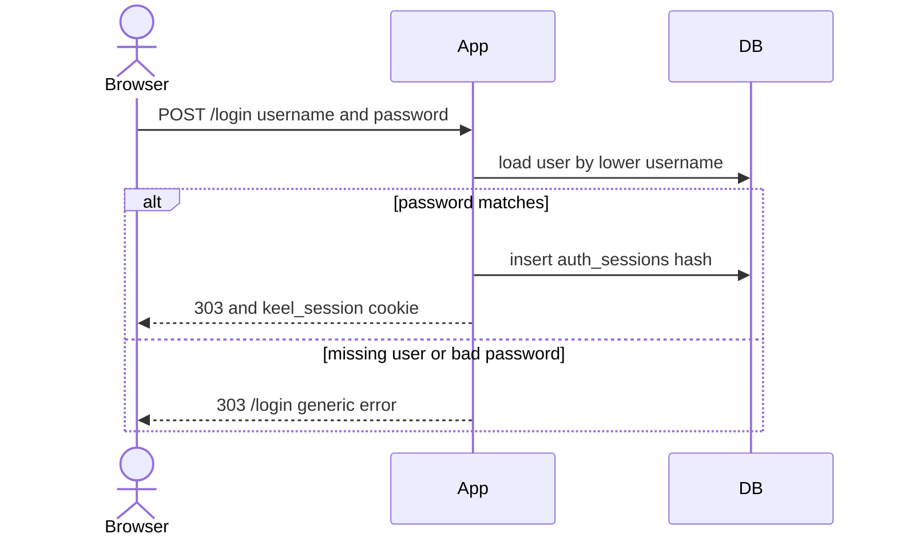
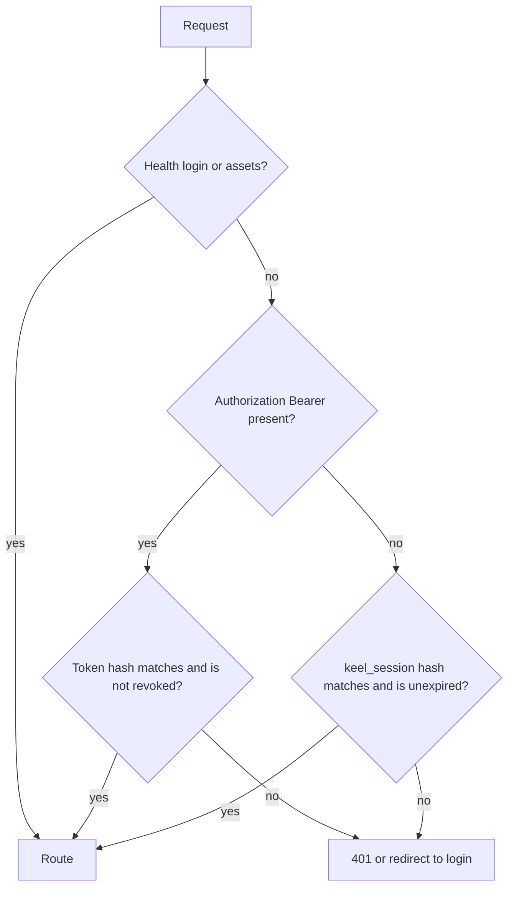

# Password login

* **Status:** Accepted
* **Date:** 2026-10-03

## Background

Keel shipped with [Ambient identity](ambient-identity.md): a display name, chosen in a top-bar picker or sent as `X-Keel-User`, with no check that the caller is that person. That was explicit about not being a security control. The product now needs a username and password, a profile the person can edit, a way to keep the existing people, a way for the Cursor agent to keep calling the API, and a server where nothing useful answers until someone has authenticated.

The profile columns themselves are recorded in [User profile](../design/user-profile.md).

## Problem Statement

Declared identity lets anyone on the network act as anyone else, including the agent account. Replacing it has to cover the browser, the JSON API, and the existing rows in `users`, without inventing roles, email, or a second factor that the work did not ask for.

## Objective(s)

- Require a verified user for every page and API call that shows or changes Keel data.
- Let a person sign in with a username and password, edit their own profile, and change their password only by proving the current one.
- Give scripts and the Cursor agent a revocable token that is not their password.
- Keep every existing person, under the same display name, and give the operator a server-side way to set the first password.
- Leave no path that still trusts `X-Keel-User`, the old `keel_user` cookie, or `KEEL_DEFAULT_USER` as the caller.

## Scope and Deliverables

### In-Scope

* Username, display name, and password on `users`, plus browser sessions and personal API tokens.
* A login page, a profile page, and sign-out.
* Argon2id password hashes, generic login failures, and an in-process lockout.
* Requiring authentication on HTML pages, `/api/v1`, `/openapi.json`, `/docs`, and `/redoc`.
* A migration that copies `display_name` into `username` and leaves `password_hash` null.
* `keel users set-password` and `keel users create-token`.
* The top bar showing the signed-in person and Log out, in place of the picker.

### Out-of-Scope

* Two-factor authentication, email, password-reset mail, avatars, roles, and SSO.
* Public self-registration. A signed-in person adds the next person and sets that person's first password.
* Changing someone else's password in the browser. Recovery is the CLI on the server.
* Terminating TLS. Production stays HTTP on the private network already documented for deploy.

### Deliverables

* This record, the [user profile schema](../design/user-profile.md), and the schema migration.
* Login, profile, session, and token behavior in the app.
* Updated API and data-model notes.

## Technical Requirements

* **Must** hash passwords with Argon2id using the library defaults. **Must Not** store or return the password or the hash. **May** use a reduced Argon2 cost when `KEEL_FAST_PASSWORD_HASH=1`, which the test suite sets. A server must leave that variable unset.
* **Must** keep password hashes comparable in cost when the username is missing or has no password, by verifying a dummy hash.
* **Must** use one failure message for an unknown username and a wrong password.
* **Must** stop accepting a username after 8 failures in 15 minutes, in this process, including names that do not exist.
* **Must** put the browser session in an `HttpOnly`, `SameSite=Lax` cookie named `keel_session`, holding a random token whose SHA-256 hash is what the database stores. The cookie's `Secure` flag is set only when the request is HTTPS. Sessions expire 14 days after they are created.
* **Must** regenerate the session on login and after a password change, and revoke that user's other sessions on a password change.
* **Must** require the current password to change it, and require the new password twice in the browser. Minimum length is 12. It must not match the username.
* **Must** authenticate `Authorization: Bearer` with a personal access token. A bearer header that is present and invalid must not fall through to the session cookie.
* **Must** show a newly created API token once, then only its prefix.
* **Must** refuse a signed-in person deleting their own user.
* **Must** redirect unauthenticated HTML requests to `/login`, and answer `/api/v1`, `/openapi.json`, `/docs`, and `/redoc` with 401.
* **Must** leave `GET /health`, `/login`, `/favicon.ico`, and `/assets/` reachable without a session. `/health` stays `{"status":"ok"}` so deploy can probe it.
* **Must** ignore `X-Keel-User`, the `keel_user` cookie, and `KEEL_DEFAULT_USER` when deciding who is calling.
* **Must Not** add a second factor, an email address, or a role.
* **May** rehash a password on the next successful check when the Argon2 parameters change.

## Consequences

* **Good:** Attribution is someone who proved the password or presented a token. The agent no longer depends on an honor-system header. Existing display names survive the migration.
* **Bad:** Every existing person is locked out until the operator sets a password on the server. API tokens are a new secret to store outside the repository. The in-memory lockout resets when the process restarts and is not shared across workers.
* **Risk:** The deploy listens on HTTP. The session cookie is therefore not marked `Secure` on that network. Someone who can read LAN traffic can copy a session. Tailscale encrypts the VPN path; plain LAN does not. HTTPS is the fix and is out of scope for this change. This is the known transport limitation, recorded here rather than papered over with a flag that would break the current deploy.

## System Design

### Technical Stack and Architecture

The same FastAPI app, SQLite database, and Jinja pages. Passwords use `argon2-cffi`. One middleware rejects anonymous requests before a route runs. `resolve_current_user` reads the bearer token or the session cookie and is the only place pages and the JSON API learn the caller. CSRF for cookie-authenticated forms relies on `SameSite=Lax` (the browser will not send the cookie on a cross-site POST) together with same-origin form actions. There is no per-form token.

Adding a person on `/users` collects a display name, an optional username (it defaults to the display name), and a password. The profile page edits the signed-in person's username and display name, changes the password, and creates or revokes API tokens.

Cutover on the server, after `keel db upgrade` (deploy already runs that):

```bash
keel users set-password "Each Existing Display Name"
keel users create-token "Cursor" --label "Cursor agent"
```

Put the printed token in `KEEL_API_TOKEN` where the agent runs. Do not write it into the skill file or the git repo.

### UML Diagrams





## Supporting Documentation

* [User profile](../design/user-profile.md)
* [Ambient identity](ambient-identity.md)
* [Data model](../design/data-model.md)
* [API reference](../design/api.md)
