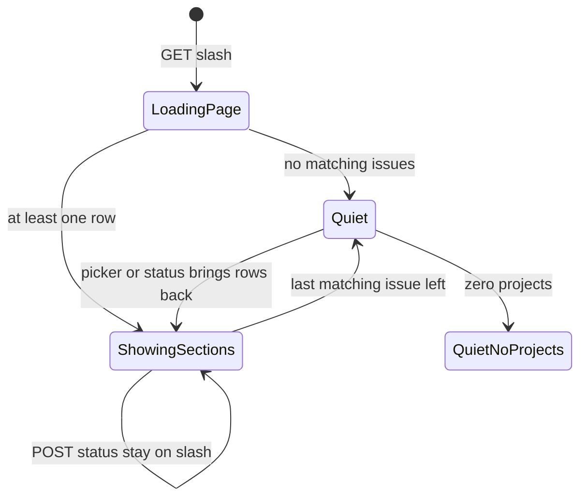
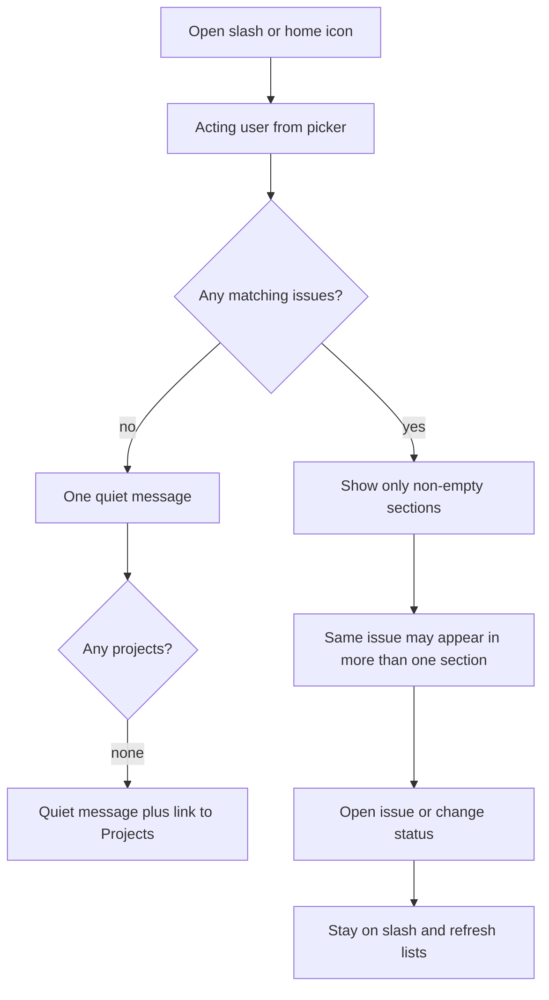

# ADR 022: Home page as a personal work inbox

* **Status:** Accepted
* **Date:** 2026-09-20

> **Amendment.** [Collapsible home inbox sections](collapsible-home-inbox-sections.md) lets each non-empty section fold behind its heading. The collapsed set is a browser cookie, restored after a reload or a status change on `/`.
>
> **Amendment.** [ADR 030](ADR-030.md) adds a Priority column on inbox rows so rank is visible next to type.
>
> **Amendment.** [ADR 029](ADR-029.md) adds a Starting or started section. Time-sensitive sections render first: Due or overdue, then Due this week or this month, then Starting or started, then Assigned to me.
>
> **Amendment.** [Completed today on the home inbox](completed-today-home-panel.md) adds a section at the bottom for assigned issues that became *Done* today.
>
> **Amendment.** [Due this week or this month on the home inbox](due-this-week-or-this-month-home-panel.md) adds a look-ahead due section immediately after Due or overdue.

## Background

Keel's shared chrome already treats `/` as home: the far-left icon in [ADR 001](ADR-001.md) links there, and [UI design](../design/ui.md) keeps `/` as an entry point separate from `/projects`. Until this record, `/` was a temporary redirect to the project list so browsers would not cache a placeholder. The UI design already said that redirect lasts only until `/` has something worth showing, and that with more than one project the project list is a directory, not a starting point.

The acting user is always known in the browser via the picker ([ADR 011](ADR-011.md)). Issues already carry assignee, due date, workflow status, dependency blockers, sprint membership, and series occurrence dates ([ADR 012](ADR-012.md), [ADR 013](ADR-013.md), [ADR 014](ADR-014.md), [ADR 021](ADR-021.md)).

## Problem Statement

Opening Keel lands on a list of projects. That is the wrong first question once more than one project exists. The owner and collaborators need a starting page that answers what is on them now — assigned to them, due or overdue, blocked, in an active sprint, and repeating copies waiting this cycle — without treating the project directory as the home screen.

## Objective(s)

- Make `/` the day's starting point for the acting user.
- Answer those five questions in one place, across projects.
- Keep `/projects` as a directory people open on purpose.
- Keep the page usable without JavaScript and inside the existing chrome, including a phone-narrow viewport.

## Scope and Deliverables

### In-Scope

* A real HTML page at `/` (no redirect) for the picker user.
* Eight titled sections, in this order: Due or overdue; Due this week or this month; Starting or started; Assigned to me; Blocked; In the active sprint; Waiting this cycle; Completed today.
* Status change on each row, returning to `/`.
* Empty-section hiding and a single quiet state when nothing matches.
* Doc updates so the UI map and use cases match this page.

### Out-of-Scope

* Showing unassigned work, or anyone else's issues, on `/`.
* Putting the project list, create-project form, charts, or reporting on `/`.
* Filters, tabs, saved views, query language, or pagination.
* A new "Home" section link in the reorderable nav (the icon remains the entry).
* Notifications or extra overdue chrome beyond listing due/overdue issues.
* Changing board, backlog, sprint, schedule, or issue-detail behavior except that `/` no longer redirects.

### Deliverables

* This ADR as the behavior source of truth.
* The `/` page in the existing server-rendered UI.
* Updates to the UI design and use cases so `/` is described as this inbox.

## Technical Requirements

* **Must** render `/` as a page for the acting user from the picker; **Must Not** redirect `/` to `/projects`.
* **Must** keep `/projects` as the project directory (list and create), reachable from the existing Projects nav item.
* **Must** include in every section only issues whose assignee is the acting user; **Must Not** show unassigned issues on `/`.
* **Must** allow the same issue to appear in more than one section when it matches more than one rule.
* **Must** hide a section entirely when it has no rows.
* **Must** render non-empty sections in this order: Due or overdue; Due this week or this month; Starting or started; Assigned to me; Blocked; In the active sprint; Waiting this cycle; Completed today.
* **Must**, when every section is empty, show one quiet message and no section headings; if there are also no projects, that message **Must** include a link to `/projects`.
* **Must** list under **Assigned to me** every unfinished issue assigned to the acting user, across all projects.
* **Must** list under **Due or overdue** those unfinished assigned issues whose `due_at` calendar date is the local today or earlier; **Must Not** list issues due after local today, or issues with no due date, in this section. "Today" is the server's local calendar date, not the UTC date, so an evening in a US timezone does not pull in tomorrow's work.
* **Must** list under **Due this week or this month** unfinished assigned issues whose `due_at` calendar date is after local today and on or before the later of this ISO week's Sunday and this calendar month's last day ([Due this week or this month on the home inbox](due-this-week-or-this-month-home-panel.md)).
* **Must** list under **Blocked** unfinished assigned issues whose status is Blocked, or that have unresolved blockers, or both.
* **Must** list under **In the active sprint** every issue assigned to the acting user whose sprint is currently active in its project, including *Done* and *Cancelled*.
* **Must** list under **Waiting this cycle** unfinished spawned series copies assigned to the acting user whose `occurrence_on` is today or earlier; **Must Not** list future look-ahead copies in this section.
* **Must Not** list *Done* or *Cancelled* issues in Assigned, Due or overdue, Due this week or this month, Blocked, or Waiting this cycle.
* **Must** list under **Completed today** assigned issues whose current status is *Done* and whose latest move to *Done* (or created-as-*Done*) falls on the local today; **Must Not** list *Cancelled* there ([Completed today on the home inbox](completed-today-home-panel.md)).
* **Must** show each row as a table in the existing list style: issue key (link to the issue), type, priority, title, project, and a status control; **Must** show the unresolved-blocker marker when that count is non-zero.
* **Must** include a status select and Move control on each row that posts to the existing issue status action and returns to `/`.
* **May** autosubmit that status control once the existing picker script has run, hiding Move as the no-JavaScript fallback (same pattern as other list forms).
* **Must** re-render `/` after a status change so membership updates; **Must** show a refused change with the usual page error, not a JSON body.
* **Must** mix issues from every project in each section, with the project key visible on the row.
* **Must** keep the existing top bar, footer, home icon, Find, and picker; Find on `/` **Must Not** scope to a project.
* **Must** work without JavaScript; on a phone-narrow viewport **Must** use the existing swipeable table treatment ([ADR 018](ADR-018.md)).
* **Must Not** add a reorderable Home nav item, filters, or pagination on this page.
* **Must Not** create, edit, or delete projects, series recipes, or issue fields other than status from `/`.

## Consequences

* **Good:** Opening the app answers "what is on me?" instead of "which project exists?" The home icon finally lands on a page. `/projects` can stay a directory.
* **Good:** Due or overdue, Due this week or this month, and Starting or started sit at the top, so calendar-urgent and near-horizon work is visible before the full assigned list.
* **Good:** Overlapping sections make an issue that is both overdue and blocked visible in both places without inventing a priority rank.
* **Bad:** Assigned to me will repeat issues that also sit in other sections, so a busy user sees the same key more than once.
* **Bad:** Closed items appear in the active-sprint section and, when *Done* today, in Completed today, so `/` is not a single consistent "open work" list.
* **Risk:** "Due today" by calendar date can still show an issue after its clock time has passed; users who think in timestamps may call that overdue. Accepted to avoid the section churning through the afternoon.
* **Risk:** Local `date.today()` follows the server's timezone. If the app host is UTC while people enter datetime-local values in another zone, membership can still disagree with the wall calendar they used. Accepted while Keel has no per-user timezone.
* **Risk:** Waiting this cycle uses `occurrence_on`, not due date or sprint overlap, so an unscheduled copy due later this week can appear here while a future look-ahead copy with a due date does not.

## System Design

### Technical Stack and Architecture

This feature only changes what `/` shows inside the existing Jinja2 chrome ([ADR 009](ADR-009.md)). Entry points: the home icon, typing `/`, and the picker returning to the current path. It reads the acting user, issues, sprints, dependency blocker counts, and series occurrence dates already used by the board, backlog, issue page, and schedules. Status changes reuse `/web/issues/{id}/status`. Query shape, caching, and any JSON inbox API are leftovers for `/blueprint` if that work is requested; they are not required to describe the page.

### UML Diagrams

User flow and page states are recorded with the journeys in this ADR.

## Supporting Documentation

* [UI design](../design/ui.md)
* [Use cases](../architecture/use-cases.md)
* [ADR 001: Persistent top menu bar](ADR-001.md)
* [ADR 011: Ambient identity without authentication](ADR-011.md)
* [ADR 013: Planning realization](ADR-013.md)
* [ADR 014: Cross-project dependencies and cycle detection](ADR-014.md)
* [ADR 018: Phone layout of the existing site](ADR-018.md)
* [ADR 021: Repeating work via Scheduling Manager](ADR-021.md)
* [Collapsible home inbox sections](collapsible-home-inbox-sections.md)
* [Completed today on the home inbox](completed-today-home-panel.md)
* [Due this week or this month on the home inbox](due-this-week-or-this-month-home-panel.md)
