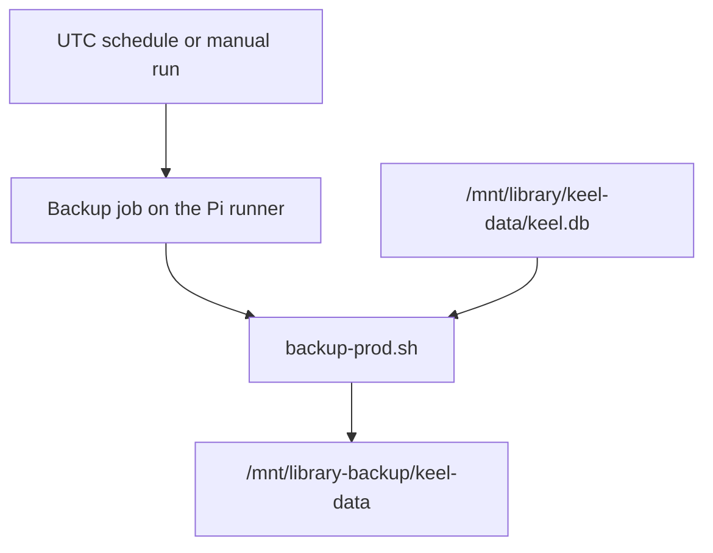

# Scheduled database backups

* **Status:** Accepted
* **Date:** 2026-10-01

## Background

Production Keel is one SQLite file at `/mnt/library/keel-data/keel.db` on the Raspberry Pi ([ADR 026](ADR-026.md)). `keel db backup` already copies that file, including while `keel serve` is running, and `--yes` overwrites a named destination ([ADR 015](ADR-015.md)). Deploy takes one pre-deploy copy under `/mnt/library/keel-data/` and leaves it there. Nothing copies the database on a clock, and those pre-deploy files are not a daily archive.

## Problem Statement

The live database sits on the same machine as the app. A bad disk, a bad restore, or a quiet stretch with no deploys leaves no recent copy on the backup mount. The owner wants a daily copy, plus a weekly copy and a monthly copy, at fixed paths on `/mnt/library-backup`.

## Objective(s)

- Write a restorable copy of the live database every day without a manual command.
- Keep a weekly copy and a monthly copy beside it.
- Run that job on the production Pi, using the same venv and env file as deploy.
- Leave the running service alone.

## Scope and Deliverables

### In-Scope

- A Backup workflow on the existing self-hosted runner, on a UTC schedule, plus a manual run.
- `scripts/backup-prod.sh` calling `keel db backup --yes` for one cadence.
- Fixed destinations: daily `/mnt/library-backup/keel-data/keel.db`, weekly `keel-weekly.db`, monthly `keel-monthly.db`.
- Refusal when that backup mount is not mounted.
- README operations notes. No VPN hostname or IP.

### Out-of-Scope

- Pruning or deleting pre-deploy backups under `/mnt/library/keel-data/`.
- Timestamped names for these three files. Each cadence overwrites its own file.
- A web UI or a change to `keel db backup` itself.
- Restarting Keel, migrating, or deploying.
- Creating the `/mnt/library-backup` mount. It is already attached on the Pi.

### Deliverables

- This ADR as the behavior source of truth.
- `.github/workflows/backup.yml` and `scripts/backup-prod.sh`.

## Technical Requirements

* **Must** run on `runs-on: [self-hosted, Linux, ARM64]`, the same runner as Deploy.
* **Must** load `/mnt/library/keel-data/keel.env` and run `/mnt/library/Keel/.venv` so the copy is the live `KEEL_DATABASE_URL`.
* **Must** write the daily backup every day at 08:00 UTC to `/mnt/library-backup/keel-data/keel.db`.
* **Must** write the weekly backup on Sunday at 08:05 UTC to `/mnt/library-backup/keel-data/keel-weekly.db`.
* **Must** write the monthly backup on the 1st at 08:10 UTC to `/mnt/library-backup/keel-data/keel-monthly.db`.
* **Must** pass `--yes` so the named file is replaced.
* **Must** refuse to run when `/mnt/library-backup` is not mounted, and **Must Not** create that mount point.
* **Must** share Deploy's `keel-production` concurrency group and **Must Not** cancel an in-flight deploy or backup.
* **Must** leave the systemd service running. A backup does not restart Keel.
* **May** be started by hand from Actions, choosing daily, weekly, or monthly.
* **Must Not** delete pre-deploy backups.
* **Must Not** write VPN hostname, tailnet name, or IP addresses into the repository.
* **Must Not** run the test suite on the Pi.

## Consequences

* **Good:** Three restorable files sit on the backup mount even when nothing is deployed. The newest day, week, and month each have one file.
* **Bad:** Each cadence keeps only its latest file, so yesterday's daily copy is gone after today's run. GitHub's scheduler can start the job late; the run still follows the cron that fired.
* **Risk:** The schedule is stored on `main`. It does not run until this workflow is on the default branch. A backup waits if a deploy holds `keel-production`, and a deploy waits if a backup holds it.

## System Design

### Technical Stack and Architecture

This is a second workflow beside Deploy, not a change to the app. The Actions checkout supplies `scripts/backup-prod.sh`. The script sources the production env file and invokes the production venv's `keel db backup`, which uses SQLite's backup API while serve is up. The three outputs are files on `/mnt/library-backup`. Restore stays `keel db restore --yes` with one of those paths.

### UML Diagrams

## Supporting Documentation

* [ADR 015: Database backup and restore](database-backup-and-restore.md)
* [ADR 026: Automated production deploy](ADR-026.md)
* [Backup workflow](../../.github/workflows/backup.yml)
* [README](../../README.md)
