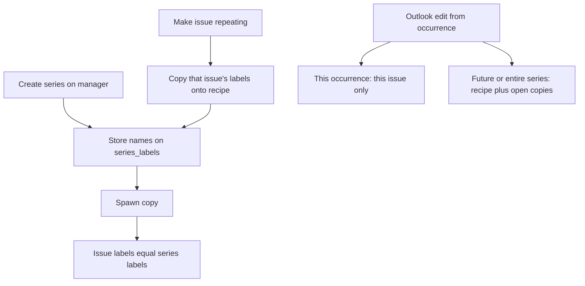

# Series recipe labels

* **Status:** Accepted
* **Date:** 2026-10-01

## Background

Issues carry zero or more labels from a global catalog ([ADR 031](ADR-031.md)). Repeating work is a series recipe that spawns ordinary issues ([Repeating work via Scheduling Manager](repeating-work-scheduling-manager.md)). ADR 031 left labels off the recipe on purpose: spawned copies arrived unlabeled until someone tagged each copy. KEEL-36 asks for that field on the schedule, the same way type, title, assignee, and priority already are.

## Problem Statement

A weekly chore that is always `chores` still appears with no labels on every new copy. Create, the issue page, and the JSON issue API can set labels, but the Scheduling Manager cannot. Tags have to be fixed after each spawn, which defeats the recipe.

## Objective(s)

- Store zero or more labels on the series recipe, using the same catalog and name rules as issues.
- Let the schedules pages and series JSON API set that set.
- Copy the recipe labels onto newly spawned issues, and seed them from an existing issue when that issue is made repeating.

## Scope and Deliverables

### In-Scope

* A `series_labels` link to the existing global catalog.
* Create, read, and update through the series JSON API and the schedules pages.
* Spawned copies inherit the recipe labels.
* Making an existing issue repeating copies that issue's labels onto the recipe.
* Outlook-scoped recipe edits from the issue overlay treat labels like priority: this occurrence, this and all future, or the entire series.
* The schedules list shows the recipe's labels.

### Out-of-Scope

* A second label catalog for series.
* Rewriting already-spawned copies when the manager saves the recipe (same as type and assignee today).
* Changing how the issue page's own add and remove controls work: those remain this occurrence only.
* Label colors, renaming a catalog row, or filtering the schedules list by label.

### Deliverables

* This ADR as the behavior source of truth.
* `series_labels`, service spawn/edit wiring, API and page forms.
* Updates to the data model, API reference, and UI design.

## Technical Requirements

* **Must** store series labels as links to the existing `labels` catalog, not as a comma-separated column on `series`.
* **Must** normalize names with the same rules as issues ([ADR 031](ADR-031.md)).
* **Must** refuse an illegal name the same way an issue label is refused.
* **Must** allow zero or more labels on a series, each name at most once.
* **Must** expose `labels` as a list of sorted names on series create, read, and patch bodies. An omitted create field means no labels, except when `seed_issue_id` is set and `labels` is omitted: then the seed issue's labels are copied. An omitted PATCH leaves the stored set alone. `[]` clears it.
* **Must** show a Labels field on New series and on the recipe form, comma-separated, empty when the recipe has none.
* **Must** show the recipe labels on the schedules list.
* **Must** spawn each new copy with the recipe's labels. A copy's history records that set when it is non-empty, attributed to Keel.
* **Must**, when an existing issue is made repeating, copy that issue's labels onto the recipe. The make-repeating form does not ask again.
* **Must** treat recipe labels as an Outlook-scoped field when changed from an occurrence overlay. This occurrence changes only that issue. This and all future, and the entire series, update the recipe and open copies in range. Closed copies stay as they are.
* **Must Not** treat the issue page's own label add and remove controls as a recipe edit.
* **Must Not** rewrite already-spawned copies when the schedules page or series PATCH saves the recipe.
* **Must** delete a series's label links with the series. Unused catalog rows may remain.

## Consequences

* **Good:** A repeating job keeps the same tags without a second pass on every copy.
* **Bad:** Saving the manager recipe does not rewrite already-spawned copies, so a label change there only affects future ticks unless the user uses Outlook scopes from an occurrence.
* **Risk:** The overlay's issue-page label chips and the recipe labels can diverge on one occurrence. Accepted so this-occurrence exceptions stay possible, the same as assignee and priority.

## System Design

### Technical Stack and Architecture

The global `labels` table is reused. `series_labels` mirrors `issue_labels`. `create_series`, `update_series`, `_spawn_one`, and `apply_occurrence_edit` pass names through `keel.services.labels`. The JSON routes and `/web` schedule forms use the same comma-separated field as Create. The shared `_series_recipe.html` Issue fieldset holds the input whenever identity fields are shown. Catch-up spawn is unchanged except that a non-empty recipe set is applied to the new issue after `create_issue`.

### UML Diagrams

## Supporting Documentation

* [ADR 031: Issue labels](ADR-031.md)
* [Series recipe priority](series-recipe-priority.md)
* [Repeating work via Scheduling Manager](repeating-work-scheduling-manager.md)
* [UI design](../design/ui.md)
* [API reference](../design/api.md)
* [Data model](../design/data-model.md)
