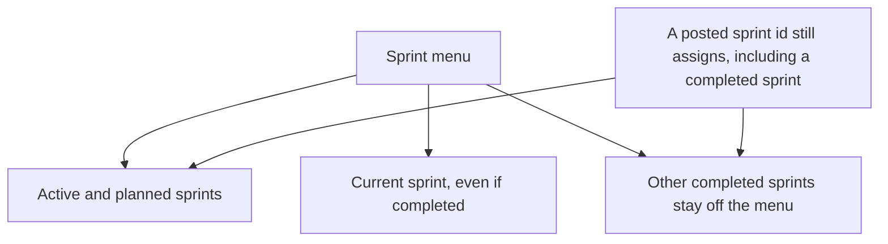

# Sprint assignment choices

* **Status:** Accepted
* **Date:** 2026-10-01

## Background

An issue can be placed in a sprint from Create, from the sprint control on the issue page, from the backlog, and by a `PATCH` of `sprint_id` ([ADR 013](ADR-013.md)). Sprints move *planned → active → completed*. The board's sprint filter already omits completed sprints ([Completed sprints off the board](completed-sprints-off-the-board.md)). The assignment controls did not: Create and the issue page listed every sprint, and the backlog listed only planned sprints, so the active sprint was missing there.

## Problem Statement

A project that has been running for a while accumulates completed sprints. Putting every one of them in the sprint menu makes the control long and hard to scan. The useful choices are the sprint that is running and the ones still planned. The backlog also could not schedule into the sprint that is actually running.

## Objective(s)

- Keep completed sprints out of the sprint menus so those lists stay short.
- Keep a completed sprint visible when the issue is already in it.
- Still allow an issue to be assigned to a completed sprint.

## Scope and Deliverables

### In-Scope

- The sprint controls on Create, the issue page, and the backlog.

### Out-of-Scope

- Refusing an assignment to a completed sprint. Create, update, and `PATCH` of `sprint_id` still accept one.
- Hiding completed sprints from the Sprints page or from Find.
- Removing issues that are already in a completed sprint.
- Changing carry-over when a sprint completes.
- The board's sprint filter, which already omits completed sprints.

### Deliverables

- This ADR as the behavior source of truth.
- Those three controls following it.

## Technical Requirements

* **Must** offer active and planned sprints on Create, on the issue page, and on the backlog.
* **Must** include a completed sprint in the issue-page control when that issue is already assigned to it, and **Must Not** offer any other completed sprint there.
* **Must Not** offer a completed sprint on Create or on the backlog.
* **Must** still accept an assignment to a completed sprint on the HTML sprint form and on `POST`/`PATCH` of an issue.
* **Must Not** clear an issue's sprint merely because that sprint is completed.

## Consequences

* **Good:** The sprint menu stays a short list of the active sprint and planned sprints. The backlog can schedule into the active sprint.
* **Bad:** An issue left in a completed sprint shows that one sprint on its page. Other completed sprints are not in the menu, so choosing one means naming it outside that control.
* **Risk:** Someone who only uses the menu will not see older sprints and may think they cannot be chosen. The API and a posted sprint id still accept them.

## System Design

### Technical Stack and Architecture

`list_assignable_sprints` is the list those three pages render. It is the project's sprints with completed ones removed, plus the issue's current sprint when that sprint is completed. `_assign_sprint` does not look at sprint state, so a posted id can still name a completed sprint. Completing a sprint still leaves closed issues where they are and still carries unfinished work forward.

### UML Diagrams

## Supporting Documentation

* [ADR 013: Planning realization](ADR-013.md)
* [Completed sprints off the board](completed-sprints-off-the-board.md)
* [UI design](../design/ui.md)
* [API design](../design/api.md)
